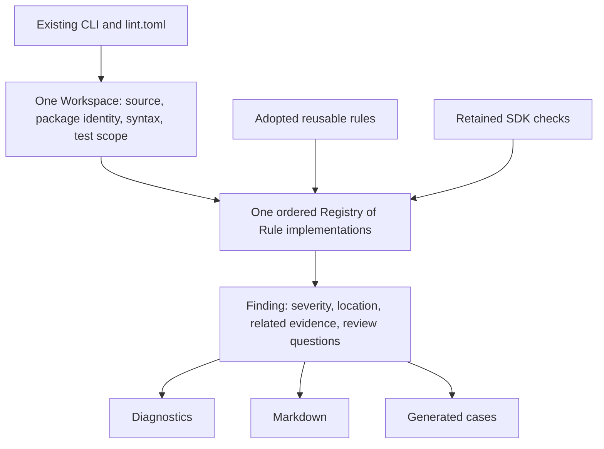

# Husklet design-lint adoption plan

## Status and objective

Approved for implementation on 2026-09-02; implemented on 2026-09-03.
The reusable rule ports and SDK integration are delivered. Four error rules
remain available for explicit review while their existing source backlog awaits
a separate ownership/refactor batch. See
[`packages/design-lint/ADOPTION.md`](../packages/design-lint/ADOPTION.md) for
per-rule activation and validation evidence.

Copy and adapt reusable analysis and rule infrastructure from the local Husklet
checkout into `packages/design-lint`, while preserving Payment-SDK's existing
architecture checks. The result is one SDK-owned linter, one parsed workspace,
one rule registry, and one reporting pipeline.

The requested approach is source adoption. Direct use of Husklet as a library
is technically possible, but a sibling checkout or an additional independently
running linter is not part of this proposed implementation.

Implementation can be authorized as a whole or by batch. Task dependencies
below express execution order, not an additional approval requirement for each
individual task. Changes to accepted design examples still follow `AGENTS.md`.

## Source baseline

| Source | Pinned revision | Relevant paths |
|---|---|---|
| Local Husklet | `1a51b7853fa71f63804cbf59de0ecb2d316c77e8` | `src/packages/hl-design-lint/`, `src/packages/hl-design/`, `LICENSE` |
| Payment-SDK | `3f54bbc6c43d5792737e603d8a754c06a7553af6` | `packages/design-lint/`, `lint.toml`, `lint/examples/`, `AGENTS.md` |

This plan uses the local Husklet implementation inspected with the user:
23 registered rules. It does not silently substitute the newer GitHub
implementation, its C rules, or its external analyzer integrations.

Record copied files, the donor revision, and material adaptations in a
package-local provenance document when copying begins. Preserve Husklet's MIT
copyright and license notice with the copied source. Inspect additional
dependency notices if the naming rule brings its language-analysis libraries.

Existing evidence from this conversation: Payment-SDK's 25 linter tests and
explicit-policy repository scan passed before adoption. Local Husklet's test
command could not reach compilation because its workspace references a missing
`../engine/pkgs/rust/Cargo.toml`. These results do not validate adopted code;
the copied rule tests must execute inside Payment-SDK.

## Required outcomes

1. Preserve all 11 existing rule identifiers, severities, and accepted SDK
   requirements. Fix demonstrated missed violations when their owning
   components are adapted; never weaken an existing check to accommodate a port.
2. Bring over complete analysis behavior and relevant tests, including shared
   support needed by a rule. Do not recreate a complex detector from its name.
3. Keep reusable algorithms independent of chain, package, and application
   identities. SDK-specific identities and ownership remain in `lint.toml`.
4. Produce findings with exact source locations, related evidence, and useful
   review questions. Preserve deterministic output for the same input.
5. Preserve Rust 2024, MSRV 1.91, locked dependencies, and forbidden unsafe code.
   Do not upgrade `syn`, TOML, or the toolchain just to match the donor manifest.
6. Keep source adoption distinct from fixing findings in SDK business code.
   Default activation of new error rules includes an explicit finding-review
   stage; it must not manufacture a green result through broad exclusions.

## Target structure



Proposed ownership inside the existing crate:

```text
src/
  lib.rs                  Linter and deliberate public exports
  main.rs                 CLI and exit behavior
  policy/                 Repository policy and boundary selectors
  source/                 Workspace, source text/spans, package/test identity
  model.rs                Finding, Location, Related, Review, Severity, Summary
  rule/
    mod.rs                Rule, Registry, configured Check registration
    repository/           Existing repository rules and dependency graph
    rust.rs               Existing Rust API checks
    adopted.rs            Adopted check registration
    adopted/              Cohesive donor rule folders
    references.rs         Shared syntactic reference evidence
    syntax.rs             Small shared syntax operations
    production.rs         One authoritative test/production classifier
  report/                 Diagnostic, Markdown, and case reporters
```

These are ownership boundaries, not a request to create empty directories or
move every existing file in one commit. Create directory modules when their
cohesive children exist, respect the production line limit, and remove replaced
files in the same change. Do not keep parallel Workspace or Finding models.

## Proposed decision records

### DL-ADR-01: One composed rule registry

**Status:** Accepted and implemented.

**Context:** Both implementations already use a three-method `Rule` interface.
Husklet gives individual rules their own types; SDK wraps checking functions in
`Check`. Both dispatch through `dyn Rule`.

**Decision:** Adopt a `Registry` that owns deterministic ordering, duplicate-ID
rejection, and selection of enabled rules. Retain `Rule::id`, `severity`, and
`check`, and keep `Policy` explicit at execution. Reuse SDK's meaningful
`Check { id, severity, run }` representation for stateless checks. Copy detector
algorithms and their cohesive internal models rather than copying every
zero-field rule carrier. New configured rule objects are justified only when
they own actual rule configuration or behavior requiring that representation.

**Consequences:** Local and adopted checks share execution and reporting without
introducing empty namespace types, dummy state, or an empty-struct exemption.
Each detector can still live in its own folder. Copying two complete runners or
introducing a sibling path dependency would duplicate ownership and is outside
the requested source-adoption approach.

Provide a library constructor that accepts an explicit registry and policy,
alongside the standard composition. A small development harness can then run
unactivated rules through the same Workspace and reporters against the actual
repository. This does not require a second runner or another CLI mode.

### DL-ADR-02: SDK requirements govern overlapping rules

**Status:** Accepted and implemented.

**Context:** Similar rule names can enforce different contracts. For example,
Husklet's broad-trait detector studies at least eight methods, while SDK already
rejects more than three; their line-count and directory policies also differ.

**Decision:** Retain the existing SDK rule as the authoritative check for each
overlap. Reuse stronger discovery/evidence algorithms where useful. Do not
register a second competing length, dependency-direction, or directory check.
Broad-trait analysis may enrich a trait-method-count finding with explanatory
evidence; it does not replace the three-method limit.

**Consequences:** Existing architecture remains enforceable. Donor fixture
expectations must be classified as preserved algorithm behavior or intentional
SDK policy differences, rather than copied with conflicting thresholds.

### DL-ADR-03: Rich evidence and explicit exception semantics

**Status:** Accepted and implemented; this is a design choice, not a claim
that macros cannot be reused.

**Context:** Husklet's `Related` and `Review` carry useful evidence. Its
`ReviewState::Check`, however, changes whether an annotated free function is an
active violation. SDK currently has reasoned comment exceptions and no
classification workflow.

**Decision:** Adopt related locations, metadata, dependencies, questions, and
warning severity. Preserve the existing SDK comment exception contract. The
initial target does not add a state that hides an unresolved error merely
because it has review metadata. Newly adopted checks can use the existing
exact-rule, reasoned exception mechanism where appropriate.

For the two annotation-sensitive rules, make the adaptation explicit:

- Noun naming uses `design-lint: allow struct-noun-naming -- reason` for an
  accepted exception. Port annotated donor tests as tests of this documented
  SDK behavior; do not silently ignore the original exception tests.
- Free-function detection retains reference and ownership evidence. Preserve
  explicit ABI and proc-macro exclusions. A framework-owned handler exemption
  requires both recognized signature evidence and a narrow reasoned SDK
  exception; a handler-looking name alone is insufficient.
- Husklet's temporary `classify` workflow is not included in this initial
  proposal. If that workflow is desired, revise this decision to specify real
  macro-crate adoption or a separately defined source marker, together with
  its queue and exit semantics. The independent rule batches do not depend on
  that choice.

**Consequences:** Existing errors remain errors and existing reviewed SDK
exceptions remain usable. This intentionally does not claim exact parity with
Husklet's annotation workflow. Adopting `hl-design` is a viable alternative,
but would add an annotation API and dependencies to annotated SDK crates.

### DL-ADR-04: Separate rule implementation from default activation

**Status:** Accepted and implemented.

**Context:** Correct new detectors may find existing source issues. Their
introduction must not silently rewrite application code or lower existing gates.

**Decision:** Port and verify each rule using an explicitly constructed registry
and fixtures first. Then scan the real repository, review findings, and activate
that rule in the default registry once its error findings have been handled.
Keep inherited warning rules as visible warnings. Do not turn a donor error
rule into a warning simply to make the repository pass.

**Consequences:** Implementation and activation status are separately visible.
Unresolved real-source findings keep activation pending; they are not reported
as a clean repository. Follow the established agent case-review process for
any separately scoped source cleanup. No blanket allowances or baselines.

## Retained SDK rules

| Rule | Required preservation |
|---|---|
| `dependency-direction` | SDK policy layers, sibling-chain isolation, configured ownership, and valid cycle detection |
| `owned-vocabulary` | Existing Bitcoin/Ethereum/Solana owners and narrow reasoned exceptions |
| `file-length` | Maximum 500 production physical lines; keep parsed test-only exclusions |
| `forbidden-path` | Existing forbidden architecture paths |
| `empty-directory` | Existing filesystem-emptiness and source-exclusion semantics; a `.gitkeep` file currently makes a directory nonempty |
| `chain-layout` | Existing concrete-chain skeleton, directory topology, and base exclusion |
| `single-file-directory` | Existing SDK direct-Rust-file and crate-root policy |
| `trait-method-count` | More than three functions remains an error |
| `empty-struct` | Empty namespace types remain errors; no artificial fields or blanket exceptions |
| `struct-word-count` | Existing two-word limit and current suffix tokenization |
| `self-constructor-static` | Existing constructor-name, receiver, and return-type conditions |

All remain error-severity rules. New tests must prove preservation on both
accepted and rejected inputs; checking only unchanged rule names is insufficient.

## Complete donor disposition

Paths in this table are relative to Husklet's `src/packages/hl-design-lint/src/rule`.
Original severity is recorded independently of the proposed SDK integration.

| Donor rule | Folder | Severity | SDK disposition |
|---|---|---|---|
| `dependency-direction` | `dependency/` | Error | Reuse manifest/graph discovery where justified; retain SDK layer policy and one existing rule ID. Donor module-role rules require explicit SDK policy before use. |
| `unclassified-free-function` | `function/` | Error | Adapt detector, references, and review context; apply DL-ADR-03 for annotations and framework handlers. |
| `duplicate-entity-base` | `duplicate/` | Error | Adopt with package/module identity and donor false-positive exclusions. |
| `boolean-state-cluster` | `boolean/` | Warning | Adopt construction/transition evidence; retain independent Boolean capabilities. |
| `broad-trait-responsibilities` | `contract/` | Warning | Reuse as optional explanatory evidence on the retained strict trait rule; avoid a competing gate. Review embedded capability vocabulary. |
| `environment-variable-access` | `environment/` | Error | Adapt allowed ownership boundaries to SDK policy; remove Husklet package/path exemptions. |
| `platform-command-boundary` | `command/` | Error | Adapt process ownership to SDK policy, including actual test/tooling use; preserve dynamic-shell analysis. |
| `ignored-fallible-result` | `result/` | Error | Adopt supported result/alias analysis and uncertainty exclusions. |
| `async-blocking-operation` | `blocking/` | Error | Adopt recognized blocking/guard analysis; preserve legitimate blocking adapters and test-scope behavior. |
| `struct-noun-naming` | `naming/` | Error | Complement struct-word-count; adapt exception syntax and verify language-library dependencies. |
| `receiver-name-repetition` | `receiver/` | Error | Adopt with conversion, trait-implementation, acronym, and ambiguous-name exclusions. |
| `gui-toolkit-type-leakage` | `toolkit/` | Error | Exclude: tied to `hl-gui` and GTK-family API boundaries absent from SDK. |
| `god-object-growth` | `object/` | Warning | Adopt method/field/workflow evidence after reviewing capability-origin assumptions. |
| `redundant-accessor` | `accessor/` | Warning | Adopt conservative local evidence; preserve encapsulation and protocol boundaries. |
| `wire-domain-model-duplication` | `model/` | Warning | Adapt relationships to actual SDK/HTTP/storage boundaries; similar fields alone must not authorize merging models. |
| `single-use-free-function` | `single/` | Warning | Adopt reference ambiguity exclusions; explicitly account for the donor visual-section exception. |
| `deep-control-flow` | `nesting/` | Warning | Adopt with explicit production/test scope and donor closure/async cases. |
| `file-length` | `length/` | Error | Keep SDK implementation and its stronger production-only policy; reuse relevant fixtures only. |
| `string-backed-finite-state` | `state/` | Warning | Adopt assignment/comparison evidence; preserve open external protocol values and user text. |
| `catch-all-module-name` | `catchall/` | Error | Adopt module-identity checking; complements forbidden filesystem paths. |
| `empty-directory` | `empty/` | Error | Keep SDK check; reuse missing edge-case fixtures without copying donor exclusions. |
| `single-file-directory` | `folder/` | Warning | Keep SDK error rule and its existing exceptions; do not lower severity. |
| `ceremonial-structure` | `ceremony/` | Warning | Adopt namespace/marker/wrapper evidence; respect required chain directory structure and intentional capability boundaries. |

No rule is enabled solely because it exists upstream. For every new active
rule, its adoption record must identify an existing SDK design invariant, the
failure it detects, and focused accepted/rejected fixtures. If that mapping is
missing, record the rule as pending instead of inventing a requirement.

## Ordered implementation tasks

DL-01 through DL-31 are implemented. DL-32 completed the activation review:
thirteen adopted rules are enabled and four error rules await source cleanup.
DL-33 documents these results; DL-34 records integrated validation in the
package adoption evidence. The table retains the original acceptance criteria
so the implementation can be reviewed against the approved plan.

| ID | Work packet | Prerequisite | Completion evidence |
|---|---|---|---|
| DL-01 | Record donor revision, copied-file inventory, and MIT notice | Implementation start | Provenance covers each copied source/test file |
| DL-02 | Capture fixtures and CLI results for all existing 11 checks | DL-01 | Accepted/rejected outcomes, severities, and exit behavior recorded |
| DL-03 | Introduce one ordered Registry and adapt existing Check registration | DL-02 | Same existing findings; duplicate IDs rejected; explicit-registry library execution available; Rule remains three methods |
| DL-04 | Extend Finding with Related/Review evidence and Warning severity | DL-03 | Existing errors still count; Rule/Finding/Summary severities agree; metadata alone never suppresses an error |
| DL-05 | Extend diagnostic and Markdown reporters | DL-04 | Related locations and warnings render; error and warning exit behavior verified |
| DL-06 | Extend case reports with context and safe deterministic file identity | DL-04 | Owned generated files identified; replacement staged; previous output, `.gitkeep`, and unrelated sentinels survive pre-replacement failure |
| DL-07 | Enrich the existing source model with exact excerpts and package/module identity | DL-03 | One parser/source model; Unicode and multiline spans verified |
| DL-08 | Provide production/test views using one classifier | DL-07 | Existing 11 rules keep their scope; inline/nested/path-based test cases covered |
| DL-09 | Adopt shared reference/syntax analysis only where used | DL-08 | Ambiguous symbol cases preserved; no claim of compiler type resolution |
| DL-10 | Add exact configurable boundaries needed by adopted rules | DL-07 | Unknown policy fields/references rejected; no embedded Husklet owners |
| DL-11 | Make CLI policy selection explicit and reliable | DL-02 | Explicit --policy wins; otherwise cwd lint.toml is loaded if present; standalone defaults retained when absent |
| DL-12 | Adapt Cargo graph discovery under retained SDK layers | DL-10 | Renamed, workspace-inherited, target-specific normal/dev/build edges and meaningful cycles tested |
| DL-13 | Apply parsed production boundaries to vocabulary checks | DL-08 | Production after test modules and literal cfg text remains checked |
| DL-14 | Adopt receiver-name-repetition | DL-05, DL-09 | Donor conversion/trait/acronym cases and SDK examples pass |
| DL-15 | Adopt catch-all-module-name | DL-05, DL-08, DL-10 | SDK policy vocabulary and inline/file/path-override/test-module cases pass |
| DL-16 | Adopt noun naming and reasoned SDK exceptions | DL-05, DL-08 | Independent word-count rule unchanged; protocol/acronym exceptions and MSRV verified |
| DL-17 | Adopt ignored-fallible-result | DL-05, DL-09 | Definite ignored results detected; uncertain expressions not invented as errors |
| DL-18 | Adopt async-blocking-operation | DL-05, DL-09 | Async scopes, guards, aliases, and legitimate blocking adapters covered |
| DL-19 | Adopt boolean-state-cluster | DL-05, DL-09 | Coordinated transitions found; independent flags accepted |
| DL-20 | Adopt string-backed-finite-state | DL-05, DL-09 | Closed state evidence found; open protocol/user text accepted |
| DL-21 | Adopt duplicate-entity-base | DL-05, DL-09 | Shared identity evidence checked; unrelated same-shaped types accepted |
| DL-22 | Adopt wire-domain-model-duplication | DL-10, DL-21 | Actual SDK transport/storage boundaries represented; necessary distinct models accepted |
| DL-23 | Adopt redundant-accessor | DL-05, DL-09 | Trivial local duplication detected; encapsulation/validation accepted |
| DL-24 | Adopt ceremonial-structure | DL-10, DL-23 | Forwarding/marker cases covered; mandatory chain layout and meaningful wrappers accepted |
| DL-25 | Adopt god-object-growth | DL-05, DL-10, DL-09 | Capability origins reviewed; cohesive large types not rejected by size alone |
| DL-26 | Adopt single-use-free-function | DL-05, DL-09 | Ambiguous references and callback/conversion cases tested; visual-section behavior explicitly mapped |
| DL-27 | Adopt deep-control-flow | DL-05, DL-08 | Scope/closure/async behavior tested and documented |
| DL-28 | Adopt free-function ownership analysis | DL-05, DL-09, DL-10, DL-ADR-03 | One/two-argument scope, ABI/proc-macro cases, handler evidence, and adapted exceptions tested |
| DL-29 | Adapt environment-variable-access | DL-05, DL-09, DL-10 | Real SDK boundary cases and retained retry/configuration semantics represented |
| DL-30 | Adapt platform-command-boundary | DL-05, DL-09, DL-10 | Application/test/tool ownership and dynamic-shell cases covered |
| DL-31 | Add useful broad-trait evidence without replacing max-three | DL-04, DL-10 | Four-method trait still errors; larger unrelated capabilities gain explanatory context |
| DL-32 | Review repository findings and activate ready rule batches | DL-06, DL-11, DL-12, DL-13, each relevant rule task | Per-rule fixture parity, real-source findings, exceptions, and default status recorded |
| DL-33 | Update linter documentation and evidence | DL-32 | README lists actual enabled rules and commands; no unsupported implementation claims |
| DL-34 | Run integrated acceptance gates | DL-33 | Required checks pass, or remaining blockers and unactivated rules are explicitly reported |

DL-10 must inventory real environment/process/framework boundaries from their
owners before choosing selectors. DL-16 adds the noun lemmatizer and POS tagger
only if their algorithms are retained. Model duplication, accessor, and wrapper
analysis use `quote::ToTokens`; the manifest owner adds a direct `quote`
dependency with the first packet that needs it. Add only dependencies actually
used by the adopted algorithms, with versions compatible with the SDK toolchain.

DL-12 and DL-13 address missed violations already reproduced during analysis.
DL-11 addresses the observed omission of configured policy by bare `check .`.
They are scoped to affected linter components, not to application refactoring.

DL-06 deliberately strengthens the current SDK case writer, which clears direct
regular files other than `.gitkeep` before executing rules. Ownership-aware
staged replacement must be implemented and tested before claiming that previous
reports and unrelated notes survive failures; it is not existing behavior.

## Execution ownership

- The integration owner edits registry, policy, shared source/model/reporting,
  manifests, lockfile, and documentation. No other agent edits those files at
  the same time.
- After foundation integration, agents can own disjoint rule folders: naming
  and structure; result and async behavior; state and duplication. Boundary
  rules wait for their shared policy contract.
- Each worker ports its rule's source and focused tests, documents intentional
  behavior differences, and reports support changes to the integration owner.
- When resolving actual `lint/errors` cases, follow `AGENTS.md`: read both
  examples completely, report the required confirmations, use disjoint owning
  domains, and leave exception approval to the manager.
- Do not edit `lint/examples/positive.md` or `negative.md` merely because a
  donor rule recognizes a pattern. Example changes require explicit acceptance
  of that pattern under the existing repository instructions.

## Validation and completion

For each rule, include a positive fixture, negative fixture, its important donor
regressions, and at least one SDK-specific boundary example. Check the relevant
span, severity, related evidence, and exception behavior rather than merely
asserting a nonzero finding count. Tests use owned temporary directories and
synthetic source; they do not contact chain RPCs or persistent databases.

Record the source-scan duration and number of parsed files before and after
adoption on the same checkout. Avoid repeated filesystem discovery or reparsing
per rule; add concurrency only if measured work warrants it. Retain documented
uncertainty for syntactic references, aliases, macro-generated code, and inferred
types instead of claiming whole-program semantic analysis.

During linter development:

```bash
cargo test --locked -p design-lint
cargo run --locked -p design-lint -- --policy lint.toml --cases lint .
cargo run --locked -p design-lint -- --policy lint.toml check .
```

Generate exploratory reports in an owned temporary output directory first.
Refresh repository cases only at the planned integration step, preserving
`.gitkeep`, unrelated files, and the established flat case workflow. Verify
reporter failures without destroying the previous report before a replacement
is ready.

After source/API/dependency integration, run the repository completion gates:

```bash
cargo fmt --all -- --check
cargo check --locked --workspace --all-targets
cargo test --locked --workspace
cargo clippy --locked --workspace --all-targets --all-features -- -D warnings
cargo doc --locked --workspace --no-deps
cargo run --locked -p design-lint -- --policy lint.toml check .
git diff --check
```

Report rule implementation, default activation, remaining source findings, and
runtime verification separately. The adoption is complete only when retained
SDK checks pass, selected adopted rules are tested and activated, case handling
is verified, and required gates have run successfully. A rule that lacks a
justified SDK invariant stays explicitly deferred; a failed or skipped gate
does not become a passing result.

For this planning document alone, validate paths, terminology, the 23-rule
disposition, the 11-rule preservation list, task dependencies, and
`git diff --check`. No Rust or workspace test run is required for the plan.

## Source references

- [SDK rules](../packages/design-lint/src/rule/mod.rs)
- [SDK source discovery](../packages/design-lint/src/source/mod.rs)
- [SDK policy](../lint.toml)
- [SDK linter documentation](../packages/design-lint/README.md)
- [Repository instructions](../AGENTS.md)
- [Canonical package boundaries](SYSTEM_REQUIREMENTS.md)
- [Husklet donor registry](https://github.com/husklet/husklet/blob/1a51b7853fa71f63804cbf59de0ecb2d316c77e8/src/packages/hl-design-lint/src/lib.rs)
- [Husklet donor license](https://github.com/husklet/husklet/blob/1a51b7853fa71f63804cbf59de0ecb2d316c77e8/LICENSE)
