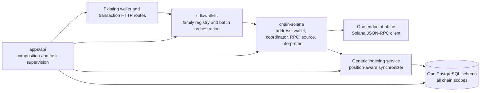

# Native Solana Master Implementation Plan

## Status

**Active; the shared ambiguity carriers, Bitcoin/Ethereum origins, and HTTP
projection are implemented, while the Solana origin remains pending.**
This is the single execution plan for the accepted native-SOL target. It
supersedes the overlapping execution checklists in

###### `SOLANA_IMPLEMENTATION_PLAN.md` and

`INDEXING_CENTRAL_DATABASE_PLAN.md`; the accepted ADRs remain the architectural
source of truth. Every unchecked step remains separately approval-gated.

This plan does not itself authorize a source edit, dependency download,
migration execution, retained-database access, public RPC call, signing with a
funded key, commit, push, or deployment. Each unchecked bold name is one small
approval boundary. Approval of one step does not approve the next.

## Reusable SDK ownership thesis

Payment-SDK is the reusable product. `apps/api` is one top-layer integration of
that SDK, not the owner of capabilities that every integrator needs. Wallet
generation, import, persistence, registry-backed restoration, custody
integration, address/birthday selection, indexing, transaction construction,
and submission must remain available through SDK-owned contracts and concrete
SDK implementations. A desktop application, CLI, background service, or
different HTTP server must be able to compose the same behavior without
copying functionality from `apps/api` or depending on that executable.

Therefore this plan must preserve `Registry`, `RegisteredAddress`,
`Wallets::adopt`/`restore`, the existing SDK PostgreSQL wallet persistence and
restoration path, and the current custody model. `apps/api` may configure,
construct, and invoke those SDK capabilities while owning HTTP, readiness,
supervision, and shutdown; it must not become their exclusive implementation
home. Solana may extend shared SDK contracts only where its protocol requires
it, principally native block position, sparse traversal, exact chain-native
values, and transaction semantics. It must not use Solana work as a reason to
remove an existing reusable SDK capability or move it into the API service.

Any step that makes functionality available only through `apps/api`, requires
another integrator to reimplement wallet restoration or persistence, removes
the existing registry/custody behavior without an approved SDK-level
replacement, or changes a shared/base layer beyond a demonstrated
cross-chain requirement is out of scope and blocks the next step.

## Fixed implementation baseline

- Rust `1.91`, edition 2024, resolver 3, locked dependencies, and
  `unsafe_code = "forbid"` are retained. No toolchain or dependency downgrade
  is part of Solana implementation.
- The resolved Alloy transaction/RPC family remains
  `alloy-consensus = 1.8.3`, `alloy-eips = 1.8.3`, and
  `alloy-rpc-types-eth = 1.8.3`; the same lock resolves
  `alloy-primitives = 1.6.1` and `alloy-sol-types = 1.6.1`. Redb remains
  exactly `4.2.0`.
- The Solana crate uses the exact modular Anza/SPL package family below. It does
  not use `solana-client`, a monolithic SDK, copied System discriminants, or
  hand-written transaction encoding.
- Official `postgres:18.6-alpine` is the owned, disposable test baseline and is
  executed only as
  `postgres@sha256:d3e1620b530c944afa6e887d22eb899824da68e19c52024bf98f5220c88a65b2`.
  The owned harness asserts both that immutable digest and server version
  `18.6` before applying the existing test schema. Production
  migrations live under `sdk/indexing/postgres/migrations/` as ordered
  deployment inputs applied outside `apps/api`; startup performs read-only
  compatibility validation and no DDL.
- One PostgreSQL database, schema, and process-wide pool store indexing state
  for every chain and asset. Repository handles are bound to one exact
  `(chain, network)` scope; assets never select a pool, schema, or repository.
- `payment_wallets` remains part of the existing reusable SDK registry and
  restoration path. It must not become an `apps/api`-private implementation,
  and the indexing registry code is not removed. Existing rows remain
  byte-for-byte preserved; initial Solana support adds no row to that table.
- Initial Solana support is native SOL only. SPL, Token-2022, priority-fee and
  Compute Budget instructions, durable nonce accounts, remote custody, and
  durable request idempotency are out of scope.
- Generated Solana wallets and source guards are process-local. Configured
  32-byte Ed25519 seed imports are restart-reconstructible. One API process is
  the only writer for a managed Solana source.
- Tests use owned RPC doubles, redb repository fixtures, a disposable
  PostgreSQL 18 database/schema, and a checksum-gated validator harness. They
  never contact a public network or use an externally funded key. The real
  validator run is evidence only after the exact archive is acquired.

### Exact Solana direct dependencies

| Package | Exact version and features |
|---|---|
| `solana-address` | `=2.2.0`; `std`, `decode`, `curve25519` |
| `solana-hash` | `=4.1.0`; `decode` |
| `solana-keypair` | `=3.1.2` |
| `solana-instruction` | `=3.0.0` |
| `solana-message` | `=3.1.0`; `bincode` |
| `solana-signature` | `=3.3.0`; `verify` |
| `solana-transaction` | `=3.1.0`; `bincode`, `verify` |
| `solana-system-interface` | `=3.0.0`; `bincode` |
| `spl-memo-interface` | `=2.0.0` |
| `bincode` | `=1.3.3` |
| `base64` | `=0.22.1` |
| `bs58` | `=0.5.1` |
| `getrandom` | `=0.3.4` |

Its remaining direct edges are fixed as follows:

- internal: `base = { path = "../base" }`,
  `indexing = { path = "../../indexing" }`,
  `wallets = { path = "../../wallets" }`, and
  `json-rpc = { path = "../../../packages/json-rpc" }`;
- external: `futures-util = "=0.3.33"` with default features disabled and
  `std`, workspace `hex = "=0.4.3"`, workspace Serde with `derive`, workspace
  `serde_json`, workspace Tokio `=1.49.0` with only `sync`/`time`, and workspace
  `zeroize = "=1.8.2"`; and
- development: workspace `futures-executor`.

It does not depend on `apps/api`, a concrete repository, another chain, the
generic secp256k1 `crypto` package, `num-bigint`, or an additional hash/error/
UUID/RPC stack. The research probe compiled the exact protocol/wire dependency
table as a standalone temporary workspace member; it did not pretend to compile
the future `chain-solana` manifest. The first real manifest change must combine
the proven protocol family with the supplemental set above and pass the full
package/workspace gates. A different dependency, version, feature, or crypto/
RPC stack is a stop condition requiring a revised plan.

## Target component flow



Generic crates receive only the accepted shared prerequisites. Solana-native
account, transaction, RPC, retry, and interpretation rules remain inside
`chain-solana`. SDK crates own reusable wallet restoration, persistence,
indexing, and chain behavior. `apps/api` owns configuration, concrete
construction, HTTP, readiness, submission task supervision, and shutdown while
invoking those SDK capabilities through the same surfaces available to other
integrators.

Completion means the runtime can generate a process-local native-SOL wallet or
load a configured seed import, while the existing public API returns its
canonical address, exact finalized balance, and complete checkpoint-bound
history and submits one transfer or a 1-through-50 ordered batch. Finalized
native movements and fees are indexed, restart and retained reorg behavior is
proven, and Solana participates in the same readiness/shutdown lifecycle as
Bitcoin and Ethereum. Parity is at the product/capability boundary; Solana
keeps its own account, transaction, slot, fee, and submission semantics.

## Public and shared contract target

The implementation must converge on these exact contracts rather than create
parallel compatibility types:

- Add `BlockPosition(u64)` and atomic `BlockParent { position, hash }`.
  `BlockRef` becomes `{ position, height, hash, parent, timestamp }`; only
  genesis may have no parent. Position drives RPC traversal, birthdays,
  restart, and canonical lookup. Produced height drives confirmations, history
  ordering, journal keys, and retention.
- Keep `BlockSource` at three methods named `tip()`,
  `blocks(start: BlockPosition, end: BlockPosition, limit: usize)`, and
  `canonical_at(position: BlockPosition)`. They return a complete tip, bounded
  actual blocks in an inclusive position range, and an optional complete
  canonical reference at one position. `None` from canonical lookup means
  proven omission; unavailable or incomplete evidence is an error. Returned
  blocks are unique and strictly increasing, and a positive limit counts
  blocks rather than numeric positions.
- Make `Provider::generate` and `Provider::create` mandatory object-safe
  methods. Bitcoin and Ethereum explicitly retain secp256k1 generation; Solana
  owns Ed25519 seed generation. Generated secrets never leave their provider.
- Export one `MAX_TRANSFERS = 50`. `Wallets::send_all` owns the authoritative
  1-through-50 guard. `SendError` carries `accepted`, optional
  `failed_index`, optional locally derived `ambiguous_transaction_id`, and its
  typed source. Collection/operation failures carry neither index nor IDs.
- Add canonical plain `AddressEncoding::Base58`, public `Chain::Solana`, and
  `WalletAsset::Sol`. Existing wallet/transaction routes remain the only public
  interface; no Solana-specific route or request wrapper is added.
- Transaction DTOs remain exact closed objects. Both transaction POST routes
  reject a non-empty query before JSON conversion. Normal infrastructure
  headers are permitted but never interpreted as commitment, lag, reference,
  retry, Memo, or priority-fee controls.
- Public block JSON and checkpoint-bound cursors carry position and height plus
  an atomic parent when present. Pre-release height-only cursors and old redb
  records are rejected; no inferred position fallback or legacy reader is
  added.
- Solana configuration is singular and closed:

  ```text
  postgres { url_env, schema, max_connections }

  indexes.solana {
    network
    genesis_hash
    rpc { endpoint, headers, timeout_seconds, max_response_bytes }
    sync { confirmation_depth, reorg_retention, poll_millis, batch_size }
  }
  ```

  Configured imports use `start_position` and exactly 64 lowercase ASCII hex
  characters from a named environment variable. Per-chain databases,
  `start_height`, endpoint lists, commitment/lag/reference/quorum/retry,
  priority-fee, and Memo override fields are rejected as unknown.

## Execution and stop rules

- Work on one named checkbox at a time. Land its focused behavioral test in the
  same reviewable diff unless the step explicitly says test-only.
- After each step report exact files, commands, results, and remaining risk.
  Do not commit or advance automatically.
- The only intentionally broad compile slices are the complete `BlockRef`
  cutover and the first Solana package topology. Splitting either would require
  placeholder coordinates or filler modules, so each receives one explicit
  approval and an immediate workspace check.
- Never run a migration against retained data from this plan. A production
  migration needs a separate approval naming the database, schema, restore
  point, writer barrier, command, verification, and rollback response.
- Stop if the dependency graph diverges from the accepted versions, an existing
  Bitcoin/Ethereum wire regression appears, PostgreSQL cannot preserve another
  scope or `payment_wallets`, a selected Solana block is incomplete, or an
  ambiguous send cannot retain its source guard.

The research closeout is the entry gate. It records the passing Rust 1.91
dependency/wire probe, the PostgreSQL schema/ownership review, current baseline
regressions, and documentation synchronization. Exact durable evidence belongs
in the canonical validation documents; this plan retains only the facts needed
to gate implementation:

| Closeout evidence | Result |
|---|---|
| Rust toolchain | `rustc 1.91.0 (f8297e351 2025-10-28)` and `cargo 1.91.0 (ea2d97820 2025-10-10)` with rustfmt and Clippy |
| Isolated Solana graph | Exact accepted direct family resolved only in a disposable temporary workspace outside the repository; 45 registry packages were added to the scratch graph and its lock SHA-256 was `5d578ca06eb117006b5dd518220d741963a1036091b7c756d40e17eb05bfe060` |
| Solana wire probe | System transfer followed by Memo-v3 built, signed, verified, decoded, and bincode-round-tripped; address/hash/curve/Base64/Base58/randomness probes passed, 1 test |
| Compatibility probe | Rust 1.91 formatting, locked offline workspace all-target check, strict all-target/all-feature Clippy, and 163 focused Ethereum/redb/indexing/runtime/wallet/API regressions passed; no public RPC was used |
| Dependency metadata | Current graph had 472 packages; 367 declared a Rust version, 105 omitted it, and none declared above 1.91 |
| PostgreSQL static baseline | Three ordered scripts and checksums, effective schema, ownership, adapter SQL, fresh/retained paths, external migration boundary, and preservation/restore requirements are recorded in `POSTGRESQL_SCHEMA_BASELINE.md`; no SQL or database access was claimed |
| PostgreSQL runtime fixture | Official `postgres:18.6-alpine` is selected; pull completion, immutable digest, and non-skipping runtime evidence remain the first database implementation gate and are not claimed by research |
| Synchronized repository | Canonical requirements, architecture, validation, indexing plan, Solana plan, and runtime ADR were synchronized; exact Rust 1.91 formatting, locked workspace check and tests, strict Clippy, no-deps documentation, and design-lint passed afterward. The eight PostgreSQL contract functions still short-circuit without a database URL and are not runtime evidence |

No scratch manifest or lock change entered this repository. The first real
Solana manifest step must reproduce the accepted graph and resulting locked
workspace evidence rather than copy a temporary path.

## Phase: Shared Contracts and RPC/API Prerequisites

- [x] **Specify RPC redaction** — test-only: prove `json_rpc::Config` debug
  output cannot contain endpoint text, URL credentials, or header values while
  still exposing endpoint count, header names, timeout, response limit, and
  retry policy. **Proof:** focused JSON-RPC redaction test fails for the current
  derive and passes only after the next step.
- [x] **Redact RPC configuration** — replace derived `Debug` with the manual
  redacted representation; keep `Http` redaction unchanged. **Depends on:**
  **Specify RPC redaction**. **Proof:** JSON-RPC tests and secret-string absence
  assertions.
- [x] **Prove one-shot transport** — cover exactly one HTTP execution, selected
  endpoint affinity, no transparent retry/failover, cancellation, response-byte
  rejection, and wire-ID correlation in generic JSON-RPC. Add no Solana DTO or
  slot state there. **Depends on:** **Redact RPC configuration**. **Proof:**
  loopback transport tests.

- [x] **Specify native provider generation** — test-only: require every fixture
  and concrete provider to select its key algorithm and require generation
  failure to publish no wallet/filter. **Proof:** focused wallet/provider tests.
- [x] **Own Bitcoin generation** — implement explicit secp256k1 generation in
  the Bitcoin provider through its existing `create` path and a private test
  failure seam. **Depends on:** **Specify native provider generation**.
  **Proof:** Bitcoin generation/address/failure tests.
- [x] **Own Ethereum generation** — implement the same provider-owned
  secp256k1 rule for Ethereum without changing its address or signing behavior.
  **Depends on:** **Specify native provider generation**. **Proof:** Ethereum
  generation, address, and signed-wire regressions.
- [x] **Close provider generation** — update test providers, make
  `Provider::generate` mandatory, and retain `Arc<T>` forwarding. **Depends
  on:** **Own Bitcoin generation**, **Own Ethereum generation**. **Proof:**
  wallet, Bitcoin, Ethereum, API, and workspace checks.

- [x] **Add transaction ambiguity** — add optional canonical transaction ID to
  the base transaction error; only a concrete transaction layer may originate
  it from exact locally signed bytes. **Proof:** base error construction and
  conversion tests.
- [x] **Preserve wallet ambiguity** — carry that exact ID unchanged through
  wallet errors; never parse provider prose or synthesize another ID. **Depends
  on:** **Add transaction ambiguity**. **Proof:** wallet conversion tests.
- [x] **Make batch failures truthful** — add `InvalidBatch`; make
  `SendError.failed_index` optional; add distinct item and operation
  constructors; and carry optional ambiguity. **Depends on:** **Preserve wallet
  ambiguity**. **Proof:** display and metadata-shape tests for collection,
  operation, item, and grouped failures.
- [x] **Enforce SDK batch bounds** — export `MAX_TRANSFERS = 50`; reject zero
  with `at least one transfer is required` and 51 with
  `at most 50 transfers are allowed` before lookup or sender invocation; admit
  1 and 50. **Depends on:** **Make batch failures truthful**. **Proof:** direct
  `Wallets::send_all` boundary tests.
- [x] **Preserve authored occurrences** — prove exact length, order,
  multiplicity, aliases, duplicate wallet IDs/destinations/amounts, and original
  indices through common conversion and sender handoff. **Depends on:**
  **Enforce SDK batch bounds**. **Proof:** wallet orchestration tests.
- [x] **Fix common precedence** — validate each authored occurrence in order:
  positive amount, wallet lookup, then family compatibility before advancing.
  **Depends on:** **Preserve authored occurrences**. **Proof:** competing-error
  table tests.
- [x] **Defend Bitcoin batches** — reject impossible zero/51 direct sender
  calls before chain I/O and make grouped failures index-free. Originate
  ambiguity only from the exact local Bitcoin envelope. **Depends on:**
  **Make batch failures truthful**. **Proof:** Bitcoin batch and ambiguity
  regressions.
- [x] **Defend Ethereum batches** — reject impossible zero/51 direct sender
  calls before chain I/O, preserve original indices/accepted prefix, and
  originate ambiguity only from the exact local Ethereum envelope. **Depends
  on:** **Make batch failures truthful**. **Proof:** Ethereum nonce, prefix,
  duplicate, and ambiguity regressions.

- [x] **Reject transaction queries** — after authentication but before body
  extraction, reject any non-empty query on both transaction POST routes with
  `transaction query parameters are not supported`; an empty query component
  and ordinary infrastructure headers remain inert. **Proof:** route precedence
  tests against malformed JSON, empty batch, and 51 items.
- [x] **Apply the wire maximum first** — reject more than 50 decoded wire items
  before converting any amount; leave the empty list to the SDK minimum guard.
  **Depends on:** **Enforce SDK batch bounds**. **Proof:** 0/1/50/51 route tests
  with wallet and RPC call counters.
- [x] **Close transaction bodies** — enforce `additionalProperties: false` for
  `AddressInput`, `SendFunds`, `WalletTransfer`, and `TransferRequest`; reject
  every unknown lag/reference/commitment/retry/Memo/priority member before SDK
  delegation. **Depends on:** **Reject transaction queries**. **Proof:** unknown
  destination, single-root, batch-item, and batch-root matrix.
- [x] **Project public ambiguity** — add optional
  `ambiguous_transaction_id`; any ambiguity maps to `503`, while definite,
  collection, item, and grouped cases omit unrelated fields. **Depends on:**
  **Make batch failures truthful**. **Proof:** exact JSON body tests.
- [x] **Publish transaction schemas** — publish `minItems: 1`, `maxItems: 50`,
  no `uniqueItems`, closed objects, and conditional accepted IDs/index/
  ambiguity descriptions. Mention native SOL without exposing a Solana-only
  route. **Depends on:** **Apply the wire maximum first**, **Close transaction
  bodies**, **Project public ambiguity**. **Proof:** OpenAPI snapshot/assertion
  tests.
- [x] **Pass shared-contract gate** — run focused JSON-RPC, base, wallets,
  Bitcoin, Ethereum, API route/OpenAPI, design-lint, formatting, and locked
  workspace checks. **Stop if:** existing wire bytes, transaction IDs, batch
  order, or public error precedence changes outside the accepted contract.

## Phase: PostgreSQL, Block Coordinates, and Wallet Coordination

This phase preserves the existing wallet-restoration and indexing-custody
design. It does not move wallet restoration into `apps/api`, remove the
indexing registry, remove `Wallets::adopt`/`restore`, or transfer custody
ownership. The coordinate migration may alter only the explicitly listed
indexing tables; `payment_wallets` and every other non-coordinate table remain
unchanged. Wallet publication is coordinated with index commits only to close
the existing runtime race, not to perform a custody handoff.

The phase order is:

```text
Own PostgreSQL tests
  -> Validate migrations and startup schema
  -> Prove shared database safety
  -> Add block-coordinate types
  -> Create and rehearse migration 0004
  -> Cut over repositories and chain sources
  -> Implement sparse synchronization
  -> Coordinate wallet publication with index commits
  -> Pass the persistence-coordinate gate
```

After every named step below, run
`cargo run --locked -p design-lint -- --policy lint.toml check .` and record the
result before advancing. A new finding introduced by the step blocks the next
step; a pre-existing finding is recorded separately and must not be hidden by a
suppression or policy weakening.

- [x] **Own PostgreSQL 18 tests** — after separate pull approval, record the
  immutable digest for official `postgres:18.6-alpine` and make repository
  tests provision and clean an isolated database/schema from exactly that
  artifact instead of returning early when an environment variable is absent.
  Keep a unique schema per test run. **Proof:** version/digest assertion and an
  intentionally wrong connection fail rather than report a skipped pass.
- [x] **Validate baseline migrations** — apply `0001`, `0002`, and `0003` in
  order only to the owned database; verify recorded checksums, the effective
  schema, scope keys, indexes, and ownership classification. **Depends on:**
  **Own PostgreSQL 18 tests**. **Proof:** schema-catalog assertions and unchanged
  application sentinel.
- [x] **Validate startup schema** — add a read-only adapter compatibility check
  for the configured schema and required relations; it performs no create,
  alter, repair, or migration. **Depends on:** **Validate baseline migrations**.
  **Proof:** compatible, missing, wrong-column, and wrong-schema tests.
- [x] **Reject zero pool size** — return a typed invalid request before
  constructing a pool with zero connections. **Proof:** focused pool test.
- [x] **Qualify output spends** — include address in unnested spend input and
  SQL matching so one address cannot spend another address's identical output
  identity. **Proof:** required-spend and tracked-spend regressions.
- [x] **Reject duplicate output identity** — reject one `OutputId` supplied
  under different addresses in the same block at domain validation before a
  PostgreSQL unique-key error. **Proof:** repository-independent block test and
  both repository contracts.
- [x] **Serialize scope commits** — take one transaction-scoped advisory lock
  derived from exact `(chain, network)` before checkpoint reads in add/remove.
  Add no lock table. **Proof:** deterministic concurrent first-commit test.
- [x] **Stabilize history pages** — execute one checkpoint-bound history page
  inside a read-only `REPEATABLE READ` transaction. **Proof:** forced checkpoint
  drift between page queries.
- [x] **Stabilize output pages** — apply the same snapshot rule to live-output
  pagination and cursor validation. **Proof:** forced output/checkpoint drift.
- [x] **Isolate PostgreSQL benchmarks** — replace global truncation with a
  unique scope and scope-only dependency-ordered cleanup. **Proof:** sentinel
  rows in another scope and `payment_wallets` survive.
- [x] **Prove shared-pool isolation** — use one pool and schema with at least
  two chain/network scopes and native/token assets; reject cross-scope handles
  and preserve every unrelated row. **Depends on:** all adapter-safety steps.
  **Proof:** non-skipping PostgreSQL contract test.

- [x] **Add block coordinates** — add `BlockPosition`, `BlockParent`, checked
  successors, and the additive constructor/conversion tests without yet
  changing `BlockRef`. **Proof:** base boundary tests at zero and `u64::MAX`.
- [x] **Specify coordinate migration** — add
  `sdk/indexing/postgres/migrations/0004_block_positions.sql` with only these
  eight indexing columns: checkpoint current/parent position, history block/
  parent position, and journal current/parent plus previous-checkpoint/
  previous-parent position. It may alter no movement, output, journal-output,
  or application table. **Depends on:** **Validate baseline migrations**.
  **Proof:** SQL statement and ownership review.
- [x] **Rehearse dense backfill** — in an owned restored copy, add the columns
  as nullable, abort on any populated unverified scope, backfill only verified
  Bitcoin/Ethereum rows with `position = height`, validate parent pairs, and
  prove all counts/hashes/application bytes are unchanged. **Depends on:**
  **Specify coordinate migration**. **Proof:** before/after hashes and negative
  unknown-scope fixture.
- [x] **Finalize coordinate constraints** — in the same transactional
  migration, require current positions, enforce complete optional parent pairs,
  and remove transition nullability only after backfill validation. No runtime
  height-to-position fallback is allowed. **Depends on:** **Rehearse dense
  backfill**. **Proof:** fresh and retained owned-database migration tests,
  rollback-on-invalid-row, and unchanged `payment_wallets` sentinel.
- [x] **Write the retained transition runbook** — document the external-only
  sequence: record applied versions/checksums and scope hashes, prove a restore,
  stop and fence every old writer, apply the ordered migration to the explicit
  schema, verify all position/parent constraints and preservation sentinels,
  then admit only the position-aware binary. An old binary may not restart
  after the migration. This step prepares commands but executes none. **Depends
  on:** **Finalize coordinate constraints**. **Proof:** restored-copy rehearsal
  and reviewed roll-forward/failure response.
- [x] **Cut over complete block references** — intentionally broad compile
  slice: replace every base/indexing/Bitcoin/Ethereum constructor, fixture,
  cursor, redb record/key, and PostgreSQL reader/writer with
  `{ position, height, hash, parent, timestamp }`. Dense adapters set position
  equal to height only at their protocol boundaries. Reject old redb records
  and height-only cursors. **Depends on:** **Add block coordinates**,
  **Finalize coordinate constraints**. **Proof:** immediate locked workspace
  check and no placeholder/default positions.
- [x] **Round-trip both repositories** — prove sparse positions, produced
  heights, atomic parents, checkpoint/history/journal/add/remove/restart,
  rollback, and old-record rejection in redb and PostgreSQL. **Depends on:**
  **Cut over complete block references**. **Proof:** shared non-skipping
  repository contract.
- [x] **Cut over the source contract** — replace dense `block_at(height)` and
  `canonical_hash(height)` with complete tip, inclusive position-range fetch
  with positive returned-block limit, and complete canonical reference lookup;
  update all doubles in one compiling slice. **Depends on:** **Cut over complete
  block references**. **Proof:** generic source contract tests.
- [x] **Prove dense sources** — adapt Bitcoin and Ethereum with contiguous
  native positions and complete parent references; equality with produced
  height exists only inside those adapters. **Depends on:** **Cut over the
  source contract**. **Proof:** focused source/reorg/restart regressions.
- [x] **Specify sparse synchronization** — test positions `100, 103, 107`,
  produced heights `50, 51, 52`, skipped birthdays, prefix resume, retained
  reorg, and `ReorgTooDeep` before changing the synchronizer. **Depends on:**
  **Cut over the source contract**. **Proof:** failing generic synchronizer
  fixtures.
- [x] **Implement sparse synchronization** — traverse actual returned blocks,
  validate strict position growth, exact produced-height increment, and exact
  parent position/hash; query canonical state by stored position and retain
  produced-height confirmation/retention. **Depends on:** **Specify sparse
  synchronization**. **Proof:** sparse plus existing dense synchronizer tests.
- [x] **Rename wallet birthdays** — replace chain-neutral `start_height` with
  `start_position`, use checked successor publication, and reject overflow.
  This does not rename the preserved `payment_wallets.start_height` column.
  **Depends on:** **Cut over complete block references**. **Proof:** generated,
  imported, skipped-position, and overflow tests.
- [x] **Specify admission races** — test both wallet-publication/commit orders,
  revision invalidation, cancellation after repository I/O begins, checkpoint
  reload, and lock ordering. **Depends on:** **Implement sparse
  synchronization**, **Rename wallet birthdays**. **Proof:** deterministic
  race fixtures, not sleeps.
- [x] **Coordinate filters and commits** — implement one in-memory coordinator
  per `IndexScope` with persisted-checkpoint snapshot, filter revision, commit
  permit, publication permit, async waiters, and recovery-required state. RPC
  and repository I/O occur outside its short lock, and no lock crosses
  `.await`. A sync plan reads checkpoint/revision, captures filters outside the
  lock, and retries if revision changed; pre-commit rechecks both values before
  granting one permit. Publication waits for any commit, inserts the
  wallet/filter at the checked checkpoint successor, then increments revision
  under the serialized boundary. **Depends on:** **Specify admission races**.
  This coordination preserves the existing indexing registry, wallet
  restoration path, custody ownership, and `Wallets::adopt`/`restore` API.
  **Proof:** all race, drop, reload, and cancellation fixtures plus a source/API
  audit proving those ownership boundaries remain unchanged.
- [x] **Break old public cursors** — publish native position and atomic parent
  in block JSON/checkpoint cursors and reject height-only encodings. **Depends
  on:** **Cut over complete block references**. **Proof:** encode/decode,
  conflict, and old-shape rejection tests.
- [x] **Pass persistence-coordinate gate** — run base, wallets, indexing,
  runtime, redb, PostgreSQL 18, Bitcoin, Ethereum, API, design-lint, formatting,
  and locked workspace checks. **Stop if:** any PostgreSQL test skips, another
  scope/application row changes, an old writer could emit null positions, or
  the runtime wallet race remains reproducible. Also stop if wallet restoration
  moved into `apps/api`, indexing custody/registry behavior changed, or
  `payment_wallets` changed in schema or content.

## Phase: Solana Primitives, RPC, and Account Acquisition

- [x] **Add Solana lint ownership** — add the `solana-chain` layer with exact
  dependencies on package, base, indexing, and wallets; permit it only from
  application/acceptance and own `solana`/`sol` vocabulary only in the app and
  Solana crate. Preserve narrow existing Ethereum `sol!` suppressions. **Proof:**
  design-lint positive/negative cases and policy check.
- [x] **Create the Solana package** — intentionally broad topology slice: add
  the workspace member, manifest with the complete fixed dependency family,
  lock resolution, and non-empty chain skeleton. Establish real owners for the
  singular client, blockhash lifetime, Memo operation, account snapshot,
  interpreter, and source budget; add no filler module. **Depends on:** **Add
  Solana lint ownership**, **Pass persistence-coordinate gate**. **Proof:**
  immediate Rust 1.91 locked package check, dependency-tree audit, design lint,
  formatting, and diff check.
- [x] **Parse Solana addresses** — accept only canonical plain Base58 decoding
  to exactly 32 bytes; reject malformed alphabet, wrong length, and a decode/
  re-encode mismatch. Keep valid off-curve values readable/indexable. **Proof:**
  canonical, malformed, boundary, and off-curve fixtures.
- [x] **Render Solana addresses** — emit canonical plain Base58 from all 32
  bytes and add the distinct wallet `AddressEncoding::Base58`; never route it
  through Bitcoin Base58Check. **Depends on:** **Parse Solana addresses**.
  **Proof:** round trips and cross-codec rejection.
- [x] **Classify send curves** — use the maintained curve predicate only as a
  native-send gate; reject off-curve destinations before RPC without calling
  them malformed. **Depends on:** **Parse Solana addresses**. **Proof:** local
  on/off-curve tests and zero RPC count.
- [x] **Add checked lamports** — own `Lamport(u64)` with checked arithmetic and
  exact nine-decimal conversion; reject zero, negative, fractional-lamport,
  overflow, and one lamport above `u64::MAX`; round-trip `u64::MAX`. **Proof:**
  decimal boundary table with no floating point.
- [x] **Add native SOL identity** — add private chain/network/native-asset
  facts required by wallets/indexing, using `{ chain: "solana", asset:
  "native" }` and nine-decimal presentation. Add no SPL identity. **Depends
  on:** **Add checked lamports**. **Proof:** scope/asset conversion tests.
- [x] **Parse imported seeds** — accept exactly 64 lowercase ASCII hex
  characters as one 32-byte Ed25519 seed; reject prefix, uppercase, whitespace,
  alternate keypair encoding, and wrong length. **Proof:** exhaustive boundary
  matrix.
- [x] **Use shared secret handling** — move an accepted decoded seed through
  the existing `SecretBytes` boundary into a Solana-private key owner that
  follows current Bitcoin/Ethereum behavior: owned secret bytes are zeroized
  on drop and no secret is exposed through errors, `Clone`, `Debug`, `Display`,
  or Serde. Do not add a Solana-only guarantee for zeroizing the environment
  `String` or rejected decode temporaries. **Depends on:** **Parse imported
  seeds**. **Proof:** shared-wrapper/trait audit and redacted error tests.
- [x] **Generate Ed25519 seeds** — use OS randomness behind a Solana-private,
  test-only failure seam; do not expose generated seed bytes. **Depends on:**
  **Use shared secret handling**, **Close provider generation**. **Proof:** uniqueness,
  injected failure, and no wallet/filter publication.
- [x] **Sign Solana messages** — derive the canonical address, sign one exact
  message once, locally verify, derive the canonical first-signature ID, and
  reject a mismatched key/signature. **Depends on:** **Generate Ed25519 seeds**.
  **Proof:** maintained-library signature fixtures.

- [x] **Add the Solana RPC double** — build an owned loopback harness that
  asserts exact method, parameters, order, call count, endpoint, body limit,
  cancellation, and response. **Depends on:** **Prove one-shot transport**.
  **Proof:** harness self-tests including unexpected-call failure.
- [x] **Build the singular RPC client** — expose one endpoint with fixed
  headers, timeout, response limit, redacted debug, and `request_once`; no
  endpoint list, failover, or transparent retry is representable. **Depends
  on:** **Add the Solana RPC double**. **Proof:** affinity and one-call tests.
- [x] **Map native RPC failures** — preserve transport, HTTP, JSON-RPC,
  malformed-data, response-resource, retryable-source, and post-wire ambiguity
  classes without trusting provider prose. **Depends on:** **Build the singular
  RPC client**. **Proof:** error-code/envelope matrix.
- [x] **Read Solana identity** — implement one-shot `getGenesisHash` with
  canonical Base58/32-byte validation and exact no-parameter `getHealth` where
  only string `"ok"` passes. **Depends on:** **Map native RPC failures**.
  **Proof:** exact method/shape and malformed-result tests.
- [x] **Read contextual slots** — implement confirmed/finalized `getSlot` with
  optional exact `minContextSlot`; accept only direct JSON unsigned integers
  through `u64::MAX` and never narrow or perform floor arithmetic. **Depends
  on:** **Map native RPC failures**. **Proof:** JSON number-form and floor tests.
- [x] **Decode native accounts** — require context slot even for null; decode
  exact `[string, "base64"]`, strict padding/alphabet, canonical owner,
  lamports, executable, and space/data agreement; ignore additive context
  metadata. **Depends on:** **Parse Solana addresses**. **Proof:** malformed
  field/encoding/cardinality matrix.
- [x] **Read one account** — implement Base64/full-data `getAccountInfo` with
  commitment/floor and complete/null account mapping for startup Memo checks.
  **Depends on:** **Decode native accounts**, **Read contextual slots**.
  **Proof:** exact request and context-floor tests.
- [x] **Read many accounts** — implement one `getMultipleAccounts` request for
  at most 100 addresses with exact cardinality and positional mapping; never
  chunk or send `dataSlice`. **Depends on:** **Decode native accounts**, **Read
  contextual slots**. **Proof:** 0/1/100/101 and short/extra response tests.
- [x] **Read finalized SOL balance** — implement exact finalized `getBalance`
  with valid context and checked lamport conversion. **Depends on:** **Read
  contextual slots**, **Add checked lamports**. **Proof:** zero, max, malformed,
  below-floor, and exact decimal presentation.

- [x] **Resolve source occurrences** — preserve each original item, map its
  already-resolved wallet to a canonical source address, and record the
  earliest occurrence per source without sorting or grouping public items.
  **Depends on:** **Preserve authored occurrences**. **Proof:** source aliases,
  duplicates, and original-index tests.
- [x] **Lease sources canonically** — acquire distinct source keys in canonical
  byte order with lexical preparing state; on `SourceBusy`, release this
  invocation's provisional leases and report the earliest original occurrence
  with no new ambiguous ID. **Depends on:** **Resolve source occurrences**.
  **Proof:** inverse order, partial acquisition, cross-path contention, and
  cancellation tests.
- [x] **Expose source busy truthfully** — add the typed wallet/public mapping
  for `SourceBusy`: `503`, original batch item index when one exists, no
  accepted IDs from the new invocation, and no new ambiguous ID. A single send
  has no index. **Depends on:** **Lease sources canonically**, **Project public
  ambiguity**. **Proof:** exact single/batch HTTP and direct SDK error shapes.
- [x] **Validate Solana destinations** — after source leases are held, parse
  every destination in original order, require on-curve, and reject every
  source-equals-destination occurrence before account RPC. Release this
  invocation's lexical leases on failure. **Depends on:** **Expose source busy
  truthfully**, **Classify send curves**. **Proof:** syntax, curve, self-transfer,
  original-index, precedence, lease-release, and zero-RPC tests.
- [x] **Build the stable account query** — append source then destination for
  every occurrence, deduplicate canonical bytes at first appearance, retain
  reverse mapping, and issue at most one 100-address call. **Depends on:**
  **Validate Solana destinations**, **Read many accounts**. **Proof:**
  duplicates, aliases, exact order, and 50-item bound.
- [x] **Open the confirmed attempt** — call `getHealth`, then exactly one
  `getSlot(confirmed) = F` on the same endpoint; initial support performs no
  automatic retry or failover. **Depends on:** **Build the stable account
  query**, **Read Solana identity**. **Proof:** ordering, one-shot, health
  failure, and no-account-call tests.
- [x] **Acquire the account context** — call one `getMultipleAccounts` with
  `minContextSlot = F`, validate the entire structure/cardinality before
  interpretation, and require its context `C >= F`. **Depends on:** **Open the
  confirmed attempt**. **Proof:** low-context and malformed response discard
  every observation.
- [x] **Close the account witness** — call one closing confirmed `getSlot` with
  `minContextSlot = C`, require `U >= C`, and retain it provisionally without
  publishing a floor or account fact.
  **Depends on:** **Acquire the account context**. **Proof:** closing failure,
  equality including `u64::MAX`, and no partial floor/fact publication.
- [x] **Classify native accounts** — in original order, accept absent or
  non-executable zero-data System-owned destinations; require the same shape
  for present sources; treat absent source as zero balance; map a semantic
  failure to the earliest truthful item. Only complete classification atomically
  publishes eligibility, balances, and operation floor `P = U`. **Depends on:**
  **Close the account witness**. **Proof:** owner/executable/data/source/
  destination policy table and no floor publication on semantic failure.
- [x] **Cancel account acquisition** — race every health, slot, account,
  decoding, classification, and handoff boundary against cancellation and the
  response-size limit; leave no task, floor, account fact, or lexical lease.
  **Depends on:** all account-acquisition steps. **Proof:** deterministic
  cancellation point matrix and zero downstream calls.
- [x] **Pass Solana account gate** — run Rust 1.91 Solana address, value, key,
  RPC, account, balance, acquisition, source-lease, cancellation, package,
  dependency, design-lint, formatting, and locked workspace checks with owned
  doubles only. **Depends on:** all Solana primitive, RPC, and account-
  acquisition steps. **Proof:** exact commands, non-skipping results, and a
  source/dependency audit recorded in implementation evidence.

## Phase: Native Submission, Sparse Indexing, and Wallet Adapters

- [x] **Define submission registration** — add one Solana-owned one-method
  capability whose success means the application has inserted the submission
  task before dispatch. Generic crates gain no Tokio task contract. **Proof:**
  accepted, closed, and lost-acknowledgement doubles.
- [x] **Model immutable envelopes** — privately bind source, original
  occurrence, message, first signature, exact signed bytes, operation floor,
  blockhash, and last valid block height. No field is mutable after signing.
  **Depends on:** **Sign Solana messages**. **Proof:** construction invariants
  and redacted debug/source audit.
- [x] **Generate opaque Memo tokens** — generate a fresh 256-bit OS-random
  value for every occurrence and encode its raw bytes as canonical Base58; it
  contains no caller, wallet, amount, destination, or time data. **Proof:**
  uniqueness including identical/sequential payments and injected RNG failure.
- [x] **Build System-plus-Memo messages** — build one legacy message per item
  with the source as fee payer/only signer, exact System transfer first, then a
  zero-account Memo using only
  `MemoSq4gqABAXKb96qnH8TysNcWxMyWCqXgDLGmfcHr`. **Depends on:** **Generate
  opaque Memo tokens**, **Add checked lamports**. **Proof:** canonical wire
  fixture, instruction order, account roles, and no override/fallback.
- [x] **Read blockhash lifetime** — implement confirmed
  `getLatestBlockhash` with the current floor and atomically retain response
  context, blockhash, and `lastValidBlockHeight`; reject a response below its
  exact sent floor. **Depends on:** **Read contextual slots**. **Proof:** exact
  request/response and malformed lifetime tests.
- [x] **Quote exact message fees** — implement sequential confirmed
  `getFeeForMessage` over exact Base64 bincode message bytes and the
  nondecreasing floor; require each response context to meet its exact sent
  floor before advancing that floor; treat null as failure, never zero.
  **Depends on:** **Build System-plus-Memo messages**, **Read blockhash
  lifetime**. **Proof:** exact byte, context, floor, and per-item order tests.
- [x] **Check source sufficiency** — checked-sum every amount plus exact fee by
  source against the witnessed account snapshot without crediting incoming
  batch transfers; report the first threshold-crossing original occurrence.
  **Depends on:** **Quote exact message fees**, **Classify native accounts**.
  **Proof:** repeated-source, incoming-credit, overflow, and exact-balance tests.
- [x] **Sign every envelope once** — sign in original order, locally verify,
  serialize exact bytes, derive the first signature locally, and reject any
  duplicate message, signature, or signed bytes. **Depends on:** **Check source
  sufficiency**, **Model immutable envelopes**. **Proof:** duplicates and
  mismatched signature/key tests.
- [x] **Simulate exact envelopes** — call sequential
  `simulateTransaction` with Base64, confirmed, `sigVerify: true`,
  `replaceRecentBlockhash: false`, and the current floor; require each response
  context to meet its exact sent floor before advancing that floor, and require
  RPC success with `value.err == null`. **Depends on:** **Sign every envelope
  once**. **Proof:** exact params/order/context plus error/malformed/
  cancellation tests.
- [x] **Prove preparation atomicity** — verify every address, account, RNG,
  blockhash, fee, arithmetic, signing, encoding, and simulation failure causes
  zero broadcasts, no registered task, no envelope guard, and release of only
  this invocation's lexical leases. **Depends on:** all preparation steps.
  **Proof:** deterministic stage-failure matrix with truthful index policy.

- [x] **Read confirmed block height** — implement `getBlockHeight` with the
  current slot floor; equality with `lastValidBlockHeight` is valid, and expiry
  begins only above it. The bare height never advances a slot floor. **Depends
  on:** **Read blockhash lifetime**. **Proof:** below/equal/above and numeric
  decoding tests.
- [x] **Register before dispatch** — atomically transition lexical leases to
  guarded immutable envelopes, obtain task-insertion acknowledgement, and make
  closed/lost registration fail definitely before any wire call. **Depends
  on:** **Define submission registration**, **Prove preparation atomicity**.
  **Proof:** serialized close/insert races and zero-wire losing branches.
- [x] **Broadcast exact signed bytes** — implement one-shot
  `sendTransaction` with Base64, preflight enabled, confirmed preflight,
  current floor, and `maxRetries: 0`; accept only a returned signature equal to
  the local first signature. **Depends on:** **Register before dispatch**.
  **Proof:** exact request/response and mismatch tests.
- [x] **Mark the ambiguity boundary** — after the first send wire execution
  begins, treat timeout, disconnect, cancellation, every JSON-RPC error,
  malformed/uncorrelated response, internal failure, and signature mismatch as
  unknown acceptance carrying only the local ID. **Depends on:** **Broadcast
  exact signed bytes**, **Add transaction ambiguity**. **Proof:** complete error
  matrix with a retained guard.
- [x] **Read historical signature status** — implement exactly one
  `getSignatureStatuses([local_id], searchTransactionHistory: true)` entry;
  require coherent cardinality/context/status/slot within operation-floor to
  response-context bounds. Non-null means submitted even with execution error;
  null remains unknown and never advances the floor. **Depends on:** **Mark the
  ambiguity boundary**. **Proof:** null/non-null/malformed/low-context matrix.
- [x] **Bound exact-byte replay** — replay only identical bytes after a valid
  null status and confirmed height at or below expiry; allow at most the
  original plus two replays, checking status/height between attempts and once
  after the final unknown. Never change endpoint, Memo, blockhash, signature,
  bytes, or order. **Depends on:** **Read historical signature status**, **Read
  confirmed block height**. **Proof:** byte equality and three-call maximum.
- [x] **Stop ordered broadcasts** — submit original occurrences in order,
  expose only the definitely acknowledged prefix, retain the ambiguous
  occurrence's original index/ID, attempt no later item, and release sources
  used only by unattempted later items. Check confirmed block height immediately
  before the first wire call and every later item; never rebuild after any item
  may have been submitted. **Depends on:** **Bound exact-byte replay**.
  **Proof:** definite, ambiguous, cancellation, expiry, and prefix matrices.
- [x] **Detach only the result waiter** — after registration, handler
  cancellation drops only its waiter while the application-supervised
  submission/reconciliation task continues. **Depends on:** **Stop ordered
  broadcasts**. **Proof:** cancellation after registration and after wire start.

- [x] **Add finalized indexing RPC** — implement `getFirstAvailableBlock`,
  inclusive `getBlocks`, and full/json/version-0/no-rewards `getBlock` with
  finalized commitment, strict bounds, and exact response pairing. Never use
  `getBlocksWithLimit`. **Depends on:** **Build the singular RPC client**, **Cut
  over the source contract**. **Proof:** exact RPC request/shape tests.
- [x] **Find the complete produced tip** — from finalized slot `T`, search
  descending closed 10,000-position windows bounded by sampled `A0`, always
  passing `minContextSlot = T`; validate unique in-range ordering and fetch the
  greatest retained candidate as a complete block. Never fabricate `T`.
  **Depends on:** **Add finalized indexing RPC**. **Proof:** non-produced tip,
  empty windows, `A0 > T`, huge gap, and unavailable candidate tests.
- [x] **Fetch sparse ranges** — enumerate checked forward inclusive windows
  sized `min(max(remaining, 10_000), 500_000)`, append only the earliest
  remaining produced slots, validate the complete response, fetch every chosen
  block, and resume at the successor of the last committed position. Sample
  `A0` before enumeration; if start is above the proved produced tip, return an
  empty range without enumeration. **Depends on:** **Find the complete produced
  tip**. **Proof:** `100/103/107`, skipped windows, above-tip empty range,
  truncation suffix, prefix resume, and known-tip omission tests.
- [x] **Bound source attempts** — apply one 30-second monotonic deadline, at
  most 64 enumeration calls, at most 500,000 numeric positions per call, and
  cancellation at every future/loop edge; any exhaustion discards all facts and
  permits no commit. Deadline/call-budget errors are retryable. **Depends on:**
  **Fetch sparse ranges**. **Proof:** deterministic time/call/cancel fixtures.
- [x] **Close the pruning sandwich** — sample `A1` after selected blocks and
  reject the plan if required start, anchor, or checkpoint was pruned between
  witnesses. Treat unavailable selected blocks as retryable. **Depends on:**
  **Bound source attempts**. **Proof:** moving lower-bound scenarios.
- [x] **Prove canonical omission** — return mismatch for a changed complete
  block, or for exact omission only after `T > S`, `A0 <= S`, empty finalized
  `getBlocks(S,S,minContextSlot=T)`, and `A1 <= S`; otherwise return
  unavailable, never false reorg evidence. **Depends on:** **Close the pruning
  sandwich**. **Proof:** every witness failure and same-slot replacement.
- [x] **Implement the Solana source** — connect tip, bounded range, and
  canonical lookup to generic `BlockSource`; require non-null produced height,
  strict slot growth, exact height increment, and exact parent position/hash.
  **Depends on:** all sparse source steps. **Proof:** source contract, restart,
  retained reorg, pruning, and deep-reorg tests.

- [x] **Resolve Solana transaction keys** — validate canonical first-signature
  identity and signer cardinality; require first static signer as fee payer;
  resolve legacy static keys and v0 static + loaded writable + loaded read-only
  order; reject unsupported versions above zero. **Proof:** legacy/v0/index/
  signer/version fixtures.
- [x] **Validate transaction metadata** — require pre/post balance vectors to
  match resolved keys; reject missing metadata/loaded addresses, invalid
  indices, and duplicate inner-instruction groups; use `meta.err` for status and
  retain exact `meta.fee` for success/failure. **Depends on:** **Resolve Solana
  transaction keys**. **Proof:** malformed and failed-transaction fixtures.
- [x] **Decode System transfers** — decode only maintained System `Transfer`
  and `TransferWithSeed` at top-level and recorded inner instructions, preserve
  execution order and repeated/self occurrences, omit zero lamports, and emit
  movement IDs `<signature>:ix:<outer-index>` and
  `<signature>:ix:<outer-index>:inner:<inner-ordinal>`. For
  `TransferWithSeed`, account 2 is the destination; account 1 is its base
  authority. Lookalike bytes from other programs emit nothing. **Depends on:**
  **Validate transaction metadata**. **Proof:** variant/program/order/duplicate
  fixtures.
- [x] **Apply SOL relevance** — retain a transaction only when an active
  address is fee payer or supported movement endpoint; once relevant, retain
  all supported movements, keep fee-only/failed fee-payer history, suppress all
  failed movements, and emit no UTXO changes. **Depends on:** **Decode System
  transfers**. **Proof:** relevance and failed-status matrix.
- [x] **Shield selected balances** — for every successful selected-wallet value
  effect, reconcile pre/post lamport delta against supported movements and fee;
  reject unexplained System/program/reward/rent effects for the whole block.
  Require present inner metadata for relevant success; `[]` is valid, null/
  omitted is incomplete. **Depends on:** **Apply SOL relevance**. **Proof:**
  supported and unsupported native-effect fixtures.
- [x] **Implement the Solana interpreter** — emit canonical observations for
  complete legacy/v0 blocks with actual fee/status/movements and all-or-nothing
  block failure. **Depends on:** all interpreter steps. **Proof:** complete
  interpreter contract and no partial checkpoint/history/output writes.
- [x] **Pass sparse indexing evidence** — cover huge gaps, skipped birthdays,
  prefix resume, pruning movement, deadlines, call budgets, cancellation,
  unavailable blocks, version rejection, restart, retained reorg, and deep
  reorg through generic synchronization and both repositories. **Depends on:**
  **Implement the Solana source**, **Implement the Solana interpreter**.
  **Proof:** focused Solana source/interpreter tests plus the shared
  synchronizer and redb/PostgreSQL repository contracts.

- [x] **Wake guarded reconciliation** — inject matching scope checkpoint
  notification and retry status/history on progress plus deterministic backoff
  from 500 ms doubling to 10 s; checkpoint progress resets backoff and no loop
  spins. **Depends on:** **Stop ordered broadcasts**, **Pass sparse indexing
  evidence**. **Proof:** virtual-time notification/backoff tests.
- [x] **Resolve indexed presence** — classify submitted when coherent status or
  canonical source history contains the exact signature, regardless of
  execution result; indexing remains final confirmation authority. **Depends
  on:** **Wake guarded reconciliation**. **Proof:** status/history/reorg tests.
- [x] **Prove terminal absence** — only after confirmed height exceeds expiry
  and finalized checkpoint height covers it, scan source history in pages of at
  most 100 against one unchanged checkpoint until exhaustion. Any cursor
  conflict, checkpoint change, reorg, pruning, gap, or page failure discards the
  scan and retains the guard. **Depends on:** **Resolve indexed presence**.
  **Proof:** complete/unstable/unavailable scan matrix.
- [x] **Release proven-absent sources** — release only after one complete
  exhausted stable scan; null status, unavailable history, lost process state,
  or fatal indexer never becomes absence. **Depends on:** **Prove terminal
  absence**. **Proof:** indefinite-guard and exact release tests.
- [x] **Build the Solana provider and wallet** — generated and imported seeds
  share one native create path; expose canonical address, finalized SOL balance,
  checkpoint-bound history, and existing wallet capabilities without exposing
  secret bytes. Generation remains process-lifetime only. **Depends on:**
  **Release proven-absent sources**, **Generate Ed25519 seeds**, **Read finalized
  SOL balance**. **Proof:** generation/import/address/balance/history/failure
  tests.
- [x] **Route both send paths** — route `Wallet::send` and registered-family
  batch `Sender` through the same source-keyed coordinator exactly once; reject
  zero/51 direct sender calls before RPC/RNG/signing/registration. **Depends
  on:** **Build the Solana provider and wallet**. **Proof:** single-to-batch and
  batch-to-single contention, 1/50 success, 0/51 rejection, and no duplicate
  guard.
- [x] **Prove ephemeral submission state** — prove neither PostgreSQL nor redb
  stores leases, envelopes, attempts, replays, or reconciliation. Document that
  restart, response loss, active-active writers, or a new logical invocation
  can double-pay and callers must not automatically retry unknown outcomes.
  **Depends on:** **Route both send paths**. **Proof:** storage audit and
  deterministic restart/response-loss tests.
- [x] **Prove central chain coexistence** — through one PostgreSQL 18 pool and
  schema write Bitcoin, Ethereum, and Solana scopes plus native/token facts;
  prove isolation and byte-for-byte unchanged `payment_wallets`. **Depends on:**
  **Pass sparse indexing evidence**, **Prove shared-pool isolation**. **Proof:**
  non-skipping multi-chain repository/system contract.
- [x] **Pass native-chain gate** — run all Solana package, account, wallet,
  construction, fee, signature, simulation, broadcast, replay, ambiguity,
  reconciliation, sparse source/interpreter, both repository, generic indexing,
  existing-chain regression, design-lint, formatting, and locked workspace
  checks using owned doubles/databases only. **Depends on:** all native-chain
  implementation steps. **Proof:** exact commands, non-skipping counts, and
  owned-resource evidence recorded in implementation validation.

## Phase: Runtime Composition and System Evidence

- [x] **Specify closed runtime config** — test the exact PostgreSQL/Solana
  objects, singular endpoint, schema identifier
  `[a-z][a-z0-9_]{0,62}` excluding `pg_`, required imports, unknown members,
  rejected aliases/per-chain databases/`start_height`, and forbidden controls.
  **Proof:** config-deserialization matrix with zero startup side effects.
- [x] **Implement closed runtime config** — add non-flattened
  `deny_unknown_fields` objects, load database URL and Solana seeds only through
  named environment variables, and keep credentials/seeds out of debug/errors.
  **Depends on:** **Specify closed runtime config**, **Redact RPC configuration**.
  **Proof:** config/redaction/environment tests.
- [x] **Expose Solana publicly** — add `Chain::Solana`, `WalletAsset::Sol`, and
  public Base58 mapping in one compiling exhaustive-match slice; expose only
  native SOL through existing wallet/transaction routes and OpenAPI. **Depends
  on:** **Build the Solana provider and wallet**, **Publish transaction schemas**.
  **Proof:** route, enum, serialization, and OpenAPI tests.

- [x] **Verify genesis before storage** — construct all configured chain
  clients and finish every existing Bitcoin/Ethereum identity check plus the
  one-shot canonical Solana `getGenesisHash` comparison before pool creation or
  schema access. **Depends on:** **Implement closed runtime config**, **Read
  Solana identity**. **Proof:** each wrong-identity test observes zero database
  calls.
- [x] **Verify Memo before storage** — obtain finalized `S`, read exactly
  Memo-v3 with Base64/finalized/`minContextSlot = S`, require context at least
  `S` and a non-null executable account, still before pool creation. **Depends
  on:** **Verify genesis before storage**, **Read one account**. **Proof:**
  absent/non-executable/malformed/low-floor tests with zero database calls.
- [x] **Open the central pool** — only after every configured chain identity
  and Memo check succeeds, construct one process-wide pool, pin each connection
  search path to the validated schema plus `pg_catalog`, and run read-only
  compatibility validation. **Depends on:** **Verify Memo before storage**,
  **Validate startup schema**. **Proof:** URL search-path override cannot redirect
  SQL; startup issues no DDL.
- [x] **Construct all scope handles** — clone the shared pool into one exact
  repository per configured chain/network; reuse Ethereum scope for native and
  ERC-20 assets; create one Solana scope, not one per asset. Load checkpoints
  before services. **Depends on:** **Open the central pool**, **Prove central
  chain coexistence**. **Proof:** composition identity and scope-isolation tests.
- [x] **Initialize scope coordination** — create one filter/commit coordinator
  and checkpoint notification from each persisted checkpoint. **Depends on:**
  **Construct all scope handles**, **Coordinate filters and commits**. **Proof:**
  restart/recovery initialization tests.
- [x] **Compose the Solana service** — construct the singular client, source,
  interpreter, indexing service, provider, coordinator, and sender once; inject
  the same service's checkpoint/history/notification views into submission and
  add the indexer to the generic Composer. Keep the concrete object graph
  explicit at the composition root rather than hiding it in a generic
  `Application` facade. **Depends on:** **Initialize scope coordination**,
  **Pass native-chain gate**. **Proof:** object-identity and no-per-handler-
  construction tests plus dependency/source audit.
- [x] **Restore and import through SDK before sync** — invoke the existing
  reusable SDK registry/restoration path for Bitcoin/Ethereum rows and import
  configured chain wallets at explicit `start_position` before the first
  filter revision/sync snapshot. `apps/api` composes this flow but owns no
  private restoration implementation. Register one Solana native family and
  no SPL family or durable generated-wallet row. **Depends on:** **Compose the
  Solana service**, **Coordinate filters and commits**. **Proof:** startup
  ordering, complete initial filter tests, and a non-API integration fixture
  using the same SDK surface.

- [x] **Own submission supervision** — add one application-owned bounded
  `mpsc` admission queue and `JoinSet`; acknowledge registration only after
  insertion and retain the sole close/wait controls. **Depends on:** **Define
  submission registration**, **Compose the Solana service**. **Proof:** close-
  winning, insert-winning, and lost-acknowledgement races.
- [x] **Track index and readiness tasks** — supervise synchronization and the
  readiness bridge; remove bare self-owned readiness spawning and make every
  unexpected completion/error visible to the application. **Depends on:**
  **Compose the Solana service**. **Proof:** task-exit propagation tests.
- [x] **Gate HTTP readiness** — bind the listener only after every configured
  index is `Ready` with a persisted checkpoint and all configured imports are
  visible. Retryable source errors publish not-ready and recover; startup fatal
  exits join owned tasks and never open HTTP. **Depends on:** **Restore and
  import before sync**, **Track index and readiness tasks**. **Proof:**
  CatchingUp/Ready/retry/recovery/fatal/cancel runtime-loop tests.
- [x] **Handle runtime fatality** — on fatal indexer exit, publish not-ready and
  close new HTTP admission immediately. Exit only if no guarded envelope needs
  evidence; otherwise keep the ambiguity barrier active. **Depends on:** **Gate
  HTTP readiness**, **Own submission supervision**. **Proof:** guarded and
  unguarded fatal-exit tests.
- [x] **Order graceful shutdown** — execute exactly: publish not-ready, stop new
  admission, close registrar, drain handlers, drain registered sends/guards
  while status/history/indexing remain alive, cancel sync after guards clear,
  then join submission/readiness/storage tasks. **Depends on:** **Handle runtime
  fatality**. **Proof:** deterministic event-order trace.
- [x] **Hold unresolved ambiguity** — impose no graceful-shutdown deadline while
  a guard is unknown. After fatal indexing only positive historical status may
  clear it; force-kill is the explicit operator choice accepting duplicate risk.
  **Depends on:** **Order graceful shutdown**. **Proof:** unavailable evidence,
  recovered evidence, positive status, and force-kill documentation tests.

- [x] **Declare the Solana system target** — explicitly add `[[test]] name =
  "solana_stack"` because application autotest discovery is disabled. **Proof:**
  `cargo test -p payment-api --features solana-stack --no-run --test
  solana_stack` resolves the declared manual target.
- [x] **Record validator checksums** — pin Agave `solana-test-validator`
  `v3.1.14`, commit
  `3134055b562e95902233be308453fffa1c4a8902`, and platform-specific SHA-256
  values before any artifact is downloaded or executed. **Depends on:**
  **Declare the Solana system target**. **Proof:** checksum manifest parser and
  unsupported-platform test.
- [ ] **Acquire the validator artifact** — with separate network approval,
  download only the exact named platform artifact into harness-owned cache and
  refuse checksum mismatch before execution. **Depends on:** **Record validator
  checksums**. **Proof:** valid and corrupted artifact tests.
- [ ] **Own validator resources** — allocate temporary ledger, ports, logs,
  keys, child process, and disposable PostgreSQL 18 database/schema; fund only
  an ephemeral local payer from the owned validator and preserve an
  application-owned sentinel. **Depends on:** **Acquire the validator artifact**.
  **Proof:** collision-free parallel run and cleanup after success/failure.
- [ ] **Verify owned validator identity** — verify genesis and the bundled
  executable `spl_memo-3.0.0.so` at exact Memo-v3 before application database
  setup. **Depends on:** **Own validator resources**. **Proof:** wrong-genesis
  and missing/non-executable Memo negative fixtures.
- [ ] **Execute native SOL end to end** — generate/import through the SDK,
  submit exact legacy System-transfer-plus-Memo bytes, match the local
  signature, index the finalized transaction, and expose one System movement,
  exact fee/status, canonical history, and no UTXO row through existing APIs.
  **Depends on:** **Verify owned validator identity**, **Hold unresolved
  ambiguity**. **Proof:** explicit `solana_stack` pass with owned resources.
- [ ] **Prove runtime restart and reorg** — restart against retained disposable
  PostgreSQL state, resume from native slot, preserve wallets/scopes, exercise
  skipped slots and retained rollback, and fail visibly on deep reorg or
  unavailable required history. **Depends on:** **Execute native SOL end to
  end**. **Proof:** deterministic system scenarios; no public cluster. The
  manual harness now rebuilds the service/wallet graph from the same database
  after a storage-derived retained rollback and refills canonical history; the
  checkbox remains open until the pinned validator executes that path.
- [x] **Classify system-test ownership** — if no checked-in CI workflow owns
  the pinned validator and PostgreSQL 18 fixture, document `solana_stack` as a
  required manual integration target rather than automated CI evidence.
  **Depends on:** **Execute native SOL end to end**. **Proof:** workflow and
  validation-document audit.
- [x] **Keep negative fixtures owned** — cover wrong genesis, missing Memo,
  malformed/oversized account data, unavailable history, pruning, unsupported
  transaction version, fatal indexer, and ambiguous shutdown with doubles or
  owned validator fixtures; no negative case is skipped for environment.
  **Depends on:** system target and runtime steps. **Proof:** each negative
  condition reaches its exact typed/public failure with no public RPC access.

- [x] **Update implementation evidence** — move validation rows from accepted/
  missing only when cited code and focused tests exist; synchronize API,
  contracts, indexing, architecture, and requirements with exact implemented
  behavior and retain process-local custody/idempotency limitations. **Depends
  on:** all implementation steps. **Proof:** path/terminology review and no
  aspirational implemented claims.
- [x] **Run the release gate** — execute formatting, locked workspace check and
  tests, strict all-features Clippy, no-deps docs, design-lint tests/policy, the
  non-skipping PostgreSQL 18 contract, explicit `solana_stack` where its owned
  artifact is available, and `git diff --check`. Report unavailable external
  tools separately; never weaken a gate. **Depends on:** **Update
  implementation evidence**. **Proof:** exact commands, versions, test counts,
  and failures or unavailable tooling recorded without skipped-pass claims.
- [x] **Review final boundaries** — prove deleting `chain-solana` leaves
  Bitcoin, Ethereum, and generic crates usable; prove no secrets/endpoints are
  logged, no public-network/funded-key path exists, no hidden retry/SPL/generic
  Solana DTO/application DDL was added, and no retained migration was executed.
  **Depends on:** **Run the release gate**. **Proof:** dependency/source/diff
  audit plus the existing-chain regression commands from the release evidence.
- [x] **Prepare the implementation handoff** — report implemented and missing
  capabilities, exact test evidence, database transition status, manual
  validator/CI boundary, process-local duplicate risk, and the first separately
  authorized deployment action. Do not commit, migrate, download, or deploy
  unless separately requested. **Depends on:** **Review final boundaries**.
  **Proof:** one reviewed closeout report whose claims link to exact code and
  test evidence and whose remaining actions stay separately approval-gated.

## Phase acceptance gates

| Gate | Required outcome | Blocks |
|---|---|---|
| Shared contracts | Existing Bitcoin/Ethereum wire behavior passes with truthful batch and ambiguity contracts | block-coordinate/API-wide changes |
| Persistence and coordinates | Non-skipping PostgreSQL 18 plus redb contracts pass; existing SDK registry/restoration and custody behavior remains reusable and sparse generic synchronization is correct | Solana source and production repository composition |
| Solana accounts | Fixed dependency graph, native values, singular RPC, and one witnessed account attempt pass using owned doubles | signing or submission |
| Native chain | Full preparation, bounded exact-byte submission, reconciliation, sparse indexing, wallet adapters, and three-chain database coexistence pass | application exposure |
| Runtime and system | Identity-before-storage, one pool, readiness, supervision, shutdown, validator wire execution, indexing, and workspace release gates pass | any deployment or support claim |

The first implementation slice, **Specify RPC redaction** plus
**Redact RPC configuration**, passed under exact Rust 1.91: formatting,
`json-rpc` tests (5/5), and strict package Clippy. **Prove one-shot transport**
then passed with four deterministic loopback proofs covering one selected-
endpoint execution despite configured retry/failover, caller-future
cancellation after remote observation, response-byte rejection, and wire-ID
correlation; the complete `json-rpc` suite passed 8/8 with strict package
Clippy. Cancellation does not retract an execution already observed by the
remote endpoint. **Specify native provider generation** then added a green
wallet invariant proving a typed generation failure publishes neither a wallet
nor an indexing filter; the focused wallet library suite passed 8/8. Its
compiler contract is intentionally red: the provider doctest still compiles an
implementation that omits `generate` because the generic secp256k1 default
remains. **Own Bitcoin generation** then moved secp256k1 selection into the
Bitcoin provider, reused its existing `create` validation/address/signer path,
and added a private per-call entropy failure seam. Three focused generation,
signer/address, and failure tests passed; the complete Bitcoin library suite
passed 44/44 with strict package Clippy, the workspace all-target check, and
design-lint. **Own Ethereum generation** then moved secp256k1 selection into
the Ethereum provider without changing its existing `create`, Keccak address,
or signing paths. Three focused generation, address, exact EIP-1559 signed-wire,
and failure proofs passed; the complete Ethereum library suite passed 77/77,
the wallet regression suite passed 8/8, and strict package Clippy, the workspace
all-target check, and design-lint passed. **Close provider generation** then
removed the generic key policy, made the API route fixture explicitly
deterministic, and retained `Arc<T>` forwarding unchanged. The E0046 compiler
doctest, Bitcoin 44/44, Ethereum 77/77 plus its adapter test, API 14/14, complete
workspace tests, strict workspace Clippy, no-deps documentation, and
design-lint passed. **Add transaction ambiguity** then extended the base
transaction error with an optional typed canonical ID while keeping ordinary
construction ID-free and message-only display unchanged. Focused tests prove
that provider prose cannot supply reconciliation metadata and that explicit
typed attachment preserves the exact ID. The complete base suite passed 23/23;
the workspace all-target check, complete workspace tests, strict all-target/
all-feature Clippy, no-deps documentation, formatting, design-lint, and diff
checks passed. **Preserve wallet ambiguity** then added the same optional typed
ID to the wallet error. Ordinary wallet and indexing errors remain ID-free;
the consuming exhaustive transaction-error conversion moves the ID unchanged
without cloning or parsing provider prose, and display remains message-only.
The wallet suite passed 11/11 plus its compiler doctest; the workspace
all-target check, complete workspace tests, strict all-target/all-feature
Clippy, no-deps documentation, formatting, design-lint, and diff checks passed.
No concrete chain attaches the ID yet. **Make batch failures truthful** then
replaced the mandatory item index and `SendError::at` with explicit collection,
operation, item, and grouped constructors. Collection/operation/grouped errors
no longer manufacture item zero; item errors preserve their original index and
accepted prefix. Construction consumes the wallet error and moves its optional
canonical ID into item/grouped `SendError`s, leaving no second mutable
authority; collection/operation construction creates an ID-free source. The four
metadata/display proofs pass, as do wallets 15/15 plus its compiler doctest,
Bitcoin 45/45, Ethereum 77/77 plus its adapter test, API 22/22, the workspace
all-target check and complete tests, strict all-target/all-feature Clippy,
no-deps documentation, formatting, design-lint, and diff checks. HTTP ambiguity
projection and concrete chain ambiguity origin remain deferred. **Enforce SDK
batch bounds** then exported the one `MAX_TRANSFERS = 50` product constant and
made `Wallets::send_all` reject zero before 51, both before allocation, item
validation, wallet lookup, or sender selection. Direct SDK tests prove exact
index-free `InvalidBatch` metadata/messages, zero key comparisons and sender
calls for invalid counts, and successful handoff at 1 and 50. The wallet suite
passes 17/17 plus its compiler doctest; the workspace all-target check and
complete tests, strict all-target/all-feature Clippy, no-deps documentation,
formatting, design-lint, and diff checks pass. HTTP/OpenAPI and concrete-sender
bounds remain deferred. **Preserve authored occurrences** then added direct
wallet orchestration evidence without changing production behavior: one
six-item batch proves exact length, order, multiplicity, repeated and identical
items, distinct wallet-ID aliases resolving to one canonical source, exact
resolved-wallet identity at sender handoff, and unchanged sender results. A
separate one-defect case proves a lookup failure keeps authored index 4 and
never invokes the sender. Wallet tests pass 19/19 plus the compiler doctest;
focused strict Clippy passes. **Fix common precedence** then proved the existing
production loop already validates each authored occurrence completely before
advancing: positive amount, exact wallet lookup, then family compatibility. A
four-row competing-error table proves amount wins over same-item missing-wallet
and wrong-family defects, an earlier lookup failure wins over later amount and
family defects, and an earlier family mismatch wins over later amount and
lookup defects. Every case keeps original index 1, carries no accepted or
ambiguous metadata, and invokes neither sender. No production behavior changed;
wallet tests pass 20/20 plus the compiler doctest and focused strict Clippy
passes. **Defend Bitcoin batches** then made the concrete sender reject zero
and 51 direct calls with the shared index-free `InvalidBatch` contract before
parsing or chain I/O. Bitcoin submission now uses one visible transport
execution; its RPC transaction adapter distinguishes definite pre-wire and
remote rejection from unknown transport or acknowledgement outcomes and
attaches only the txid validated from the exact local consensus envelope.
Wallet and grouped-send conversion preserve that typed authority, returned
mismatches and provider prose cannot replace it, and grouped failures remain
index-free. The Bitcoin suite passes 58/58, as do the workspace all-target
check and complete test suite, strict all-target/all-feature Clippy, no-deps
documentation, formatting, design-lint, and diff checks. The next approval
boundary is **Defend Ethereum batches**. **Defend Ethereum batches** then made
the concrete sender reject direct zero and 51 calls with the shared index-free
`InvalidBatch` contract before account, nonce, preparation, or broadcast work.
Three identical authored transfers remain three prepared occurrences with
consecutive nonces; submission stops at the first unknown outcome, keeps only
the definitely acknowledged prefix, and reports that occurrence's original
index. Ethereum transaction submission now carries `base::TransactionError`
from the one-attempt RPC boundary through the process-local coordinator,
wallet, and batch. Pre-wire envelope/ID mismatch and definite rejection remain
ID-free; post-attempt transport, malformed, missing, and returned-hash
uncertainty use only the Keccak ID validated from the exact local EIP-2718
envelope. The coordinator normalizes any adapter candidate back to that local
authority and keeps the exact envelope guarded for reconciliation. Ethereum
tests pass 81/81 plus the external adapter test; the workspace all-target
check and complete tests, strict all-target/all-feature Clippy, no-deps
documentation, formatting, design-lint, and diff checks pass. The next
approval boundary is **Reject transaction queries**.
**Reject transaction queries** then added one shared request-parts extractor to
both transaction POST handlers. The protected-router authentication layer
remains earlier, while any non-empty raw query now returns the exact index-free
`400` error before the JSON extractor runs. Route-contract regressions prove
that query rejection wins over malformed JSON, an empty batch, and 51 items;
an empty query component and unrelated tracing, retry-like, or
minimum-context-slot headers remain inert. The complete API suite passes 3/3
library, 5/5 binary, and 16/16 integration tests. The workspace all-target
check and complete tests, strict all-target/all-feature Clippy, no-deps
documentation, formatting, design-lint, and diff checks pass. The next
approval boundary is **Apply the wire maximum first**.
**Apply the wire maximum first** then made HTTP request conversion compare the
decoded array length with the shared `wallets::MAX_TRANSFERS` before parsing an
amount or constructing any SDK transfer. The zero-item body still reaches the
SDK minimum guard; one and 50 items reach the sender unchanged; and 51 invalid
items return only the index-free maximum error without a sender, transaction,
or broadcast call. The complete API suite passes 3/3 library, 5/5 binary, and
17/17 integration tests. The workspace all-target check and complete tests,
strict all-target/all-feature Clippy, no-deps documentation, formatting,
design-lint, and diff checks pass. The next approval boundary is **Close
transaction bodies**.
**Close transaction bodies** then locked the existing exact-object contract in
tests. `AddressInput`, `SendFunds`, `WalletTransfer`, and `TransferRequest`
already denied unknown fields; OpenAPI regression assertions now prove each
publishes `additionalProperties: false`. The route matrix proves unknown lag,
reference, commitment, retry, Memo, and priority controls at the shared
destination, single root, batch item, and batch root all return the generic
schema `400` before SDK delegation, with no transaction metadata or effect. The
complete API suite passes 3/3 library, 5/5 binary, and 18/18 integration tests.
The workspace all-target check and complete tests, strict
all-target/all-feature Clippy, no-deps documentation, formatting, design-lint,
and diff checks pass. The next approval boundary is **Project public
ambiguity**.
**Project public ambiguity** then added optional
`ambiguous_transaction_id` to the public error body and preserved the existing
typed value through both single-wallet and batch conversion. Its presence is
the final `503` status authority. Exact JSON projection tests cover single,
indexed batch, grouped batch, definite collection/operation/item/grouped
failures, and omission of every unrelated field; the composed Ethereum test
proves a real acknowledged prefix, original failed index, and locally derived
ambiguous ID reach the HTTP response unchanged. The complete API suite passes
4/4 library, 5/5 binary, and 18/18 integration tests. The workspace all-target
check and serialized complete tests, strict all-target/all-feature Clippy,
no-deps documentation, formatting, design-lint, and diff checks pass. The next
approval boundary is **Publish transaction schemas**.
**Publish transaction schemas** then made the accepted transaction contract
machine-readable. The assembled OpenAPI proves the four request objects expose
only their exact required properties and references, the ordered transfer
array publishes `minItems: 1` and `maxItems: 50` while omitting `uniqueItems`
and a default, and the optional accepted-prefix, original-index, and
exact-envelope ambiguity fields describe when they may truthfully appear. Both
submission operations reserve native SOL on the existing shared routes, and a
regression assertion proves no Solana-only path exists. The complete API suite
passes 5/5 library, 5/5 binary, and 18/18 integration tests. The workspace
all-target check and serialized complete tests, strict all-target/all-feature
Clippy, no-deps documentation, formatting, design-lint, and diff checks pass.
The next approval boundary is **Pass shared-contract gate**.
**Pass shared-contract gate** then reran the shared transaction boundary without
changing production behavior. Focused suites pass for JSON-RPC (8), base (23),
wallets (20 plus its compile-fail doctest), Bitcoin (58), Ethereum (81 plus its
external-adapter integration test), and the API (5 library, 5 binary, and 18
integration tests). Exact local envelope IDs and bytes, authored occurrence
order and multiplicity, accepted-prefix/index truthfulness, validation
precedence, and the assembled OpenAPI contract all remain covered. The locked
workspace all-target check and serialized complete tests, strict
all-target/all-feature Clippy, no-deps documentation, formatting, design-lint,
and diff checks pass. Cargo still reports the pre-existing duplicate `bench`
example output-name warning for the redb and PostgreSQL indexing crates. The
next approval boundary is **Own PostgreSQL 18 tests**.
**Own PostgreSQL 18 tests** then removed the optional `POSTGRES_TEST_URL`
short-circuit and made every repository contract own a disposable PostgreSQL
18.6 container plus a unique schema. The harness executes only the recorded
immutable image digest, asserts server version `18.6`, applies the three
unchanged baseline scripts needed by the repository, and removes its container
on success or failure. A ninth contract proves intentionally wrong credentials
fail rather than skip. The contract passed 9/9 serially and 9/9 under the
package's normal parallel runner; package unit and documentation targets also
passed, no owned container remained, formatting and diff checks passed, and
design-lint reported zero findings. Migration checksums, effective catalog,
scope/index ownership, and application sentinels remain deliberately deferred
to the next boundary, **Validate baseline migrations**.
**Validate baseline migrations** then locked the reviewed SHA-256 for `0001`,
`0002`, and `0003` into the owned harness and verifies each file before
execution. The harness inserts a complete known registry sentinel after
`0001`, applies `0002` and `0003` in order, and proves the exact
`payment_wallets` row remains unchanged. A catalog contract classifies six
indexing tables and the preserved reusable SDK registry table, then asserts the
complete effective columns, nullability, constraint families, primary/scope/
pagination keys, final movement/output indexes, removed movement foreign key,
and retained journal-output cascade. The focused catalog proof passed 1/1 and
the complete PostgreSQL package passed 10/10 with no skips. Strict package
Clippy, formatting, diff checks, and design-lint passed. No retained database
or migration file was changed. Read-only runtime compatibility validation is
still absent and remains the next boundary, **Validate startup schema**.
**Validate startup schema** then exported
`indexing_postgres::validate_schema(&pool, expected_schema)`. It uses one
read-only repeatable-read transaction, proves the pool's resolved schema equals
the configured schema, and validates the complete required baseline columns,
nullability, constraint families, indexes, and journal cascade without issuing
DDL or reading wallet secret values. Focused owned PostgreSQL tests pass 4/4
for the compatible baseline, missing relation, wrong column type, and wrong
resolved schema; the compatible case also proves the exact registry sentinel
is unchanged. The complete package passes 14/14 with no skips, strict package
Clippy, formatting, diff checks, and design-lint pass, and no retained database
was accessed. Pool-size validation is intentionally unchanged and remains the
next boundary, **Reject zero pool size**.
**Reject zero pool size** then made `indexing_postgres::pool` reject zero
connections before URL parsing or pool construction with the exact typed,
non-retryable `InvalidRequest` message
`PostgreSQL pool size must be greater than zero`. The focused library proof
passed 1/1, the 14 non-skipping PostgreSQL contracts still pass, strict package
Clippy, formatting, diff checks, and design-lint pass, and no schema or database
state changed. The next boundary is **Qualify output spends**.
**Qualify output spends** then added each `OutputKey` address to the transposed
spend columns and the single PostgreSQL delete/journal CTE. A live output now
matches only exact `(chain, network, address, transaction_id, output_index)`.
Focused owned-database regressions pass 2/2: a wrong-address required spend is
an `InvalidBlock` and rolls back without deleting the real output, while the
same wrong-address tracked spend is an ordinary miss and commits without
deleting it. The complete PostgreSQL package passes its pool unit test and
16/16 non-skipping contracts; strict package Clippy, formatting, diff checks,
and design-lint pass. No schema or migration changed. The next boundary is
**Reject duplicate output identity**.
**Reject duplicate output identity** then made `BlockAddition::new` reject a
second created output with the same chain-neutral `OutputId`, even when an
interpreter supplies a different address. The repository-independent block
test and the redb and owned PostgreSQL 18.6 repository contracts all prove the
typed `InvalidBlock` occurs before `Blocks::add`; both repositories remain at
an empty checkpoint. The complete indexing, redb, and PostgreSQL suites pass,
as do strict Clippy, formatting, diff checks, and design-lint. No schema or
migration changed. The next boundary is **Serialize scope commits**.
**Serialize scope commits** then placed one PostgreSQL transaction-scoped
advisory lock, derived from the length-framed exact `(chain, network)` tuple,
before every add/remove checkpoint read. The existing checkpoint-row
`FOR UPDATE` remains as a second guard, while the advisory lock covers an empty
scope that has no row to lock. A deterministic owned PostgreSQL 18.6 contract
held the scope lock, observed both concurrent first commits waiting, released
it, and proved exactly one `Applied` result plus one `AlreadyApplied` replay
with one checkpoint and one history row. The complete package passes its pool
unit test and 18/18 non-skipping contracts; strict Clippy, formatting, diff
checks, and design-lint pass. No lock table, schema, or migration changed. The
next boundary is **Stabilize history pages**.
**Stabilize history pages** then moved the initial checkpoint read, history
rows, movement rows, and final checkpoint verification for one page into one
read-only PostgreSQL `REPEATABLE READ` transaction. A deterministic owned
PostgreSQL 18.6 contract locked the movement table after the reader fetched its
history rows, advanced the checkpoint in another transaction, released the
reader, and proved the page retained its original checkpoint and matching
movements while a later read observed the new checkpoint. The complete package
passes its pool unit test and 19/19 non-skipping contracts; strict Clippy,
formatting, diff checks, and design-lint pass. No schema or migration changed.
The next boundary is **Stabilize output pages**.
**Stabilize output pages** then moved the initial checkpoint, live-output rows,
and final checkpoint verification into one read-only PostgreSQL
`REPEATABLE READ` transaction. A deterministic owned PostgreSQL 18.6 contract
paused the reader after its checkpoint, atomically removed its live output and
advanced the checkpoint, then proved the in-flight page retained the original
checkpoint/output pair while a later page observed the new checkpoint and
empty projection. The complete package passes its pool unit test and 20/20
non-skipping contracts; strict Clippy, formatting, diff checks, and design-lint
pass. No schema or migration changed. The next boundary is
**Isolate PostgreSQL benchmarks**.
**Isolate PostgreSQL benchmarks** then replaced the example's schema-wide
`TRUNCATE` with parameterized, dependency-ordered deletion for one exact
benchmark scope. Each run now generates a unique scope unless an operator
deliberately supplies `BENCH_SCOPE`. The shared cleanup implementation is used
by both the example and an owned PostgreSQL 18.6 contract; that proof removes
the target checkpoint/history/output/journal state while preserving another
chain/network scope and the exact `payment_wallets` sentinel. The example
all-target check, focused contract, formatting, diff checks, and design-lint
pass. No schema or migration changed. The next boundary is
**Prove shared-pool isolation**.
**Prove shared-pool isolation** then constructed two repositories from one
actual pool/schema for distinct chain/network scopes, committed native and
USDC movement facts, and proved each history retained its exact asset. The
owned PostgreSQL 18.6 contract rejects both cross-scope reads and writes with
`ScopeMismatch`, mutates the native scope, and compares every raw checkpoint,
history, movement, journal, journal-output, and output row in the token scope
before/after byte-for-byte while also preserving the exact `payment_wallets`
sentinel. The complete package passes its pool unit test and 22/22 non-skipping
contracts; strict Clippy, formatting, diff checks, and design-lint pass. No
schema or migration changed. The PostgreSQL adapter-safety sequence is closed;
the next boundary is **Add block coordinates**.
**Add block coordinates** then exported additive `BlockPosition(u64)` and
atomic `BlockParent { position, hash }` values from `sdk/chains/base` without
changing `BlockRef` or any caller. Both `BlockPosition` and the existing
produced `BlockHeight` now provide checked successors and lossless `u64`
conversions; `BlockParent` converts to/from its complete position/hash pair.
Base boundary tests prove zero conversion/successors, `u64::MAX` overflow, and
atomic parent round-trip. The base crate passes 26/26 tests, strict all-target
Clippy, formatting, diff checks, and design-lint. No persistence or migration
changed. The next boundary is **Specify coordinate migration**.
**Specify coordinate migration** then added the unexecuted
`0004_block_positions.sql` expansion with exactly eight nullable `bigint`
columns: checkpoint position/parent position, history block/parent position,
and journal current/parent plus previous-checkpoint/previous-parent position.
One static migration contract accepts only `BEGIN`, those eight exact
`ALTER TABLE ... ADD COLUMN` statements, and `COMMIT`; any statement touching
movement, output, journal-output, `payment_wallets`, indexes, data, or
constraints fails that contract. The focused migration proof passes 1/1,
strict package all-target Clippy, formatting, diff checks, and design-lint
pass. `0004` is not in the owned harness's applied migration list, has no final
checksum yet, and has not run against PostgreSQL. The next boundary is
**Rehearse dense backfill**.
**Rehearse dense backfill** then extended the still-unfinalized
`0004_block_positions.sql` transaction with an explicit session allowlist of
exact Bitcoin/Ethereum `(chain, network)` scopes. The migration inventories all
six indexing tables, aborts before backfill when any populated scope is absent
from that allowlist, validates dense current and previous-parent relationships,
and derives positions only for allowlisted rows. An owned PostgreSQL 18.6
retained-state fixture proved `position = height`, complete parent positions,
unchanged row counts and SHA-256 signatures for all six indexing tables, and
unchanged `payment_wallets` bytes. A populated Solana negative fixture produced
the required error and proved the transaction rolled back both data and all
eight column additions. The static ownership contract plus both database
contracts pass 3/3. No retained database was inspected or changed, and final
nullability and pair constraints remain absent. The next boundary is
**Finalize coordinate constraints**.
**Finalize coordinate constraints** then completed the same transactional
`0004_block_positions.sql` migration. Current checkpoint, history, and journal
positions are non-null and non-negative. Each current parent is an atomic
position/hash pair absent only at genesis; a journal previous checkpoint is
either wholly absent or contains position, height, hash, and the same atomic
parent rule. Seven check constraints are added `NOT VALID`, explicitly
validated only after backfill validation, and only then are the three current
position columns made `NOT NULL`. The finalized migration checksum is
`5019860075ddc36d4aca97de660968c92b77f42efaabe70fe226b74f978696c7`.
Owned PostgreSQL 18.6 contracts pass 5/5 for static ownership/checksum, an empty
indexing-state baseline, retained Bitcoin/Ethereum backfill and preservation,
populated Solana rollback, and invalid retained-parent rollback. Fresh invalid
writes prove null current positions, half-present current parents, and an
incomplete previous checkpoint are rejected. The exact `payment_wallets`
sentinel remains unchanged in every database path. `0004` is deliberately not
in the height-only repository harness's default migration list: the current
writer cannot run after these constraints and must be fenced until the complete
block-reference cutover. No retained database was inspected or changed. The
next boundary is **Write the retained transition runbook**.
**Write the retained transition runbook** then added
`POSTGRESQL_COORDINATE_TRANSITION_RUNBOOK.md`. It requires an exact retained
target and change record, immutable migration checksums, a reviewed dense-scope
allowlist, deterministic per-scope and registry preservation evidence, and an
opened disposable restore proof before the maintenance window. It closes and
drains admission, stops every height-only writer, requires a deployment-level
restart fence, rechecks checkpoint stability, and applies the unchanged `0004`
bytes in one schema-pinned PostgreSQL 18 session. Post-commit verification
covers columns, all seven validated constraints, backfill facts, every
pre-existing indexing hash, registry bytes, and position-aware startup
validation. Recovery is permitted back to the old release only before migration
commit and only after exact baseline proof; after commit the transition is
roll-forward and the old writer remains permanently fenced. No database command
was executed and no retained target was named. Documentation checks and the
required design-lint gate pass. The next implementation boundary is **Cut over
complete block references**.
**Cut over complete block references** then replaced every persisted and public
block shape with atomic `{ position, height, hash, parent, timestamp }` facts.
Bitcoin and Ethereum derive dense positions only while translating their native
RPC blocks. redb records, PostgreSQL checkpoint/history/journal readers and
writers, indexing validation, API block JSON, and checkpoint cursors now carry
the complete coordinate; the finalized `0004` migration is in the owned
repository harness and startup validation requires its columns and constraints.
Height-only redb records and cursors have explicit rejection tests. A locked
workspace all-target check passed, redb passed 8/8 repository and unit tests,
the PostgreSQL migration contract passed 5/5, and the finalized PostgreSQL
repository contract passed 22/22 on owned PostgreSQL 18.6 containers. The
PostgreSQL write path was split into commit and projection owners to satisfy the
500-line production limit; formatting, diff checks, and design-lint pass. No
retained database was contacted or changed. The next boundary is **Round-trip
both repositories**.
**Round-trip both repositories** then added the same sparse-coordinate contract
to redb and PostgreSQL: native positions `100` and `103` carry produced heights
`50` and `51`, and the second block carries the exact first position/hash as its
atomic parent. Each backend proves checkpoint, retained journal lookup,
address-primary history, a newly opened repository handle, rollback to the
first complete reference, and another reopen. redb additionally rejects the
legacy height-only binary record, while the finalized PostgreSQL harness cannot
start without all `0004` coordinates and constraints. The focused redb and
owned PostgreSQL 18.6 sparse contracts pass. The next boundary is **Cut over the
source contract**.
**Cut over the source contract** then replaced height-addressed single-block
and hash-only reads with the exact three-method interface: complete `tip`,
inclusive `blocks(start, end, limit)`, and complete `canonical_at(position)`.
The generic contract proof covers inclusive bounds, a returned-block limit,
strict dense ordering, complete canonical references, proven omission, and
zero-limit rejection. Bitcoin, Ethereum, the synchronizer, and every test double
were changed in one compiling slice; no `BlockSource::block_at` or hash-only
canonical call remains. Focused generic and chain-source tests, a locked
workspace all-target check, formatting, diff checks, and design-lint pass. The
next boundary is **Prove dense sources**.
**Prove dense sources** then made the dense translation explicit in each chain
adapter. Bitcoin converts its numbered height to the same native position and
derives the complete parent position/hash from the parsed header; Ethereum does
the same from the numbered JSON-RPC block. Their focused source tests assert
position `10`, produced height `10`, parent position `9`, the exact native
parent hash, and zero-limit rejection before RPC. Bitcoin source tests pass 6/6
and Ethereum source tests pass 4/4; formatting, diff checks, and design-lint
pass. The generic synchronizer still has a temporary dense compiling bridge;
the next test-first sparse rewrite removes it. The next boundary is **Specify
sparse synchronization**.
**Specify sparse synchronization** then added generic, deterministic fixtures
for actual positions `100 -> 103 -> 107`, produced heights `50 -> 51 -> 52`, a
birthday on skipped position `102`, a two-block prefix and resume, a retained
replacement at `104 -> 108`, and a replacement whose ancestor lies beyond
retention. All three tests compile and fail at the temporary dense bridge with
`source did not return exactly one dense block`, proving the intended sparse
behavior is not already passing accidentally. Design-lint, formatting, and diff
checks pass. The next boundary is **Implement sparse synchronization**.
**Implement sparse synchronization** then removed the dense bridge. Fresh
indexing locates the first actual block at or after the earliest birthday,
loads and verifies that block's real parent as the empty-address anchor, and
never manufactures a skipped coordinate. Forward passes request one inclusive
native-position range bounded by the remaining returned-block budget, reject
out-of-range/non-increasing/over-limit responses, activate filters by position,
require produced height to increment exactly once, require the exact atomic
parent, and recheck the complete canonical reference before commit. Restart and
reorg reconciliation query each retained block's stored native position while
retention and confirmation ordering remain produced-height based. The indexing
crate passes 25/25 tests, including all sparse prefix, skipped-birthday,
retained-reorg, and deep-reorg fixtures; the locked workspace all-target check,
formatting, diff checks, and design-lint pass. The next boundary is **Rename
wallet birthdays**.
**Rename wallet birthdays** then changed the chain-neutral filter, wallet
import, registry domain value, deduplication, synchronization activation, and
closed application configuration to `start_position: BlockPosition`. Runtime
generation now uses the persisted checkpoint position's checked successor and
fails without publishing a wallet or filter at `u64::MAX`; configured imports
reject the old `start_height` spelling. PostgreSQL deliberately continues to
encode the semantic position in the existing application-owned
`payment_wallets.start_height` column, and an owned PostgreSQL 18.6 registry
round-trip proves the mapping without schema/content changes. Wallets pass
21/21 tests, indexing passes 25/25, API configuration passes 5/5, and the
focused PostgreSQL registry contract passes; formatting and diff checks pass.
The next boundary is **Specify admission races**.
**Specify admission races** then added four deterministic coordinator fixtures
without timing sleeps: commit-first publication observes the newly persisted
checkpoint, publication-first blocks and invalidates the older revision,
cancellation after repository I/O requires an authoritative checkpoint reload,
and a dropped publication wakes queued work without changing the revision. The
coordinator releases its mutex before every async wait and repository operation.
The focused indexing admission tests pass 5/5, including direct proof that
filter capture occurs outside the admission mutex, and design-lint passes.
**Coordinate filters and commits** then connected one `ScopeAdmission` per
`IndexScope` to `Wallets`, `FilterSource`, `Composer`, the synchronizer, and the
runtime. A sync plan captures checkpoint, revision, and filters; every add or
retained-reorg removal obtains and completes a commit permit around repository
I/O, while runtime generation/adoption obtains a publication permit, anchors at
the checked successor, inserts the wallet/filter, and then advances the filter
revision. Real `Wallets` tests prove both orderings and the updated birthday;
all 23 wallet tests, the focused indexing coordination tests, formatting, diff
checks, and design-lint pass. `Registry`, `RegisteredAddress`,
`Wallets::adopt`/`restore`, and the physical `payment_wallets` mapping remain in
the reusable SDK. The next boundary is **Break old public cursors**.
**Break old public cursors** then completed the intentional wire break. Public
checkpoint and transaction-status blocks carry native `position`, produced
`height`, and one optional parent object containing both position and hash.
Opaque history cursors round-trip the same complete checkpoint, reject the old
height/`parent_hash` shape, reject a partial parent object, and retain the
existing checkpoint-conflict behavior. Focused API and indexing cursor tests,
formatting, diff checks, and design-lint pass. The next boundary is **Pass
persistence-coordinate gate**.
**Pass persistence-coordinate gate** then completed the phase. The uninterrupted
locked workspace suite passes, including PostgreSQL migration 5/5, PostgreSQL
repository 23/23, wallet API 18/18, wallets 23/23, Bitcoin 58/58, Ethereum
81/81, indexing contracts, redb restart/rollback, and all doc tests. Formatting,
locked all-target compilation, strict all-target/all-feature Clippy, no-deps
documentation, design-lint, and diff checks pass. A complete-reference check
also exposed an inconsistent timestamp between the Bitcoin acceptance fixture's
block and header views; aligning those two views restored the canonical reorg,
restart, generation, and batch acceptance cases. No retained database was
contacted, `payment_wallets` remained unchanged, and reusable SDK restoration
and custody ownership were not moved. The next phase starts at **Add Solana lint
ownership**.
**Add Solana lint ownership** then established the concrete-chain boundary
before creating the crate. `chain-solana` maps to a `solana-chain` layer that
may depend only on packages, base, indexing, and wallets; only application and
acceptance layers may consume it. `solana`/`sol` production vocabulary is owned
only by `apps/` and `sdk/chains/solana/`. Ethereum retains exactly two reasoned
line-local exceptions for Alloy's standard `sol` import and invocation. Focused
positive/negative ownership tests lock the policy, all 25 design-lint tests and
the two Ethereum ERC-20 ABI tests pass, generated cases remain empty, strict
design-lint Clippy, formatting, policy check, and diff checks pass. No Solana
crate or dependency was added in this boundary. The next boundary is **Create
the Solana package**.
**Create the Solana package** then added `sdk/chains/solana` as a Rust 1.91
workspace member and application dependency with the complete accepted direct
dependency family. The non-empty chain skeleton establishes real owners for
the shared single-client transport, recent-blockhash lifetime, 32-byte Memo
token, structural account snapshot, scope-bound interpreter, and produced-block
source budget; it also enforces the shared 1-through-50 batch boundary without
implementing address text, RPC methods, signing, submission, or indexing.
Offline resolution added exactly 43 packages to the then-current 504-package
lockfile, producing 547 packages and SHA-256
`aeaa2571a739d9de53de70e8ce1372add05e9defe19a81ff2eca5620c99e3226`.
The resolved direct tree matches every fixed version, contains no
`solana-client` or monolithic `solana-sdk`, and retains Alloy 1.8.3/1.6.1 plus
redb 4.2.0. Rust 1.91 locked package compilation, all 9 foundation tests,
strict package Clippy, formatting, design-lint, and diff checks pass. The
locked workspace all-target check, strict all-target/all-feature Clippy, and
complete workspace suite also pass, including PostgreSQL 5/5 migration and
23/23 repository tests, Bitcoin 58/58, Ethereum 81/81, wallets 23/23, and API
18/18. The next boundary is **Parse Solana addresses**.
**Parse Solana addresses** then added `FromStr` over the maintained
`solana-address` decoder with typed invalid-alphabet, wrong-length, and
non-canonical errors. Parsing requires an exact decode/re-encode match and
preserves all 32 bytes without applying destination curve policy. Canonical
zero and maximum values, malformed alphabet, empty/31/33/oversized inputs, the
explicit canonicality guard, and a deterministic off-curve address pass 14/14
package tests plus the public parser doctest. Strict package Clippy, formatting,
design-lint, and diff checks pass. Rendering and the wallet plain-Base58 codec
remain the next boundary: **Render Solana addresses**.
**Render Solana addresses** then added canonical `Display` output over all 32
bytes, lossless conversion to and from the protocol-neutral `base::Address`,
and the distinct wallet `AddressEncoding::Base58` tag. The Solana address
boundary emits and accepts only that plain-Base58 tag, explicitly rejecting
`Base58Check`, Bech32, Bech32m, and hexadecimal tags before parsing. Canonical
zero, intermediate, and maximum byte values round-trip through text; exact
portable bytes round-trip separately; and cross-codec rejection passes in
17/17 Solana tests plus the public doctest and 24/24 wallet tests. Public API
Solana/Base58 variants remain deferred to application composition. The next
boundary is **Classify send curves**.
**Classify send curves** then added the transaction-owned
`NativeDestination` invariant over the maintained `solana-address` Ed25519
curve predicate. A fixed-seed keypair public key passes; a known program-derived
address fails with typed `UnsupportedDestination` before the zero-call RPC and
signer counters. Both curve classes still round-trip through the unchanged
canonical address parser, so off-curve identities remain readable and
indexable rather than becoming malformed syntax. All 21 Solana tests plus the
public address doctest, strict package Clippy, formatting, design-lint, and diff
checks pass.

**Solana Primitives, RPC, and Account Acquisition** then added exact checked
lamports and native identity; strict lowercase-hex Ed25519 import, shared
zeroizing secret ownership, OS generation, exact-message signing, local
verification, and canonical first-signature identity; and a singular redacted
one-shot RPC client with owned loopback evidence. Health, genesis, contextual
slot, complete Base64 account, multi-account, and finalized-balance methods
preserve transport, HTTP, remote-code, malformed-data, response-resource,
floor, and post-dispatch ambiguity classes without trusting provider prose.

The transaction-owned acquisition path preserves authored occurrences, leases
distinct sources in canonical byte order, projects `SourceBusy` truthfully,
validates destinations and self-transfer before RPC, builds one stable query,
and executes the accepted `getHealth -> F -> C -> U` witness. Only complete
System-account classification returns the floor and source balances; every
failure or cancellation drops provisional observations and leases. The final
owned suite passes 57 Solana tests plus the public doctest, including exact
1/100 bounds, `u64::MAX` closing-witness behavior, strict account matrices,
and cancellation at every RPC await. The locked workspace test suite,
all-target check, strict all-target/all-feature Clippy, no-deps docs,
design-lint tests/cases/policy, formatting, dependency/source audit, and diff
check pass. The existing duplicate `bench` example-name Cargo warning remains
non-blocking and unrelated. The next phase begins with **Define submission
registration**.

**Native Submission, Sparse Indexing, and Wallet Adapters** then completed the
chain-owned native path without adding Solana tables or moving wallet custody.
One source-keyed coordinator performs witnessed account acquisition, exact
System-transfer-plus-Memo construction, sequential fee quotation, cumulative
lamport checks, one-time Ed25519 signing, complete simulation, registered
ordered dispatch, and original-plus-two identical-byte replay. The first
post-wire unknown outcome carries only the local signature, retains exactly its
source guard, detaches an abandoned result waiter, and continues status/indexed
history reconciliation until presence or a checkpoint-stable terminal absence
is proved.

The finalized source searches and enumerates sparse produced slots under one
30-second/64-call/500,000-position budget with opening/closing pruning
witnesses and strict canonical-omission evidence. The interpreter validates
legacy and version-zero keys and metadata, decodes maintained System transfer
variants in execution order, preserves exact fee/status/movement facts, shields
selected balances, and emits no UTXO projection. Generated/imported Solana
wallets expose canonical address, finalized balance, checkpoint-bound history,
and one-shot sending; single and 1-through-50 family batches enter the same
coordinator exactly once.

The final locked workspace suite passes 114 Solana tests plus its doctest, 58
Bitcoin tests, 81 Ethereum tests, generic sparse synchronization/restart/reorg
contracts, redb restart/rollback contracts, 24 PostgreSQL repository contracts,
and API acceptance tests. A pinned PostgreSQL 18.6 test writes Bitcoin,
Ethereum native/token, and sparse Solana facts through one pool and proves
scope isolation plus unchanged `payment_wallets`. Formatting, locked
all-target checks, strict all-target/all-feature Clippy, no-deps docs,
design-lint, and diff checks pass. Submission state remains process-local; the
restart/active-active duplicate-payment limitation is retained. The next phase
begins with **Specify closed runtime config**.

## Accepted limitations and operational failure policy

| Condition | Required behavior |
|---|---|
| Solana RPC account/read failure before submission | Fail the complete operation, publish no floor/account facts, release only this invocation's lexical leases, and perform no later effect. |
| Unknown `sendTransaction` outcome | Preserve exact local signature/bytes and source guard; bounded replay may use only identical bytes; return truthful `503` metadata if unresolved. |
| Unavailable status/history or unstable checkpoint | Keep the source guarded indefinitely; never infer absence from missing evidence. |
| Process restart, response loss, active-active writer, or new logical invocation | Duplicate payment remains possible because durable request identity/envelope recovery is not implemented; callers must not automatically retry unknown outcomes. |
| Provider pruning below required birthday/checkpoint | Fail visibly as provider capability loss; do not skip, fabricate, or reset automatically. |
| PostgreSQL transition failure | Transactional disposable rehearsal must roll back; retained execution is a separately authorized operational event using a tested restore point and writer barrier. |
| Fatal indexer with no guarded send | Publish not-ready, close admission, join supervised tasks, and return the fatal error. |
| Fatal indexer with a guarded send | Keep reconciliation/evidence services alive; only positive status can clear the guard, otherwise graceful shutdown remains blocked until explicit force-kill. |
