# Crypto Deposit System — consolidated requirements

## Document status

This is the canonical requirements baseline for the contract-first redesign
and its first Ethereum service implementations.
It gathers the product flows, service boundaries, folder rules, persistence
semantics, accounting corrections, acceptance criteria, and unresolved
decisions in one place.

The stateless Bitcoin/Ethereum Wallet Service execution path, authenticated
Ethereum Wallet HTTP runtime, Ethereum Indexer Service vertical slice, and
single-network Ethereum Payment Service v1 runtime are implemented in source.
Code and acceptance tests, not trait presence or documentation, determine
which parts are complete. This source status is not live deployment evidence:
production custody, the opt-in Anvil scenario, HA, and multi-network PS
ownership remain external, unvalidated, or excluded. The service runbooks are
[`INDEXER_SERVICE.md`](./INDEXER_SERVICE.md),
[`WALLET_SERVICE.md`](./WALLET_SERVICE.md), and
[`PAYMENT_SERVICE.md`](./PAYMENT_SERVICE.md).

The words **MUST**, **MUST NOT**, **SHOULD**, and **MAY** express requirement
strength.

## 1. Goal and scope

The system is a crypto deposit and collection subsystem for an exchange. It
must:

1. generate a dedicated deposit address for an asset;
2. observe every relevant on-chain transaction from the address birthday;
3. distinguish inclusion from accounting-grade confirmation/finality;
4. preserve a replayable history of every observation state transition;
5. project observations into an auditable per-deposit balance ledger;
6. credit users only through an explicit Payment Service decision;
7. collect funds from deposit addresses into a master destination;
8. support account transfers, batched UTXO collection, and tokens requiring
   native gas funding;
9. recover from restarts, duplicate delivery, dropped transactions,
   replacements, and chain reorganizations; and
10. keep concrete chain logic removable and isolated inside its chain crate.

The generic requirements do not impose one backend on every deployment. The
approved Ethereum v1 IX/PS slice selects RocksDB and Axum at the application
composition boundary; custody, message broker, and future backend choices
remain open.

## 2. Architectural layers and repository structure

```text
apps/
├── api/                           Payment Service composition root
├── indexer/                       Indexer Service composition root
└── wallet/                        stateless Wallet Service composition root

sdk/
├── chains/
│   ├── identity/                  opaque cross-process chain identifiers
│   ├── contract/                  stateless wallet/transaction capabilities
│   ├── bitcoin/                   all Bitcoin-specific logic and types
│   └── ethereum/                  all Ethereum-specific logic and types
├── deposits/                      PS deposit, ledger, event, collection contracts
├── indexing/                      generic sync, watch, fact, finality contracts
├── signing/
│   ├── contract/                  generic key/signing contracts
│   ├── local/                     ephemeral in-memory test provisioner/signer
│   ├── remote/                    authenticated remote custody client
│   └── trezor/                    Trezor signer implementation placeholder
├── storage/                       backend-independent atomic storage mechanics
└── transactions/
    ├── account/                   narrow reusable account-model construction
    └── utxo/                      reusable UTXO selection/funding

packages/
├── http/                          transferable HTTP wrapper
├── json-rpc/                      transferable JSON-RPC framing
├── telemetry/                     transferable observability contracts
└── transport/                     transferable request transport

reference/                         ignored upstream research checkouts
old/                               recoverable previous workspace
```

### 2.1 Dependency direction

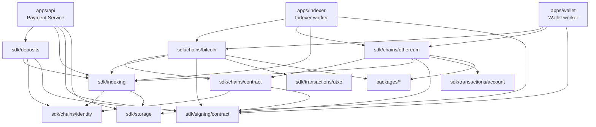

Cargo arrows mean “depends on.” The abstraction order
`storage → indexing → bitcoin` therefore appears in Cargo as
`bitcoin → indexing → storage`.

### 2.2 Mandatory ownership rules

- Everything specific to Bitcoin MUST live under `sdk/chains/bitcoin`.
- Everything specific to Ethereum MUST live under `sdk/chains/ethereum`.
- Deleting the Bitcoin crate MUST remove all Bitcoin-specific RPC, parsing,
  address, transaction, collection, and indexing types.
- Generic signing MUST NOT depend on a chain, transaction, wallet, RPC, or
  indexer type.
- A chain MAY accept `&dyn Signer`; it MUST NOT construct or choose local,
  Trezor, HSM, KMS, or remote signer implementations.
- Concrete HTTP/JSON-RPC methods MUST remain in the concrete chain crate.
- `packages/*` MUST remain usable by non-blockchain projects and MUST NOT
  import `sdk/*`.
- WS MUST be stateless and MUST NOT select or own a database backend.
- IX MUST NOT import deposits, users, accounting, or collection semantics.
- No crate named `core`, `common`, `utils`, `payment-domain`, `payment-ports`,
  or `signing-core` may be introduced as a catch-all.
- No `signing_plan` layer may be introduced. Transactions move through
  builder, unsigned transaction, signature insertion, and signed transaction.
- No flat top-level `crates/` namespace may be reintroduced.

## 3. Runtime components and state ownership

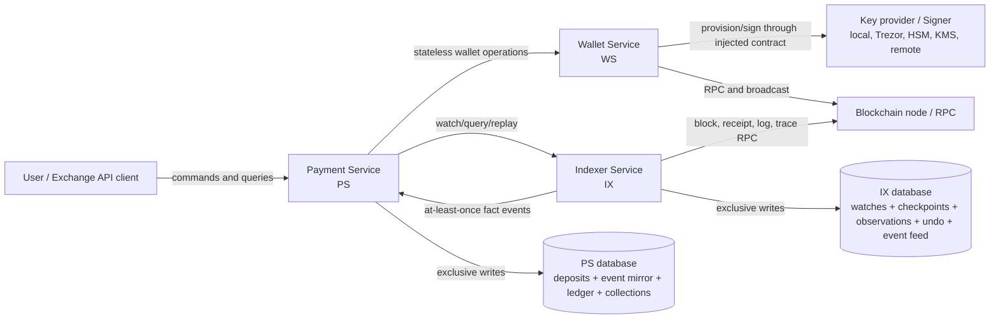

Interfaces are semantic. A call MAY be in-process, HTTP, queue-based, or
another transport. Process placement MUST NOT change ownership semantics.

### 3.1 Payment Service — PS

PS MUST:

- own users, deposits, expected amounts, expirations, and deposit-to-key
  relationships;
- own the append-only mirror of relevant IX events;
- classify raw movements as incoming, collection, gas funding, or other;
- own the absolute balance ledger and business accounting decisions;
- own collection jobs, reservations, legs, retries, and master destinations;
- deduplicate IX replay and all user/business commands;
- expose user-facing deposit/balance/collection APIs; and
- store only key locators/ownership metadata unless a selected custody backend
  explicitly stores encrypted material there.

PS MUST NOT write IX storage.

### 3.2 Wallet Service — WS

WS MUST:

- remain stateless across calls;
- expose a per-chain/per-asset `WalletFactory`/`WalletAdapter` surface;
- generate chain-native addresses using an injected `KeyProvisioner`;
- read balances;
- build unsigned transactions;
- invoke an injected signer and assemble signed chain transactions;
- broadcast transactions;
- read receipts;
- report factual collection prerequisites; and
- perform one collection transaction per call.

WS MUST NOT persist deposits, watches, observation state, ledger balances, or
multi-step collection workflow state.

### 3.3 Indexer Service — IX

IX MUST:

- own a separate database;
- store one canonical checkpoint per chain/network scope;
- persist height, hash, parent hash, and optional timestamp;
- store watches and their earliest relevant height;
- consume blocks in canonical order;
- parse watched transaction effects into normalized facts;
- store current transaction state plus an append-only revision feed;
- track inclusion, proof depth/finality, failure, drop, replacement, and reorg;
- answer transaction queries; and
- emit facts only.

IX MUST NOT label a movement as “incoming deposit,” “sweep,” “user credit,” or
“collection.”

## 4. Shared identifiers and monetary representation

- Service boundaries MUST use stable chain, asset, address, and transaction
  identifiers.
- Concrete chain crates MUST retain their native strongly typed forms.
- Monetary values MUST use integer atomic units, never floating point.
- The cross-chain atomic amount supports an unsigned 256-bit magnitude.
- Asset display precision and symbols are metadata, not part of the amount.
- Transaction observations MUST support multiple movements.
- A UTXO transaction MUST NOT be reduced to a fictitious single
  `from → to → amount` transfer.
- Every movement MUST have a stable movement ID within its transaction.

## 5. Deposit lifecycle requirements

### 5.1 Deposit record

A deposit MUST include at least:

- deposit ID;
- idempotency key;
- user ID;
- asset ID;
- canonical address;
- opaque key locator;
- expected atomic amount;
- birthday block height;
- expiration time;
- creation time; and
- lifecycle state.

Lifecycle states are:

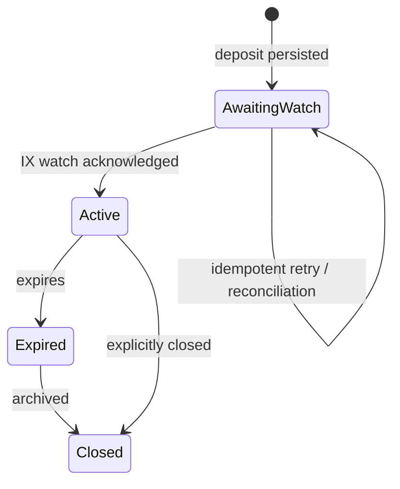

### 5.2 Deposit address generation sequence

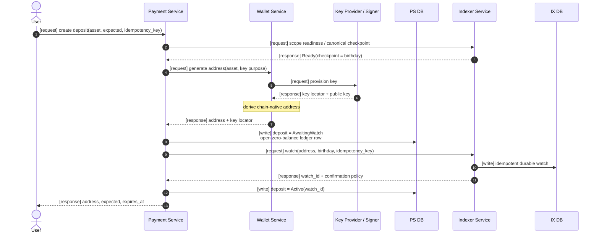

Requirements:

- PS MUST NOT return an address before IX acknowledges the watch.
- PS and IX cannot share a local transaction because their databases are
  separate.
- `AwaitingWatch` MUST be recoverable by an idempotent reconciler.
- Repeating the same IX idempotency key MUST return the same effective watch.
- PS MUST capture the birthday from an IX-owned canonical Ready checkpoint;
  WS MUST NOT invent or return an indexing birthday.
- The birthday MUST be the earliest block that can contain activity.
- Imported addresses MUST provide an explicit historical birthday or request
  a deliberate full rescan.

## 6. Indexing, observation, and confirmation

### 6.1 IX public semantic interface

IX MUST expose:

- `watch(address)`;
- `watch(txid)`;
- `unwatch(watch_id)`;
- `tx(txid)`;
- `txs(address)`;
- chain/network sync status; and
- a cursor-based observation event feed.

The feed MUST be at-least-once and replayable. Push delivery is an adapter over
the durable cursor; it is not the source of truth.

### 6.2 Normalized transaction fact

An observed transaction MUST contain:

- chain and canonical transaction ID;
- monotonically increasing observation revision;
- current transaction status;
- zero or more value movements;
- optional network fee and payer;
- first-seen and current-observation timestamps;
- block identity when included; and
- all matching watch IDs in the emitted event.

### 6.3 Transaction state machine

```mermaid
stateDiagram-v2
    [*] --> Pending: first seen in mempool or submitted watch
    Pending --> Included: canonical block inclusion
    Pending --> Replaced: RBF or nonce replacement wins
    Pending --> Dropped: no longer accepted/visible
    Pending --> Failed: chain reports terminal failure
    Included --> Included: tip advances; depth increases
    Included --> Confirmed: confirmation policy proven
    Included --> Failed: included receipt reports failure
    Included --> Reorged: inclusion block orphaned
    Confirmed --> Reorged: previously proven block orphaned
    Failed --> Reorged: failed inclusion block orphaned
    Reorged --> Pending: transaction returns to mempool
    Reorged --> Included: re-included in canonical branch
    Replaced --> Pending: original transaction becomes viable again
    Dropped --> Pending: observed again
```

The same apparent status MAY occur more than once after reorg/re-inclusion.
Therefore idempotency MUST use event ID and observation revision, not only
`(txid, status)`.

### 6.4 Confirmation policy

Each chain/network scope MUST have an IX-owned confirmation policy:

- minimum confirmation depth;
- whether a chain-native finalized checkpoint is required; or
- both.

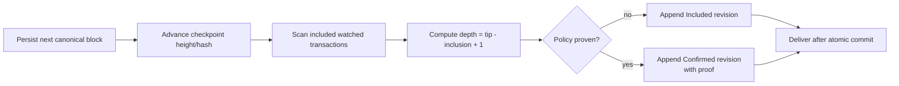

- A caller MUST NOT weaken the policy in `watch`.
- IX MUST re-evaluate included transactions after every checkpoint advance,
  even when the new block contains no watched movements.
- `Included` MAY change PS `received` and current `balance` snapshots.
- Only `Confirmed` MAY advance PS `confirmed` or `collected`.
- User `accounted` changes only through a separate PS command after the
  applicable business confirmation policy is satisfied.

### 6.5 Forward synchronization

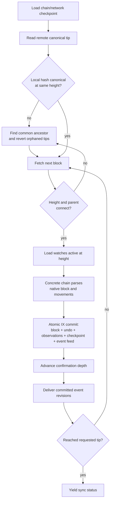

Block fetch MAY be parallelized, but durable connection MUST remain ordered.

### 6.6 Incoming observation sequence

```mermaid
sequenceDiagram
    autonumber
    participant Chain as Chain / Node
    participant IX as Indexer Service
    participant IXDB as IX DB
    participant PS as Payment Service
    participant PSDB as PS DB

    Chain-->>IX: [event] canonical block(height, hash, parent, txs)
    IX->>IXDB: [write] atomic block + undo + checkpoint<br/>transaction = Included + event revision
    IX-->>PS: [event] Included(txid, movements, fee, block, revision)
    PS->>PSDB: [write] append raw event mirror (idempotent)
    Note over PS: classify movement using deposit/collection records
    PS->>PSDB: [write] append absolute ledger row<br/>received/balance may change; confirmed unchanged

    Note over Chain,IX: Later canonical blocks increase proof depth
    Chain-->>IX: [event] deeper block
    IX->>IXDB: [write] checkpoint + Confirmed revision + event
    IX-->>PS: [event] Confirmed(txid, proof, revision)
    PS->>PSDB: [write] append raw event mirror (idempotent)
    PS->>PSDB: [write] append absolute ledger row<br/>confirmed advances

    opt PS business policy authorizes credit
        PS->>PSDB: [write] append Accounting row<br/>accounted changes only
    end
```

### 6.7 Mempool requirements

- Mempool state MUST remain separate from canonical block state.
- A mempool transaction MUST have first-seen/last-seen behavior.
- It MAY be replaced, conflicted, evicted, or dropped.
- Mempool value MUST NOT enter confirmation-qualified accounting.
- UTXO conflicts MUST track multiple transactions spending the same outpoint.
- Account chains MUST track pending nonce replacement/conflicts.

### 6.8 Reorganization sequence

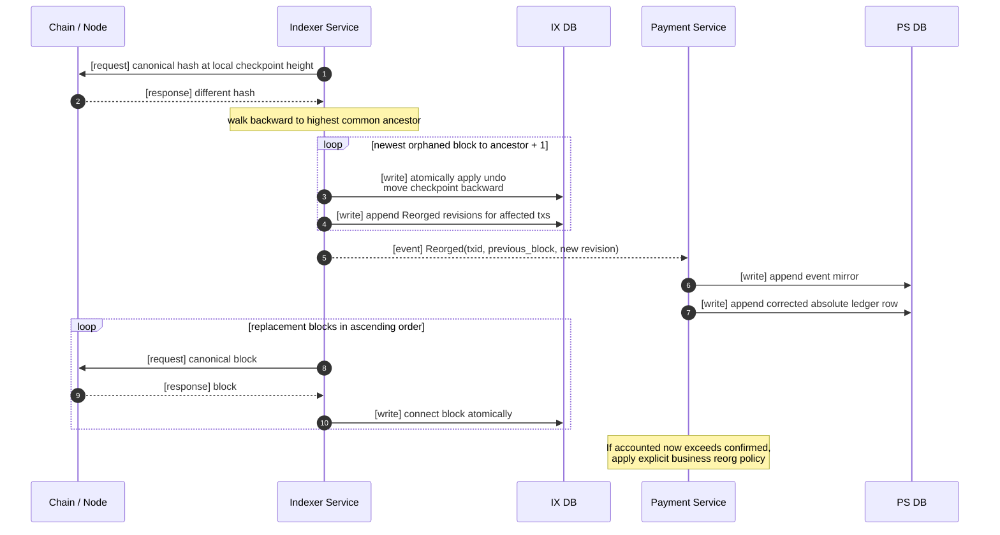

- Earlier IX and PS journal rows MUST NOT be deleted.
- Reorg support MUST have explicit undo retention and maximum recoverable depth.
- A reorg beyond retained undo data MUST trigger a controlled rebuild, not a
  normal retry loop.

## 7. PS event mirror, classification, and absolute ledger

### 7.1 Event mirror

PS MUST store an append-only copy of each relevant IX event before projection.

The mirror MUST:

- deduplicate by IX event ID/revision;
- preserve raw status, movements, fee, and block facts;
- support ordered replay by cursor;
- permit rebuilding ledger projections; and
- remain separate from IX's own event store.

PS MUST also maintain a durable per-deposit observation index as a derived
projection. The index MUST be updated in the same PS batch as the affected
ledger/reconciliation rows and projection cursor, MUST be rebuildable from the
append-only mirror plus PS attribution records, and MUST include relevant
facts that intentionally produce no ledger row, such as native gas funding for
an ERC-20 deposit.

### 7.2 Classification

PS classification MUST consult its own records and produce one or more of:

- `Incoming` — movement credits a known deposit address;
- `Collection` — movement belongs to a PS collection transaction;
- `GasFunding` — movement funds a token collection prerequisite;
- `OtherBalanceChange`; or
- relevant but not yet classified.

One IX transaction MAY classify against multiple deposits, especially a
batched UTXO collection.

### 7.3 Absolute balance journal

The ledger MUST be append-only. Every row MUST contain the complete absolute
state after its cause; rows MUST NOT contain only deltas.

Each row includes:

- ledger entry ID;
- deposit ID;
- previous ledger entry ID;
- exact cause and idempotency identity;
- IX event ID/revision/status when observation-driven;
- PS classification and stable movement IDs;
- absolute balances; and
- recorded timestamp.

Absolute balances are:

| Field | Meaning | Permitted trigger |
|---|---|---|
| `received` | Total canonical included incoming asset value, whether deep or not | Incoming `Included`, re-inclusion, drop/reorg correction |
| `confirmed` | Subset of received that has satisfied IX confirmation/finality policy | Incoming `Confirmed`, confirmed reorg correction |
| `balance` | Current canonical asset value at the deposit address | Any canonical movement or reconciliation affecting the address |
| `collected` | Confirmed gross value removed by PS-owned collection transactions | Collection `Confirmed`, confirmed reorg correction |
| `accounted` | Value credited to the user's business account | Explicit PS accounting command only |

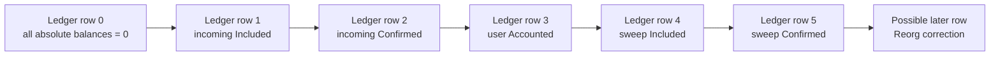

Example for 100 USDT, using display units only for readability:

| Row cause | received | confirmed | balance | collected | accounted |
|---|---:|---:|---:|---:|---:|
| Deposit created | 0 | 0 | 0 | 0 | 0 |
| Incoming included | 100 | 0 | 100 | 0 | 0 |
| Incoming confirmed | 100 | 100 | 100 | 0 | 0 |
| User credited | 100 | 100 | 100 | 0 | 100 |
| Token sweep included | 100 | 100 | 0 | 0 | 100 |
| Token sweep confirmed | 100 | 100 | 0 | 100 | 100 |

The latest row is the current read model. The full row chain is the audit
history. A reorg appends a new lower/corrected absolute snapshot and MUST NOT
modify an earlier row.

### 7.4 Accounting rules and corrections

- `accounted` MUST NOT be changed by an IX event.
- At authorization time, a positive accounting credit MUST NOT exceed
  confirmation-qualified value permitted by business policy.
- A post-credit reorg MAY make `accounted > confirmed`; PS MUST explicitly
  reverse the credit, create debt, or accept the loss according to configured
  business policy.
- Ethereum PS v1 records that response as a typed, idempotent reconciliation
  decision. `ReverseCredit` appends an expected-head accounting correction;
  `AcceptLiability` and `ExternalDebtRecorded` preserve `accounted`, with the
  latter requiring an opaque external reference.
- `received` and `confirmed` are canonical current balances, not permanent
  monotonic lifetime metrics.
- Historical monotonicity is the increasing sequence of immutable ledger rows.
- If needed, `gross_received` MUST be a separate reporting metric.
- `collected` means gross deposit debit, not net master receipt.
- Collection attribution MUST separately retain `master_credit` and
  `allocated_fee`.
- `received ≈ balance + collected` is a reconciliation relation, not an exact
  invariant until fee allocation, dust, unsolicited spending, token taxes,
  rebasing, and reorg state are specified.
- `received - collected - accounted` MUST NOT determine collection readiness.
- Sweepable value MUST use current spendable balance minus pending
  reservations, fee reserve, dust, and chain-specific minimums.

### 7.5 Event replay after restart

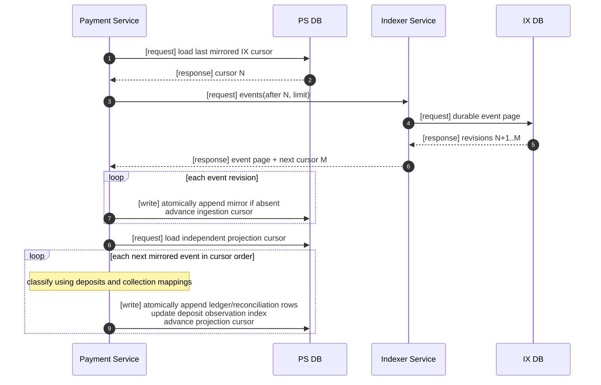

## 8. Collection requirements

### 8.1 Common collection behavior

PS decides **when** to collect. WS knows **how** to construct and broadcast one
chain-specific collection transaction.

Every collection MUST:

- have a durable collection ID and idempotency identity;
- reserve source value before broadcast;
- identify asset and master destination;
- persist one or more durable legs;
- validate a chain-native signed transaction against the active chain ID and
  configured gas/fee ceilings before persistence or broadcast;
- persist the expected transaction ID and exact opaque signed envelope before
  the first broadcast side effect;
- record broadcast transaction IDs;
- call IX `watch(txid)` after broadcast;
- retain the failure window where a transaction ID exists but watch
  registration has not completed;
- update `collected` only after IX confirmation proof;
- release/retry reservations after terminal failure or drop; and
- reverse canonical collection balances after reorg.

Collection modes are:

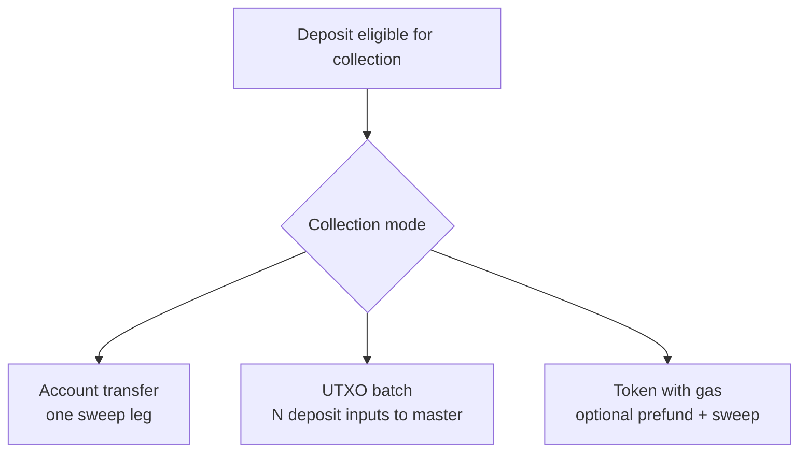

### 8.2 Collection leg state

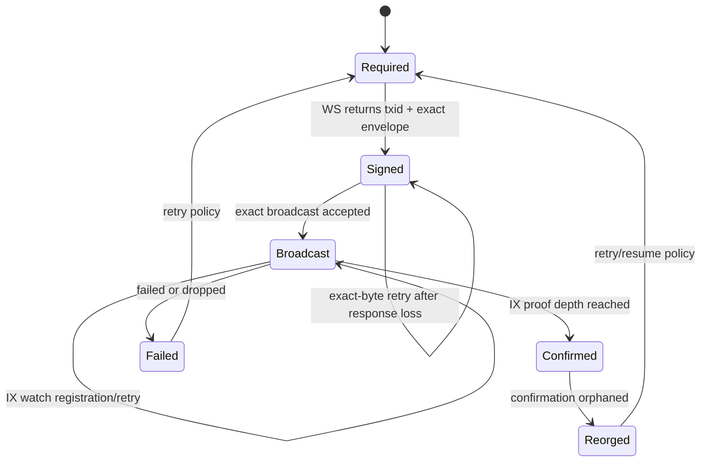

### 8.3 Account/wallet collection

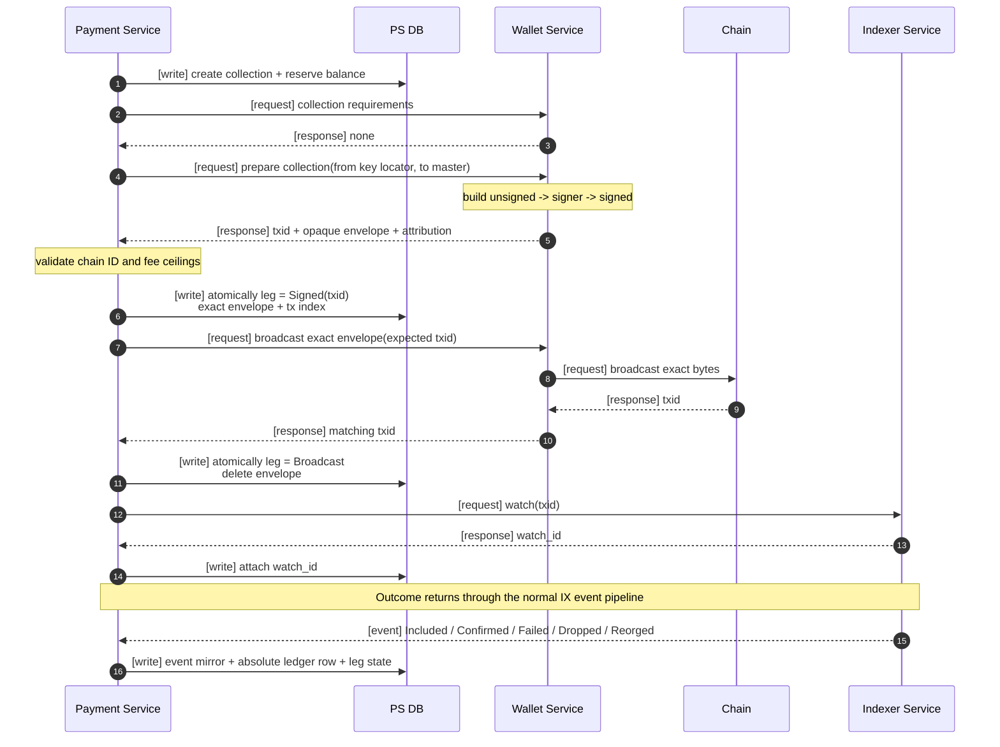

### 8.4 Batched UTXO collection

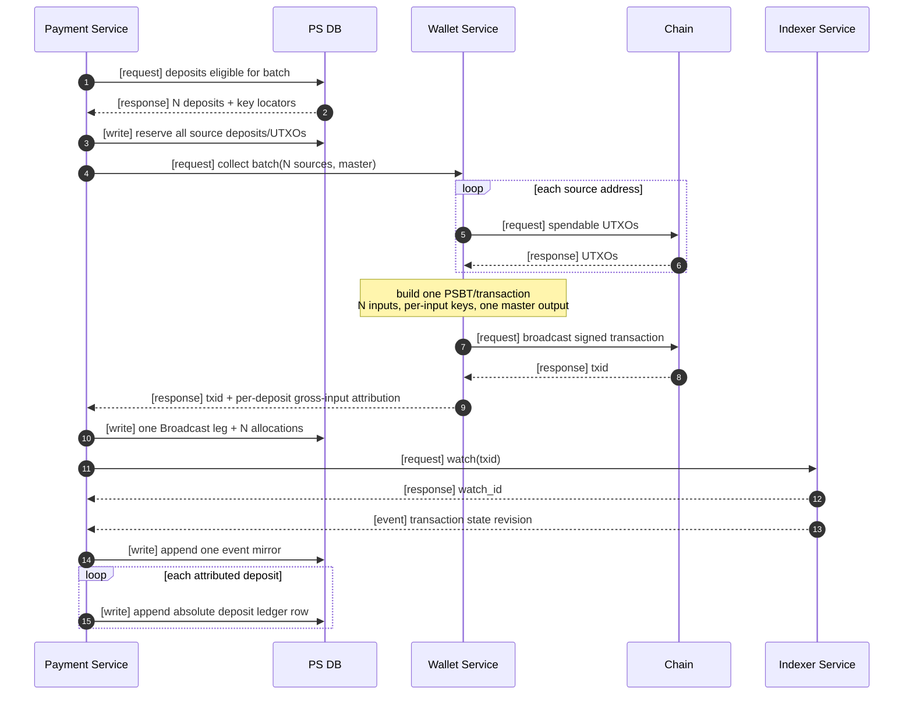

UTXO requirements:

- Input attribution MUST use the amount of the previous output being spent.
- One batch transaction MUST resolve all included deposits consistently.
- The shared network fee MUST have an explicit allocation policy.
- `collected` uses gross deposit input; master receipt is net of shared fee.
- Concurrent jobs MUST NOT select the same reserved outpoint.

### 8.5 ERC-20/token collection with gas

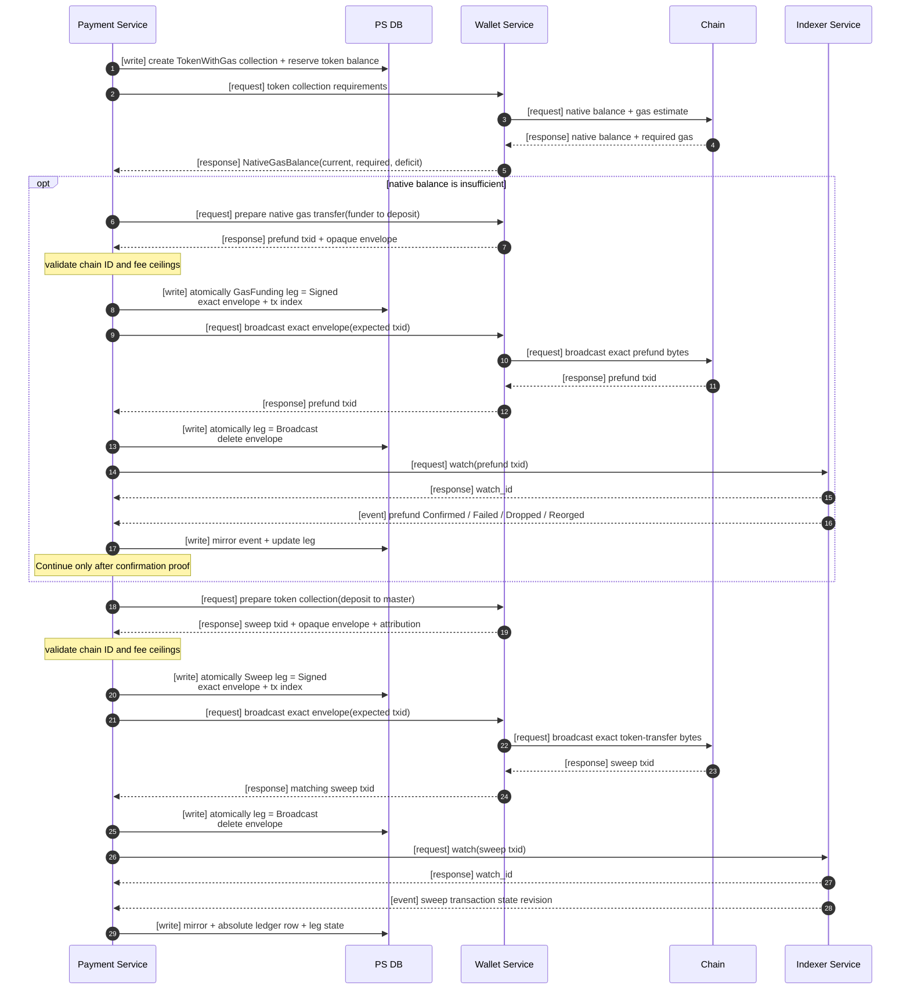

- WS owns calculation and construction for each leg.
- PS owns durable sequencing and MUST NOT rely on WS memory between legs.
- A confirmed prefund followed by a dropped sweep MUST remain visible and
  retryable.
- Token amount and native gas fee MUST be represented as different assets.
- Fee-on-transfer, rebasing, and non-standard token behavior require explicit
  reconciliation policy before production support.

## 9. Transaction construction and signing requirements

### 9.1 Generic transaction flow

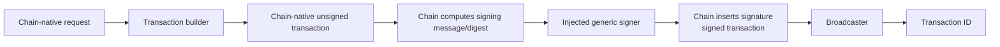

- Signers MUST be selected in application composition.
- The generic signer MUST understand keys, curves, messages/digests, schemes,
  user interaction, and signatures only.
- Bitcoin MUST own sighash computation, scripts, witnesses, consensus encoding,
  PSBT integration, and previous-output requirements.
- Ethereum MUST own chain ID, nonce, gas, EIP-1559 fees, typed envelopes, token
  calldata, receipt interpretation, and trace/log requirements.
- Solana MUST eventually receive a separate chain-native builder; it MUST NOT
  be forced through an Ethereum-shaped account transaction.

### 9.2 Key custody

- PS persists deposit-to-key ownership using an opaque `KeyLocator`.
- Actual secret material belongs to the selected local/Trezor/HSM/KMS/remote
  key provider.
- WS receives a public key and/or locator, not authority to choose custody.
- Process-separated PS and WS require an authenticated signer adapter; they
  MUST NOT serialize a Rust trait object or casually pass plaintext keys.
- Hardware signer availability, rejection, timeout, and required user
  interaction MUST be explicit outcomes.

### 9.3 Trezor limitation

Native Trezor Bitcoin signing is an interactive transaction protocol that may
request inputs, outputs, previous transactions, and replacement data. It is not
equivalent to blind `sign_digest`.

The implementation MUST choose one of:

1. support only raw cryptographic operations through the generic signer;
2. add a higher integration package depending on both Bitcoin and Trezor;
3. define a protocol-neutral interactive signing session; or
4. treat hardware transaction signing as an application workflow.

Bitcoin MUST NOT depend directly on `signer-trezor`, and the base signer MUST
NOT learn Bitcoin transaction types.

## 10. Storage and consistency requirements

### 10.1 Generic storage

The current storage contract provides:

- namespaced keys;
- point reads;
- prefix scans with pagination;
- versions;
- conditional writes; and
- atomic write batches.

No database engine is selected.

### 10.2 IX atomicity

For one connected block, IX SHOULD atomically persist:

- block identity;
- new canonical checkpoint;
- chain-native index effects;
- undo data;
- normalized transaction revisions;
- confirmation-state changes; and
- outgoing event-feed rows.

For one reverted block, inverse effects and checkpoint movement MUST be atomic.

### 10.3 PS consistency

- Event mirror append MUST be idempotent.
- Ledger projection MUST be idempotent by projection ID.
- Ledger append MUST use expected-head optimistic concurrency.
- Each ledger row MUST point to its previous row.
- Accounting commands MUST have independent idempotency keys.
- Collection creation, reservations, leg transitions, and attribution MUST be
  durable.
- A deposit close MUST be conditioned on the exact zero-balance ledger head
  and the absence of active reservations and open reconciliation. Concurrent
  projection, reservation, or reconciliation changes MUST force a retry.
- PS MUST NOT remove a closed deposit's IX address watch unless IX supplies a
  durable cutoff and PS drains projection through that cutoff. Without that
  protocol the watch MUST remain active so late payments stay visible.
- PS MUST persist the expected transaction ID and opaque signed envelope before
  broadcast. A retry after response loss MUST rebroadcast the exact bytes and
  MUST verify that WS/RPC returns the expected hash; it MUST NOT silently
  re-sign the same leg as a fresh transaction.
- A crash between event mirroring and projection MUST be recoverable by replay.
- A crash between broadcast and IX watch registration MUST be recoverable from
  the persisted collection leg and idempotent reconciliation.

## 11. API requirements

Ethereum PS v1 exposes internal exchange-backend JSON/HTTP operations for:

- create deposit;
- retrieve deposit address and expiration;
- retrieve latest absolute deposit balances;
- retrieve deposit ledger history;
- retrieve relevant observation history;
- retrieve collection state and legs;
- initiate/enable collection according to policy;
- apply a user accounting credit/reversal; and
- inspect reconciliation or failure state; and
- resolve reconciliation explicitly as reverse credit, accepted liability, or
  externally recorded debt.

Commands that can outlive one request SHOULD return durable job IDs.

Ethereum PS v1 uses `/v1`, strict JSON, unsigned decimal strings for atomic
amounts, bounded cursor pagination, and separate ordinary and administrator
bearer credentials. The administrator credential MAY use ordinary routes; the
ordinary credential MUST receive `403` on administrator routes. Non-loopback
listeners require trusted upstream TLS termination. Webhooks are excluded.

Every external mutation MUST carry `Idempotency-Key`. PS scopes it by the
authenticated principal and semantic operation and stores a hash of the
canonical request meaning. Exact replay returns the original resource/job IDs;
reuse for different content returns `409`. Server-owned IDs are
lowercase-prefixed UUIDv7 values. Long-running create-deposit, close-deposit,
create-collection, and retry-collection commands return `202` and a durable
job in `queued`, `running`, `waiting_retry`, `succeeded`, or `failed` state.

The Ethereum v1 deployment unit is one PS process with exclusive ownership of
one PS RocksDB path, one Ethereum `IndexScope`, one active policy identity, and
one IX feed. Multiple networks require separate instances/databases until a
future scope-keyed PS persistence design is approved.

The required Ethereum v1 policy supplies both a human-readable network label
and numeric EVM chain ID, asset allowlist, TTL, master destinations, collection
thresholds, gas-funder limit, and ceilings for gas limit, maximum fee per gas,
priority fee per gas, and maximum total fee. These values have no permissive
financial defaults.

## 12. Operational and security requirements

- All externally caused commands MUST be idempotent.
- Event delivery MUST be assumed duplicate and out of order unless ordered by
  the explicit IX cursor.
- Logs MUST NOT contain private keys, seed phrases, raw signer secrets, or
  unredacted custody credentials.
- Chain/node capabilities MUST be detected explicitly.
- Ethereum internal native transfer completeness MUST NOT be claimed without a
  supported trace source and retention guarantee.
- Health status SHOULD expose local checkpoint, remote tip, lag, last advance,
  current reorg depth, and event-delivery lag.
- Confirmation policy changes MUST be versioned and auditable.
- Clock timestamps are metadata; canonical order comes from chain height/hash
  and journal cursor/revision.
- Balance reconciliation jobs SHOULD compare ledger projections with chain
  queries and emit explicit correction/investigation records.
- A node/RPC outage MUST not silently convert unknown state into dropped or
  failed state.

## 13. Remaining open decisions and selected v1 decisions

The questions below remain open for the general multi-chain system unless a
more focused decision record closes them. For Ethereum IX v1,
[`INDEXER_SERVICE.md`](./INDEXER_SERVICE.md) closes the database, transport,
scope, confirmation, reorg, and completeness choices described there.

### 13.1 Wallet and address lifecycle

- Is a wallet one root key, one chain account, one customer, or only a key
  ownership abstraction?
- Are watch-only xpub/public-key wallets supported?
- Which derivation standards and address types are supported per chain?
- Is a birthday height sufficient, or are timestamp and block hash required?
- Are imported addresses supported?
- How are orphaned keys retired if address generation succeeds but PS
  persistence permanently fails?

### 13.2 Index scope and completeness

Ethereum v1 decision: one process and RocksDB path own one scope; all blocks are
downloaded and locally filtered; mempool and traces are unwired; depth 12 is the
confirmation policy; 50 reversible bundles plus one predecessor anchor are
retained; ERC-20 `Transfer` logs are the only token standard indexed. These are
v1 boundaries, not answers for every future chain.

- How are multiple IX workers leased so only one advances a chain/network?
- Are all blocks downloaded and filtered locally, or may a source filter?
- Are mempool deposit notifications required for the first release?
- What confirmation/finality thresholds apply per asset/network?
- What maximum reorg depth and undo retention are required?
- Are Ethereum internal native transfers required?
- Which Ethereum trace API and historical retention guarantees are acceptable?
- Which token standards are supported?
- How are fee-on-transfer and rebasing tokens reconciled?

### 13.3 Bitcoin transaction construction

- Which script types are supported: legacy, nested SegWit, native SegWit,
  Taproot, multisig?
- Is PSBT the durable unsigned/partially signed representation?
- Which coin-selection policies are required?
- How are UTXOs reserved across concurrent collections/withdrawals?
- When is a change address allocated and may it be reused?
- What fee ceilings and dust rules apply?
- Are RBF, CPFP, rebroadcast, and fee bump workflows required?

### 13.4 Account transaction construction

- Which Ethereum envelope types are required?
- How are nonces reserved across concurrent transactions?
- Are replacement, cancellation, and fee bump workflows required?
- Is transaction building synchronous from indexed state or allowed to query
  RPC during the request?

### 13.5 Signing and custody

- Can one transaction require multiple signers or partial signatures?
- Does one signer instance own many keys addressed by `KeyLocator`?
- Which curves, schemes, and signature encodings are required?
- Must signers display or attest transaction intent?
- What timeout, cancellation, retry, and user-rejection behavior is required?
- Which Trezor integration option from section 9.3 is selected?

### 13.6 Storage

Ethereum v1 decision: semantic IX commands compose over the generic `Storage`
contract and commit through a serialized RocksDB 0.24 writer. One synchronous
WAL-backed batch contains block effects, observations, events, checkpoint, and
retention changes. Records have explicit versions; migrations, backup, and
generation-based rebuild fail closed.

Ethereum PS v1 separately binds its RocksDB database to the PS owner, schema
v2, one Ethereum scope, numeric chain ID through policy, and active policy
identity. `migrate` requires and verifies a physical backup, validates semantic
records and references, rebuilds supplementary indexes, and binds metadata
only after validation succeeds. These are v1 selections, not mandatory
backends for every future deployment.

- Is the atomic key/value contract sufficient, or should implementations expose
  only semantic repositories?
- What isolation and durability guarantees are mandatory?
- Must IX block commit, observation update, and event feed share one physical
  transaction?
- How are schema versions and migrations represented?
- Which backup, restore, and rebuild procedures are required?

### 13.7 Deposit accounting

Ethereum v1 decision: a post-credit reorg preserves `accounted`, corrects the
canonical snapshot, creates an open durable `PostCreditReorg` reconciliation
case, and blocks automatic credit/collection until explicit resolution.

- Which assets can derive balance completely from events and which require
  periodic direct balance queries?
- How is shared Bitcoin fee allocated across deposits?
- What exact reconciliation drift is permitted?
- What is the business response to a post-credit reorg?
- Is IX `Confirmed` sufficient to credit a user, or does PS require a stronger
  policy?
- What reservation model prevents duplicate collection?

### 13.8 Application topology and delivery

Ethereum v1 decision: `apps/indexer` supervises IX synchronization, reorg, and
fact delivery. `apps/api` supervises PS HTTP, durable jobs, watch
reconciliation, IX mirroring, business projection, expiration, collection,
readiness, and maintenance over a separate PS database. IX delivery is
at-least-once with a cursor; command and semantic effects are idempotent. PS
classification precedence is durable collection mapping, gas-funding mapping,
incoming movement to a known deposit, then other balance change. A relevant
unresolved fact stops projection/readiness rather than being silently skipped.

- Are reconciliation and delivery loops inside existing apps or separate
  executables?
- Which commands return jobs versus immediate results?
- What external deposit and collection status model is exposed?
- Which delivery paths require exactly-once effects versus at-least-once
  transport plus idempotency?
- Are webhooks required, and how are they authenticated/retried?

## 14. Contract and implementation traceability

| Requirement area | Rust location |
|---|---|
| Chain identity and atomic value | `sdk/chains/identity` |
| Stateless wallet capabilities/factory | `sdk/chains/contract` |
| Generic signer/key provisioning | `sdk/signing/contract` |
| Bitcoin transactions/indexing/collection | `sdk/chains/bitcoin` |
| Ethereum transactions/indexing/collection | `sdk/chains/ethereum` |
| Generic block sync/reorg/finality | `sdk/indexing` |
| IX public watch/query/event surface | `sdk/indexing::service` |
| IX fact and transaction state model | `sdk/indexing::observation` |
| PS deposits/event mirror/ledger | `sdk/deposits` |
| PS durable collection workflow | `sdk/deposits::collection` |
| Ethereum PS API and workers | `apps/api` |
| PS users/jobs/reconciliation/migration | `sdk/deposits::{user,job,reconciliation,metadata,migration}` |
| Stateless authenticated Ethereum WS | `apps/wallet`, `sdk/signing/remote` |
| Backend-independent storage mechanics | `sdk/storage` |
| Generic UTXO construction | `sdk/transactions/utxo` |
| Narrow account construction | `sdk/transactions/account` |
| Generic HTTP/JSON-RPC/transport | `packages/*` |

## 15. Structural acceptance criteria

The contract phase is structurally accepted when:

- the full workspace compiles;
- all chain-specific types disappear when their concrete chain crate is
  removed;
- packages import no SDK or chain crate;
- generic signing imports no chain crate;
- indexing imports no deposit/accounting crate;
- WS selects no database backend;
- IX and PS persistence contracts are distinct;
- both address and transaction-ID watches are representable;
- transaction facts support multiple movements and stable revisions;
- confirmation depth/finality is explicit and persisted per chain/network;
- PS can represent included, confirmed, collected, and accounted balances as
  immutable absolute ledger rows;
- UTXO collection can attribute one transaction to multiple deposits;
- token collection can persist gas-funding and sweep legs; and
- reorg and replay paths can append corrective state without deleting history.

Behavioral acceptance requires proportionate store, parser, worker,
failure-window, and live-environment evidence. The existence of the concrete
Ethereum v1 source slices does not make that evidence automatic.

## 16. Related documents

- [`ARCHITECTURE.md`](../ARCHITECTURE.md) — concise ownership and dependency rules.
- [`FEATURE_VALIDATION.md`](./FEATURE_VALIDATION.md) — original-design traceability and corrections.
- [`CONTRACTS.md`](./CONTRACTS.md) — current Rust trait walkthrough.
- [`INDEXING.md`](./INDEXING.md) — focused synchronization and reorg design.
- [`RESEARCH.md`](./RESEARCH.md) — Alloy, BDK, Blockbook, NBXplorer,
  BTCPay, SHKeeper, Trezor, and Solana findings.
- [`REQUIREMENTS.md`](./REQUIREMENTS.md) — compact open-decision checklist.
