# Crypto Deposit System — consolidated requirements

## Document status

This is the canonical requirements baseline for the contract-first redesign
and its first Ethereum and Bitcoin service implementations.
It gathers the product flows, service boundaries, folder rules, persistence
semantics, accounting corrections, acceptance criteria, and unresolved
decisions in one place.

The durable Bitcoin and Ethereum indexer runtime, stateless wallet runtime,
concrete wallets, and configured payment runtime are implemented. A
cross-service Ethereum acceptance test composes wallet/signing, RPC broadcast,
Indexer HTTP, Payment HTTP, reconciliation, restart, and reorg correction over
real temporary RocksDB databases. Code and tests, not trait presence or
documentation, determine completeness. The Payment binary optionally composes
one finite Bitcoin-native, Ethereum-native, or ERC-20 deposit scope and requires
bearer authentication; TLS termination remains external. That singular scope
supports authenticated collection planning from durable ledger and canonical
Indexer evidence; multiple deposit scopes are not composed. The workspace has no
production custody process and therefore does not claim a production exchange/
payment-gateway deployment, production custody, HA, or multi-network payment
ownership.

The words **MUST**, **MUST NOT**, **SHOULD**, and **MAY** express requirement
strength.

## 1. Goal and scope

The system is a crypto deposit and collection subsystem for an exchange. It
must:

1. generate a dedicated deposit address for an asset;
2. observe every relevant on-chain transaction from the address birthday;
3. distinguish inclusion from accounting-grade confirmation/finality;
4. preserve a replayable history of every observation state transition;
5. project observations into an auditable per-deposit balance ledger;
6. credit users only through an explicit Payment Service decision;
7. collect funds from deposit addresses into a master destination;
8. support account transfers, batched UTXO collection, and tokens requiring
   native gas funding;
9. recover from restarts, duplicate delivery, dropped transactions,
   replacements, and chain reorganizations; and
10. keep concrete chain logic removable and isolated inside its chain crate.

The generic requirements do not impose one backend on every deployment. The
approved Ethereum v1 IX/PS slice selects RocksDB and Axum at the application
composition boundary; custody, message broker, and future backend choices
remain open.

## 2. Architectural layers and repository structure

```text
apps/
├── api/                           Payment Service composition root
├── indexer/                       Indexer Service composition root
└── wallet/                        stateless Wallet Service composition root

sdk/
├── chains/
│   ├── base/                      approved neutral values, signing and transaction contracts
│   ├── bitcoin/                   all Bitcoin-specific logic and types
│   └── ethereum/                  all Ethereum-specific logic and types
├── deposits/                      PS deposit, ledger, event, collection contracts
├── indexing/                      generic sync, watch, fact, finality contracts
│   ├── http/                      chain-neutral remote consumer adapter
│   └── rocksdb/                   semantic RocksDB repository implementation
└── wallets/                       protocol-neutral wallet/provider composition

packages/
├── crypto/                        reusable cryptographic mechanisms and values
├── http/                          transferable HTTP wrapper
├── json-rpc/                      transferable JSON-RPC framing
├── storage/                       backend-independent atomic storage mechanics
└── design-lint/                   repository design validation

reference/                         ignored upstream research checkouts
old/                               recoverable previous workspace
```

### 2.1 Dependency direction

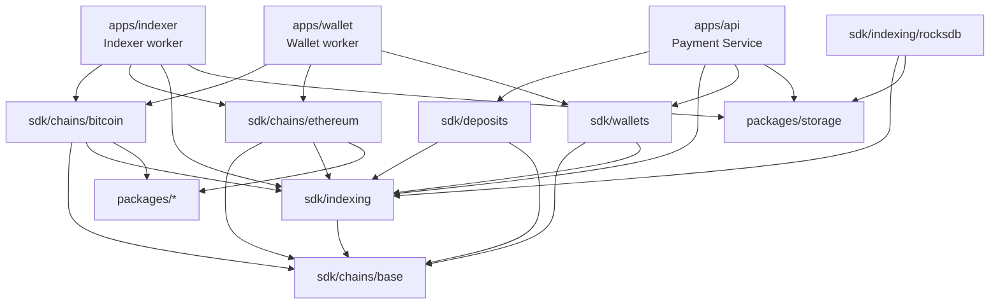

Cargo arrows mean “depends on.” The abstraction order
`storage → indexing → bitcoin` therefore appears in Cargo as
`bitcoin → indexing → storage`.

### 2.2 Mandatory ownership rules

- Everything specific to Bitcoin MUST live under `sdk/chains/bitcoin`.
- Everything specific to Ethereum MUST live under `sdk/chains/ethereum`.
- Deleting the Bitcoin crate MUST remove all Bitcoin-specific RPC, parsing,
  address, transaction, collection, and indexing types.
- Generic signing MUST NOT depend on a chain, transaction, wallet, RPC, or
  indexer type.
- A chain MAY accept `&dyn Signer`; it MUST NOT construct or choose local,
  Trezor, HSM, KMS, or remote signer implementations.
- Concrete HTTP/JSON-RPC methods MUST remain in the concrete chain crate.
- `packages/*` MUST remain usable by non-blockchain projects and MUST NOT
  import `sdk/*`.
- `packages/crypto` MUST NOT contain chain names, address formats, transaction
  rules, RPC methods, wallet behavior, asset units, or custody policy.
- Each concrete chain MUST own its RPC wrapper below that chain's `src/rpc/`
  directory. The wrappers MAY use different upstream clients and DTOs; no
  cross-chain RPC trait is required.
- WS MUST be stateless and MUST NOT select or own a database backend.
- IX MUST NOT import deposits, users, accounting, or collection semantics.
- No crate named `core`, `common`, `utils`, `payment-domain`, `payment-ports`,
  or `signing-core` may be introduced as a catch-all.
- No `signing_plan` layer may be introduced. Transactions move through
  builder, unsigned transaction, signature insertion, and signed transaction.
- No flat top-level `crates/` namespace may be reintroduced.

## 3. Runtime components and state ownership

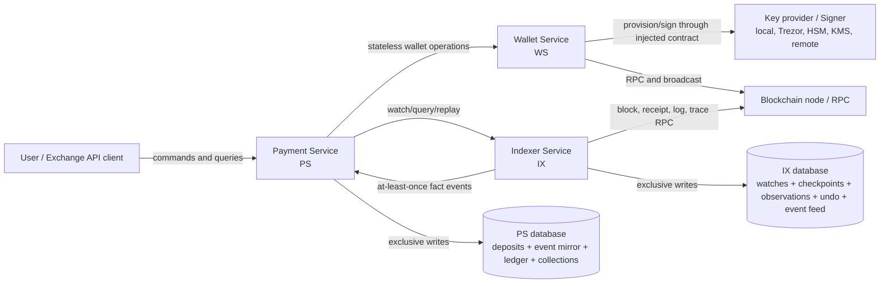

Interfaces are semantic. A call MAY be in-process, HTTP, queue-based, or
another transport. Process placement MUST NOT change ownership semantics.

### 3.1 Payment Service — PS

PS MUST:

- own users, deposits, expected amounts, expirations, and deposit-to-key
  relationships;
- own the append-only mirror of relevant IX events;
- classify raw movements as incoming, collection, gas funding, or other;
- own the absolute balance ledger and business accounting decisions;
- own collection jobs, reservations, legs, retries, and master destinations;
- deduplicate IX replay and all user/business commands;
- expose user-facing deposit/balance/collection APIs; and
- store only key locators/ownership metadata unless a selected custody backend
  explicitly stores encrypted material there.

PS MUST NOT write IX storage.

### 3.2 Wallet Service — WS

WS MUST:

- remain stateless across calls;
- expose the small `Addresser`, `AddressFormat`, `AmountFormat`,
  `BalanceReader`, `TransactionFactory`, `CollectionFactory`, `Sweeper`,
  `TransactionRestore`, and `HistoryReader` capabilities through
  `wallets::Wallet`;
- construct concrete wallets through application-registered `Provider` values;
- keep chain-native address derivation and validation in the concrete chain;
- build and serialize chain-native transaction snapshots;
- return a durable exact `SignedTransaction` before broadcast;
- expose broadcast as a separate one-method capability; and
- obtain transaction history and confirmation from indexing rather than
  polling a receipt waiter;
- perform one collection transaction per call.
- require authentication on every non-health runtime route;
- separate preparation from broadcast so the exact signed transaction can be
  persisted before the external effect; and
- accept transaction-addressed retries only with the caller's same serialized
  signed transaction, without rebuilding or re-signing it.

For selected-output collection, a wallet MAY expose `Collector`. Its generic
inputs MUST contain only source wallets, stable output identities, exact
scale-zero native atomic reservation amounts, and a destination. Chain scripts
and spend evidence MUST remain in the concrete chain. Preparation MUST return
the exact signed transaction and factual scale-zero fee without applying
business allocation policy.

For account-model collection, a wallet MAY implement the one-method
`Sweeper::sweep(destination)` capability. Native-asset sweeping MUST reserve a
checked fee ceiling before choosing the transferred value. Token sweeping MAY
transfer the full token balance only when the wallet independently verifies
that its native balance covers the fee ceiling. The capability MUST return the
exact signed transaction and its scale-zero fee ceiling; application policy
and factual post-confirmation allocation remain outside the wallet. PS MUST
persist that ceiling with the signed leg before broadcast and MUST reject an
observed fee above it. When actual gas or effective price is lower, the
remaining native balance is factual and eligible for a later collection; the
ceiling MUST NOT be accounted as if it were the receipt fee.

WS MUST NOT persist deposits, watches, observation state, ledger balances, or
multi-step collection workflow state.
It also MUST NOT claim durable idempotency-key deduplication: that state belongs
to PS. Its broadcast retry semantics derive from resubmitting the same signed
envelope under its canonical transaction ID.

### 3.3 Indexer Service — IX

IX MUST:

- own a separate database;
- store one canonical checkpoint per chain/network scope;
- persist height, hash, parent hash, and optional timestamp;
- store watches and their earliest relevant height;
- consume blocks in canonical order;
- parse watched transaction effects into normalized facts;
- store current transaction state plus an append-only revision feed;
- track inclusion, proof depth/finality, failure, drop, replacement, and reorg;
- answer transaction queries; and
- emit facts only.

IX MUST NOT label a movement as “incoming deposit,” “sweep,” “user credit,” or
“collection.”

Bitcoin IX v1 is an explicit block-only subset: it emits included, confirmed,
and reorg revisions but does not claim mempool drop, conflict, or replacement
coverage. Those generic lifecycle requirements remain mandatory for a future
mempool-capable Bitcoin release.

## 4. Shared identifiers and monetary representation

- Service boundaries MUST use stable chain, asset, address, and transaction
  identifiers.
- Concrete chain crates MUST retain their native strongly typed forms.
- Monetary values MUST use integer atomic units, never floating point.
- `base::Decimal` is the sole cross-chain monetary representation and MUST retain
  arbitrary-precision exact base-10 values without floating point.
- Concrete chain boundaries MUST validate non-negativity, supported precision,
  and native integer range when converting `Decimal` to atomic units.
- Asset display precision and symbols are metadata, not a second amount type.
- Transaction observations MUST support multiple movements.
- A UTXO transaction MUST NOT be reduced to a fictitious single
  `from → to → amount` transfer.
- Every movement MUST have a stable movement ID within its transaction.

## 5. Deposit lifecycle requirements

### 5.1 Deposit record

A deposit MUST include at least:

- deposit ID;
- idempotency key;
- user ID;
- asset ID;
- canonical address;
- the canonical address's complete chain/network scope;
- opaque key locator;
- expected exact amount;
- birthday block height;
- expiration time;
- creation time; and
- lifecycle state.

Lifecycle states are:

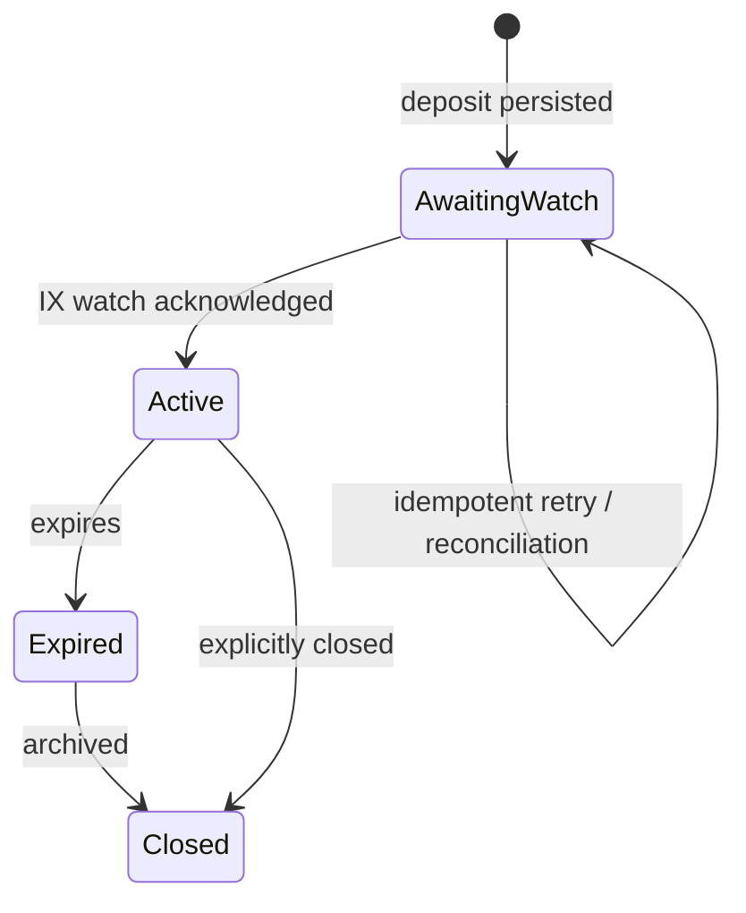

### 5.2 Deposit address generation sequence

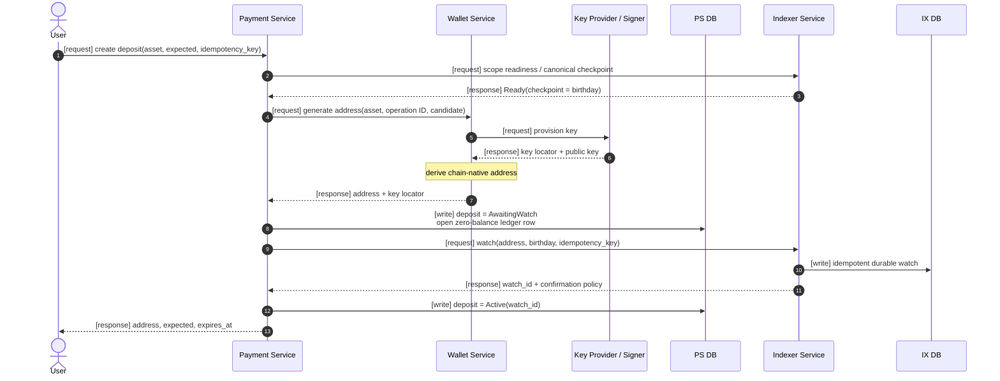

Requirements:

- PS MUST NOT return an address before IX acknowledges the watch.
- Deposit-address selection is server-owned. A caller MUST NOT select key
  purpose or key material. Independent deposits MUST receive different
  canonical addresses; an idempotent retry of one deposit MUST retain its
  exact address, key identity, birthday, and watch request.
- A finite configured address source MUST resolve candidates deterministically
  and report exhaustion explicitly. PS MAY skip a candidate already owned by
  another durable deposit, but MUST rely on the repository's atomic address
  uniqueness check to resolve concurrent allocation safely.
- PS and IX cannot share a local transaction because their databases are
  separate.
- `AwaitingWatch` MUST be recoverable by an idempotent reconciler.
- Repeating the same IX idempotency key MUST return the same effective watch.
- PS MUST capture the birthday from an IX-owned canonical Ready checkpoint;
  WS MUST NOT invent or return an indexing birthday.
- The birthday MUST be the earliest block that can contain activity.
- Imported addresses MUST provide an explicit historical birthday or request
  a deliberate full rescan.

## 6. Indexing, observation, and confirmation

### 6.1 IX public semantic interface

IX MUST expose:

- `watch(address)`;
- `watch(txid)`;
- `unwatch(watch_id)`;
- `tx(txid)`;
- `txs(address)`;
- chain/network sync status; and
- a cursor-based observation event feed.

The feed MUST be at-least-once and replayable. Push delivery is an adapter over
the durable cursor; it is not the source of truth.

### 6.2 Normalized transaction fact

An observed transaction MUST contain:

- chain and canonical transaction ID;
- monotonically increasing observation revision;
- current transaction status;
- zero or more value movements;
- optional network fee and payer;
- first-seen and current-observation timestamps;
- block identity when included; and
- all matching watch IDs in the emitted event.

### 6.3 Transaction state machine

```mermaid
stateDiagram-v2
    [*] --> Pending: first seen in mempool or submitted watch
    Pending --> Included: canonical block inclusion
    Pending --> Replaced: RBF or nonce replacement wins
    Pending --> Dropped: no longer accepted/visible
    Pending --> Failed: chain reports terminal failure
    Included --> Included: tip advances; depth increases
    Included --> Confirmed: confirmation policy proven
    Included --> Failed: included receipt reports failure
    Included --> Reorged: inclusion block orphaned
    Confirmed --> Reorged: previously proven block orphaned
    Failed --> Reorged: failed inclusion block orphaned
    Reorged --> Pending: transaction returns to mempool
    Reorged --> Included: re-included in canonical branch
    Replaced --> Pending: original transaction becomes viable again
    Dropped --> Pending: observed again
```

The same apparent status MAY occur more than once after reorg/re-inclusion.
Therefore idempotency MUST use event ID and observation revision, not only
`(txid, status)`.

### 6.4 Confirmation policy

Each chain/network scope MUST have an IX-owned confirmation policy:

- minimum confirmation depth;
- whether a chain-native finalized checkpoint is required; or
- both.

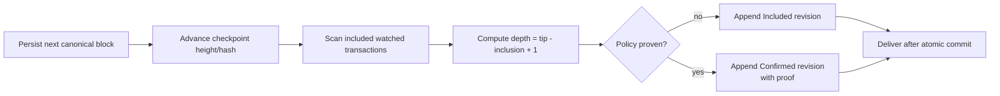

- A caller MUST NOT weaken the policy in `watch`.
- IX MUST re-evaluate included transactions after every checkpoint advance,
  even when the new block contains no watched movements.
- `Included` MAY change PS `received` and current `balance` snapshots.
- Only `Confirmed` MAY advance PS `confirmed` or `collected`.
- User `accounted` changes only through a separate PS command after the
  applicable business confirmation policy is satisfied.

### 6.5 Forward synchronization

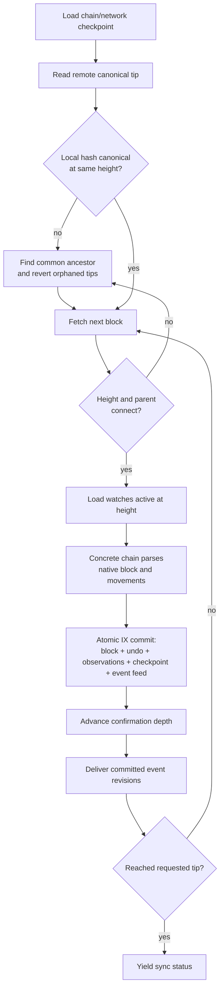

Block fetch MAY be parallelized, but durable connection MUST remain ordered.

### 6.6 Incoming observation sequence

```mermaid
sequenceDiagram
    autonumber
    participant Chain as Chain / Node
    participant IX as Indexer Service
    participant IXDB as IX DB
    participant PS as Payment Service
    participant PSDB as PS DB

    Chain-->>IX: [event] canonical block(height, hash, parent, txs)
    IX->>IXDB: [write] atomic block + undo + checkpoint<br/>transaction = Included + event revision
    IX-->>PS: [event] Included(txid, movements, fee, block, revision)
    PS->>PSDB: [write] append raw event mirror (idempotent)
    Note over PS: classify movement using deposit/collection records
    PS->>PSDB: [write] append absolute ledger row<br/>received/balance may change; confirmed unchanged

    Note over Chain,IX: Later canonical blocks increase proof depth
    Chain-->>IX: [event] deeper block
    IX->>IXDB: [write] checkpoint + Confirmed revision + event
    IX-->>PS: [event] Confirmed(txid, proof, revision)
    PS->>PSDB: [write] append raw event mirror (idempotent)
    PS->>PSDB: [write] append absolute ledger row<br/>confirmed advances

    opt PS business policy authorizes credit
        PS->>PSDB: [write] append Accounting row<br/>accounted changes only
    end
```

### 6.7 Mempool requirements

- Mempool state MUST remain separate from canonical block state.
- A mempool transaction MUST have first-seen/last-seen behavior.
- It MAY be replaced, conflicted, evicted, or dropped.
- Mempool value MUST NOT enter confirmation-qualified accounting.
- UTXO conflicts MUST track multiple transactions spending the same outpoint.
- Account chains MUST track pending nonce replacement/conflicts.

### 6.8 Reorganization sequence

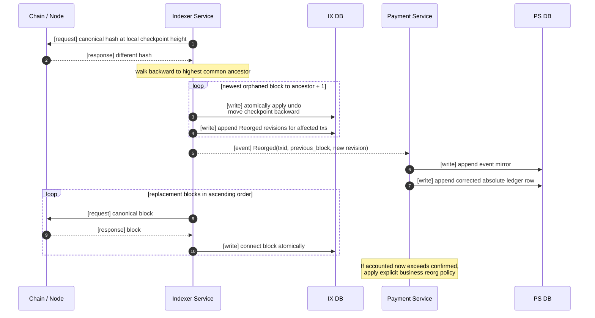

- Earlier IX and PS journal rows MUST NOT be deleted.
- Reorg support MUST have explicit undo retention and maximum recoverable depth.
- A reorg beyond retained undo data MUST trigger a controlled rebuild, not a
  normal retry loop.

## 7. PS event mirror, classification, and absolute ledger

### 7.1 Event mirror

PS MUST store an append-only copy of each relevant IX event before projection.

The mirror MUST:

- deduplicate by IX event ID/revision;
- preserve raw status, movements, fee, and block facts;
- support ordered replay by cursor;
- permit rebuilding ledger projections; and
- remain separate from IX's own event store.

PS MUST also maintain a durable per-deposit observation index as a derived
projection. The index MUST be updated in the same PS batch as the affected
ledger/reconciliation rows and projection cursor, MUST be rebuildable from the
append-only mirror plus PS attribution records, and MUST include relevant
facts that intentionally produce no ledger row, such as native gas funding for
an ERC-20 deposit.

### 7.2 Classification

PS classification MUST consult its own records and produce one or more of:

- `Incoming` — movement credits a known deposit address;
- `Collection` — movement belongs to a PS collection transaction;
- `GasFunding` — movement funds a token collection prerequisite;
- `OtherBalanceChange`; or
- relevant but not yet classified.

One IX transaction MAY classify against multiple deposits, especially a
batched UTXO collection.

### 7.3 Absolute balance journal

The ledger MUST be append-only. Every row MUST contain the complete absolute
state after its cause; rows MUST NOT contain only deltas.

Each row includes:

- ledger entry ID;
- deposit ID;
- previous ledger entry ID;
- exact cause and idempotency identity;
- IX event ID/revision/status when observation-driven;
- PS classification and stable movement IDs;
- absolute balances; and
- recorded timestamp.

Absolute balances are:

| Field | Meaning | Permitted trigger |
|---|---|---|
| `received` | Total canonical included incoming asset value, whether deep or not | Incoming `Included`, re-inclusion, drop/reorg correction |
| `confirmed` | Subset of received that has satisfied IX confirmation/finality policy | Incoming `Confirmed`, confirmed reorg correction |
| `balance` | Current canonical asset value at the deposit address | Any canonical movement or reconciliation affecting the address |
| `collected` | Confirmed gross value removed by PS-owned collection transactions | Collection `Confirmed`, confirmed reorg correction |
| `accounted` | Value credited to the user's business account | Explicit PS accounting command only |

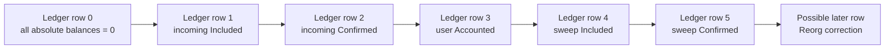

Example for 100 USDT, using display units only for readability:

| Row cause | received | confirmed | balance | collected | accounted |
|---|---:|---:|---:|---:|---:|
| Deposit created | 0 | 0 | 0 | 0 | 0 |
| Incoming included | 100 | 0 | 100 | 0 | 0 |
| Incoming confirmed | 100 | 100 | 100 | 0 | 0 |
| User credited | 100 | 100 | 100 | 0 | 100 |
| Token sweep included | 100 | 100 | 0 | 0 | 100 |
| Token sweep confirmed | 100 | 100 | 0 | 100 | 100 |

The latest row is the current read model. The full row chain is the audit
history. A reorg appends a new lower/corrected absolute snapshot and MUST NOT
modify an earlier row.

### 7.4 Accounting rules and corrections

- `accounted` MUST NOT be changed by an IX event.
- At authorization time, a positive accounting credit MUST NOT exceed
  confirmation-qualified value permitted by business policy.
- A post-credit reorg MAY make `accounted > confirmed`; PS MUST explicitly
  reverse the credit, create debt, or accept the loss according to configured
  business policy.
- Ethereum PS v1 records that response as a typed, idempotent reconciliation
  decision. `ReverseCredit` appends an expected-head accounting correction;
  `AcceptLiability` and `ExternalDebtRecorded` preserve `accounted`, with the
  latter requiring an opaque external reference.
- `received` and `confirmed` are canonical current balances, not permanent
  monotonic lifetime metrics.
- Historical monotonicity is the increasing sequence of immutable ledger rows.
- If needed, `gross_received` MUST be a separate reporting metric.
- `collected` means gross deposit debit, not net master receipt.
- Collection attribution MUST separately retain `master_credit` and
  `allocated_fee`.
- `received ≈ balance + collected` is a reconciliation relation, not an exact
  invariant until fee allocation, dust, unsolicited spending, token taxes,
  rebasing, and reorg state are specified.
- `received - collected - accounted` MUST NOT determine collection readiness.
- Sweepable value MUST use current spendable balance minus pending
  reservations, fee reserve, dust, and chain-specific minimums.

### 7.5 Event replay after restart

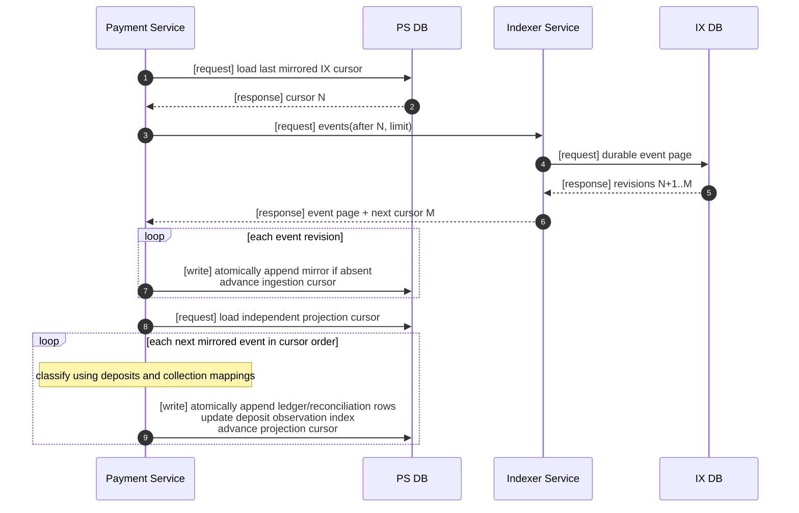

## 8. Collection requirements

### 8.1 Common collection behavior

PS decides **when** to collect. WS knows **how** to construct and broadcast one
chain-specific collection transaction.

Every collection MUST:

- have a durable collection ID and idempotency identity;
- reserve source value before broadcast;
- identify asset and master destination;
- persist one or more durable legs;
- validate a chain-native signed transaction against the active chain ID and
  configured gas/fee ceilings before persistence or broadcast;
- persist the expected transaction ID and exact opaque signed envelope before
  the first broadcast side effect;
- record broadcast transaction IDs;
- call idempotent IX `watch(txid)` before broadcast and durably attach its
  receipt after the accepted broadcast transition; repeating after an
  ambiguous response MUST use the same idempotency key;
- retain the exact signed envelope after submission so an explicit retry can
  rebroadcast identical bytes without rebuilding or signing again;
- update `collected` only after IX confirmation proof;
- release or retry reservations only after a chain-specific proven-safe
  transition; Bitcoin UTXO-batch v1 exposes retry but no generic failure or
  release transition; and
- reverse canonical collection balances after reorg.

`POST /v1/collections` accepts only durable collection/job IDs, deposit IDs,
and a timestamp. Scope, asset, transaction model, master destination, policy,
amount, and UTXO evidence are application-bound or loaded from PS/IX state.
For UTXO batches the planner reads each active deposit and ledger head,
requires one stable canonical output snapshot, derives exact outpoint
reservations, and atomically fences every participant and resource.

Collection modes are:

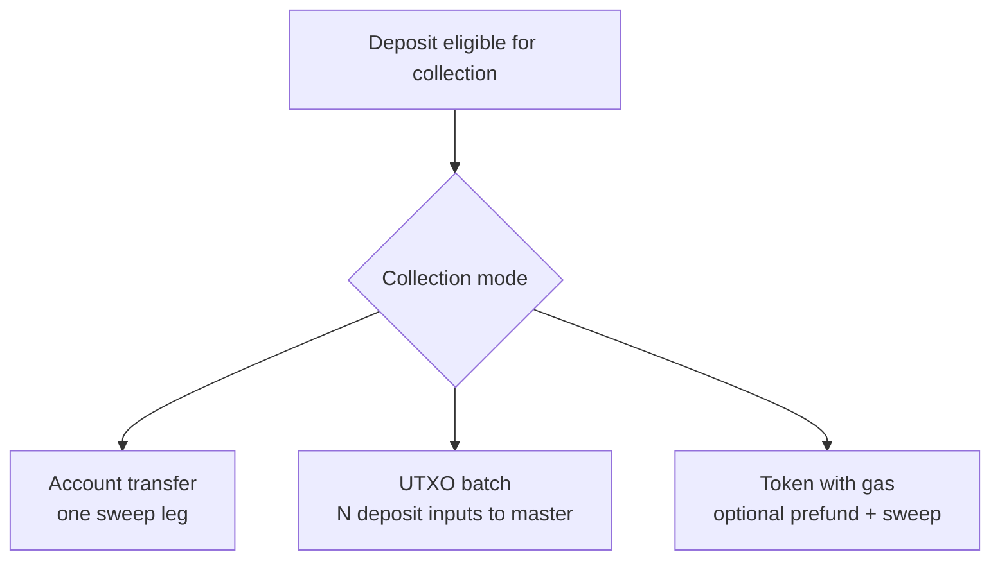

### 8.2 Collection leg state

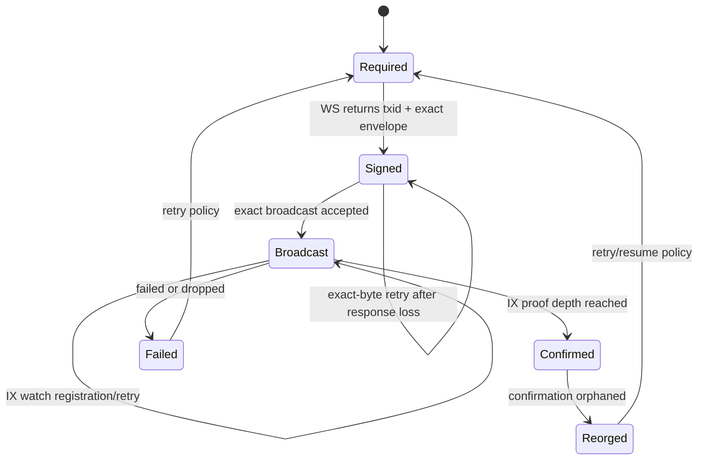

For Bitcoin PS block-only v1, `Reorged -> Required` is not permission to sign a
replacement. The leg retains its exact bytes, txid, reservations, allocations,
and watch; recovery may rebroadcast those bytes and accept same-txid
re-inclusion. Any later replacement attempt requires an explicit future policy
and evidence that the original exact outpoints cannot be reused ambiguously.

### 8.3 Account/wallet collection

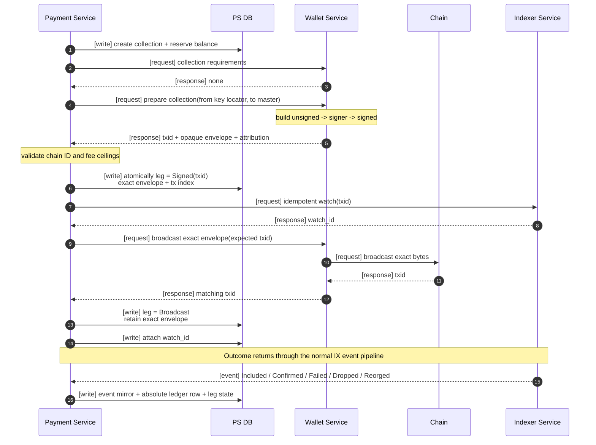

### 8.4 Batched UTXO collection

The implemented abstract execution boundary is `apps/api::Sweeps`. An injected
`DepositWallets` resolves durable deposit ownership to already composed
wallets; neither secrets nor key locators cross the executor API. The Bitcoin
collector MUST reload every reserved output from IX at one common checkpoint,
verify source ownership and exact amount, reject duplicates, order inputs
canonically, and sign every input through its owning wallet.

Execution MUST persist the exact signed transaction before any node effect,
register the idempotent transaction watch before broadcast, and reuse both the
stored envelope and watch identity after an ambiguous/lost response. It MUST
NOT rebuild, resign, or substitute another transaction during that retry.

The factual scale-zero fee MUST be allocated proportionally to participant
gross reservation values using integer largest remainder. Equal remainders use
canonical deposit ID ordering. Durable allocations MUST separately record
gross debit, net master credit, fee asset, and allocated fee with checked
arithmetic; a fee greater than or equal to total reserved value MUST fail.

```mermaid
sequenceDiagram
    autonumber
    participant PS as Payment Service
    participant PSDB as PS DB
    participant WS as Wallet Service
    participant Chain
    participant IX as Indexer Service

    PS->>PSDB: [request] deposits eligible for batch
    PSDB-->>PS: [response] N deposits + key locators
    PS->>IX: [request] canonical unspent-output facts for N addresses
    IX-->>PS: [response] exact output IDs + atomic values
    PS->>PSDB: [write] atomically reserve exact source outpoints
    PS->>WS: [request] collect(source wallets + selected outputs, master)

    Note over WS: reload one IX snapshot; validate ownership/value/evidence<br/>canonically order and sign each input with its source wallet
    WS-->>PS: [response] PreparedCollection(exact signed transaction, factual fee)
    PS->>PSDB: [write] persist exact bytes + Signed leg + largest-remainder allocations
    PS->>IX: [request] idempotently watch(txid)
    IX-->>PS: [response] durable watch receipt
    PS->>WS: [request] broadcast exact stored transaction
    WS->>Chain: [request] preflight then send unchanged bytes
    Chain-->>WS: [response] same txid
    WS-->>PS: [response] verified txid
    PS->>PSDB: [write] advance leg to Broadcast + attach watch_id

    IX-->>PS: [event] transaction state revision
    PS->>PSDB: [write] append one event mirror
    loop each attributed deposit
        PS->>PSDB: [write] append absolute deposit ledger row
    end
```

UTXO requirements:

- Input attribution MUST use the amount of the previous output being spent.
- IX MUST materialize canonical UTXOs; PS MUST atomically reserve exact
  outpoints; WS MUST sign only the supplied, revalidated selection.
- PS MUST persist the exact signed consensus bytes and expected txid before
  requesting broadcast. WS MUST submit those bytes unchanged.
- One batch transaction MUST resolve all included deposits consistently.
- The shared network fee MUST have an explicit allocation policy.
- `collected` uses gross deposit input; master receipt is net of shared fee.
- Concurrent jobs MUST NOT select the same reserved outpoint.

Bitcoin PS block-only v1 makes these additional selections:

- One PS process and RocksDB path own one native-BTC network, policy identity,
  IX feed, and exchange-principal namespace. Bitcoin and Ethereum or two
  Bitcoin networks MUST NOT share one PS database.
- One explicitly requested batch MAY contain deposits for different users only
  when every durable user belongs to the same authenticated exchange principal.
  It MUST NOT mix principals, networks, assets, policies, or master
  destinations.
- For every requested deposit, PS selects the complete eligible UTXO set from
  one generation/revision/checkpoint-fenced IX snapshot, sorts it canonically by
  `(txid, vout)`, and drains it to exactly one policy master output with no
  change output.
- Collection creation atomically reserves every exact outpoint and amount.
  Overlap on any outpoint MUST make the whole
  reservation attempt fail and retry; partial reservation is forbidden.
- The actual transaction fee is allocated in proportion to gross input using
  integer largest-remainder allocation. Equal remainders are ordered by
  canonical deposit ID. Allocated fees MUST sum to the exact fee and per-source
  master credits MUST sum to the one master output.
- The active policy MUST explicitly configure the deposit address kind,
  minimum collection amount, minimum spend confirmations, requested and maximum
  fee rates in satoshis per kvB, maximum absolute fee, and batch deposit/input
  limits. None has a permissive financial default.
- Before returning `PreparedCollection`, the Bitcoin collector validates exact
  inputs, ownership, one destination output, fee, and dust/value bounds. The
  Bitcoin broadcaster revalidates the signed envelope and transaction ID before
  node submission. PS consumes only the generic prepared transaction and
  factual fee.
- Once signed bytes are durably recorded, neither reservations nor the exact
  envelope expire automatically. Bitcoin PS v1 retains the same txid, bytes,
  allocations, reservations, and watch indefinitely through broadcast
  ambiguity, inclusion, confirmation, and reorg. IX's separately configured
  rollback retention does not release PS ownership. A reorg permits identical-
  byte rebroadcast and same-txid re-inclusion, never replacement signing or
  outpoint reuse.
- V1 permits only one Bitcoin collection aggregate per deposit. Later payments
  to that address remain watched and affect its ledger, but the retained per-
  deposit collection ownership prevents another collection. Multi-collection-
  per-deposit support, archival, and space reclamation require a future approved
  design.
- Bitcoin PS v1 has no mempool, dropped, conflict, or replacement feed and does
  not implement PS-generated RBF replacement, CPFP, fee bumping, PSBT, or
  conflicting replacement signing. Timeout, RPC outage, or one missing receipt
  is not evidence that a reserved outpoint is reusable.

These requirements remain useful domain constraints. A narrow opt-in harness
starts a disposable, network-disabled Bitcoin Core 31.x regtest process and
checks concrete wallet construction, indexed funding, build/sign/broadcast,
mined inclusion, confirmed history, balance, and the production RPC wrapper;
it is feature-gated and ignored by default. It does not compose the HTTP
payment/deposit application, and deterministic tests or a compiled harness are
not live-node or production-runtime evidence. See
[`manual-bitcoin-regtest/README.md`](./manual-bitcoin-regtest/README.md).

### 8.5 ERC-20/token collection with gas

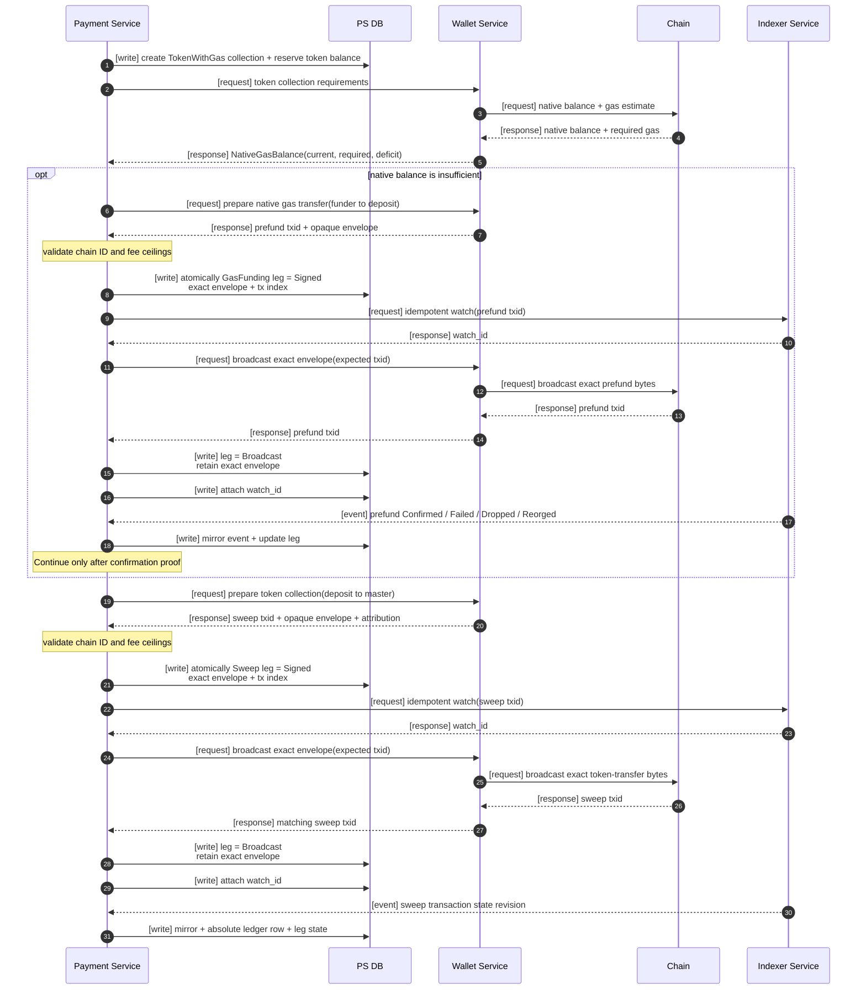

- WS owns calculation and construction for each leg.
- PS owns durable sequencing and MUST NOT rely on WS memory between legs.
- A confirmed prefund followed by a dropped sweep MUST remain visible and
  retryable.
- Token amount and native gas fee MUST be represented as different assets.
- Fee-on-transfer, rebasing, and non-standard token behavior require explicit
  reconciliation policy before production support.

## 9. Transaction construction and signing requirements

### 9.1 Generic transaction flow

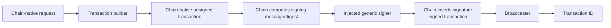

- Signers MUST be selected in application composition.
- The generic signer MUST understand keys, curves, messages/digests, schemes,
  user interaction, and signatures only.
- Bitcoin MUST own sighash computation, scripts, witnesses, consensus encoding,
  PSBT integration, and previous-output requirements.
- Ethereum MUST own chain ID, nonce, gas, EIP-1559 fees, typed envelopes, token
  calldata, receipt interpretation, and trace/log requirements.
- Solana MUST eventually receive a separate chain-native builder; it MUST NOT
  be forced through an Ethereum-shaped account transaction.

### 9.2 Key custody

The current workspace implements only the in-process `base::KeyPair` signer;
it does not define a key locator, custody service, remote signer, or hardware
wallet adapter. A production composition MUST keep actual secret material in
its selected custody backend. If PS and WS are process-separated, their signer
boundary MUST be authenticated and MUST NOT serialize a Rust trait object or
pass plaintext keys. Any future hardware signer must represent availability,
rejection, timeout, and required user interaction explicitly without teaching
the base signer chain transaction types.

### 9.3 Trezor limitation

Native Trezor Bitcoin signing is an interactive transaction protocol that may
request inputs, outputs, previous transactions, and replacement data. It is not
equivalent to blind `sign_digest`.

The implementation MUST choose one of:

1. support only raw cryptographic operations through the generic signer;
2. add a higher integration package depending on both Bitcoin and Trezor;
3. define a protocol-neutral interactive signing session; or
4. treat hardware transaction signing as an application workflow.

Bitcoin MUST NOT depend on a hardware-wallet package, and the base signer MUST
NOT learn Bitcoin transaction types.

## 10. Store and consistency requirements

### 10.1 Generic storage

The current storage contract provides:

- namespaced keys;
- point reads;
- prefix scans with pagination;
- versions;
- conditional writes; and
- atomic write batches.

No database engine is selected.

### 10.2 IX atomicity

For one connected block, IX SHOULD atomically persist:

- block identity;
- new canonical checkpoint;
- chain-native index effects;
- undo data;
- normalized transaction revisions;
- confirmation-state changes; and
- outgoing event-feed rows.

For one reverted block, inverse effects and checkpoint movement MUST be atomic.

### 10.3 PS consistency

- Event mirror append MUST be idempotent.
- Ledger projection MUST be idempotent by projection ID.
- Ledger append MUST use expected-head optimistic concurrency.
- Each ledger row MUST point to its previous row.
- Accounting commands MUST have independent idempotency keys.
- Collection creation, reservations, leg transitions, and attribution MUST be
  durable.
- A deposit close MUST be conditioned on the exact zero-balance ledger head
  and the absence of active reservations and open reconciliation. Concurrent
  projection, reservation, or reconciliation changes MUST force a retry.
- PS MUST NOT remove a closed deposit's IX address watch unless IX supplies a
  durable cutoff and PS drains projection through that cutoff. Without that
  protocol the watch MUST remain active so late payments stay visible.
- PS MUST persist the expected transaction ID and opaque signed envelope before
  broadcast. A retry after response loss MUST rebroadcast the exact bytes and
  MUST verify that WS/RPC returns the expected hash; it MUST NOT silently
  re-sign the same leg as a fresh transaction.
- Bitcoin PS MUST retain those exact bytes indefinitely in v1 once durably
  signed. A Bitcoin reorg MUST preserve the same transaction watch and
  authorize only same-byte rebroadcast/re-inclusion, not a newly signed
  replacement. IX rollback retention is a separate policy and MUST NOT release
  PS ownership.
- A crash between event mirroring and projection MUST be recoverable by replay.
- A crash after watch registration and before a successful broadcast response
  MUST be recoverable from the persisted collection leg by rebroadcasting the
  same signed bytes; watch registration is idempotent.

## 11. API requirements

The Indexer Service exposes one chain-neutral `/v1/scopes/{chain}/{network}`
surface for status, watches, transaction history, revision events, and output
queries. Watch registration always requires a caller-owned idempotency key;
authentication mode never authorizes the server to invent one.

The wallet and payment crates currently export routers and `serve` helpers for
already composed values. Their embedding application MUST select
authentication, TLS, secret/custody integration, rate limits, and process
supervision. Documentation MUST NOT claim a checked-in deployment merely
because these routers compile.

Monetary API values use exact `Decimal` strings. Large cursors/heights use
lossless decimal encoding. Chain-specific address and transaction text is
validated by the concrete chain at its boundary.

External mutations MUST be retry-safe. Transaction submission persists the
exact signed envelope and caller-owned watch identity before broadcast;
confirmation is consumed asynchronously from indexing rather than awaited in
the request.

## 12. Operational and security requirements

- All externally caused commands MUST be idempotent.
- Event delivery MUST be assumed duplicate and out of order unless ordered by
  the explicit IX cursor.
- Logs MUST NOT contain private keys, seed phrases, raw signer secrets, or
  unredacted custody credentials.
- Every repo-owned network service MUST expose its sanitized authentication
  mode in structured startup output and public readiness/status. If a metrics
  adapter is composed, it MUST expose the same sanitized mode there.
  Global-trusted mode MUST emit one high-severity startup warning and MUST NOT
  log one warning per request.
- A repo-owned client MUST reject a missing or mismatched remote authentication
  mode as a nonretryable configuration failure. It MUST NOT downgrade after a
  `401`, connection failure, or missing status field.
- Chain/node capabilities MUST be detected explicitly.
- Ethereum internal native transfer completeness MUST NOT be claimed without a
  supported trace source and retention guarantee.
- Health status SHOULD expose local checkpoint, remote tip, lag, last advance,
  current reorg depth, and event-delivery lag.
- Confirmation policy changes MUST be versioned and auditable.
- Clock timestamps are metadata; canonical order comes from chain height/hash
  and journal cursor/revision.
- Balance reconciliation jobs SHOULD compare ledger projections with chain
  queries and emit explicit correction/investigation records.
- A node/RPC outage MUST not silently convert unknown state into dropped or
  failed state.

## 13. Remaining open decisions and selected v1 decisions

The questions below remain open for the general multi-chain system unless a
more focused decision record closes them. For Ethereum IX v1,
[`INDEXER_SERVICE.md`](./INDEXER_SERVICE.md) closes the database, transport,
scope, confirmation, reorg, and completeness choices described there.
The implemented Bitcoin WS/IX choices and the remaining Bitcoin payment
constraints are recorded below. Removed implementation-plan files are not
current sources of truth.

### 13.1 Wallet and address lifecycle

Bitcoin PS v1 decision: the mandatory deployment policy selects either P2WPKH
or P2TR key-path for newly generated deposit addresses. Imported/watch-only
addresses, additional derivation/script families, and orphan-key retirement
automation are excluded from v1. PS persists only opaque key ownership and does
not infer semantics from a locator.

- Is a wallet one root key, one chain account, one customer, or only a key
  ownership abstraction?
- Are watch-only xpub/public-key wallets supported?
- Which derivation standards and address types are supported per chain?
- Is a birthday height sufficient, or are timestamp and block hash required?
- Are imported addresses supported?
- How are orphaned keys retired if address generation succeeds but PS
  persistence permanently fails?

### 13.2 Index scope and completeness

Ethereum v1 decision: one process and RocksDB path own one scope; all blocks are
downloaded and locally filtered; mempool and traces are unwired; depth 12 is the
confirmation policy; 50 reversible bundles plus one predecessor anchor are
retained; ERC-20 `Transfer` logs are the only token standard indexed. These are
v1 boundaries, not answers for every future chain.

Bitcoin v1 decision: one process and RocksDB path own one Bitcoin network;
Bitcoin Core 31 must be unpruned, report local block/header synchronization, be
on the configured genesis, and have a synchronized transaction index. These
node-local checks are not independent proof of peer connectivity or network-tip
freshness, which production operators monitor separately. IX downloads
canonical blocks, resolves input previous outputs, indexes P2WPKH/P2TR watches,
and atomically materializes canonical UTXOs. It has no mempool coverage.
Confirmation depth and reorg retention are required deployment values rather
than universal constants.

- How are multiple IX workers leased so only one advances a chain/network?
- Are all blocks downloaded and filtered locally, or may a source filter?
- Are mempool deposit notifications required for the first release?
- What confirmation/finality thresholds apply per asset/network?
- What maximum reorg depth and undo retention are required?
- Are Ethereum internal native transfers required?
- Which Ethereum trace API and historical retention guarantees are acceptable?
- Which token standards are supported?
- How are fee-on-transfer and rebasing tokens reconciled?

### 13.3 Bitcoin transaction construction

Bitcoin v1 decision: support native SegWit v0 P2WPKH and Taproot key-path P2TR;
use finalized raw consensus transactions rather than PSBT; express fee rates as
integer satoshis per kvB; let IX materialize UTXOs, PS reserve exact outpoints,
and WS validate/sign the supplied selection. Mempool replacement and fee-bump
workflows are not part of block-only v1.

Bitcoin PS v1 decision: an explicit same-principal batch drains every eligible
UTXO for each requested deposit, sorted by `(txid, vout)`, into one master
output with no change. PS atomically reserves every exact outpoint before
signing. UTXO-batch v1 has no generic failure or reservation-release path: a
required unsigned reservation remains active and may be retried. Cancellation
or release requires a future explicit safe design. Once durably signed there is
no time-based expiry. Mandatory policy values bound minimum collection/spend
confirmations, requested and maximum sat/kvB rates, maximum absolute fee, and
batch size. Only same-byte rebroadcast and same-txid re-inclusion are supported;
PS-generated RBF replacement, CPFP, fee bumping, PSBT, and conflicting
replacement signing are excluded.

- Which additional scripts follow P2WPKH/P2TR: legacy, nested SegWit,
  script-path Taproot, or multisig?
- Which hardware/multisignature workflows require PSBT and which version?
- Which post-v1 privacy grouping, partial-selection, change, or address-reuse
  policies are required?
- Which future mempool/RBF, CPFP, replacement, or fee-bump workflows are
  required after the block-only release?

### 13.4 Account transaction construction

- Which Ethereum envelope types are required?
- How are nonces reserved across concurrent transactions?
- Are replacement, cancellation, and fee bump workflows required?
- Is transaction building synchronous from indexed state or allowed to query
  RPC during the request?

### 13.5 Signing and custody

- Can one transaction require multiple signers or partial signatures?
- Should a future production signer own one key or many keys addressed by an
  opaque application-defined locator?
- Which curves, schemes, and signature encodings are required?
- Must signers display or attest transaction intent?
- What timeout, cancellation, retry, and user-rejection behavior is required?
- Which Trezor integration option from section 9.3 is selected?

### 13.6 Store

Ethereum v1 decision: semantic IX commands compose over backend-neutral
repository contracts. The selected `sdk/indexing/rocksdb` adapter commits them
through a serialized RocksDB 0.24 writer. One synchronous WAL-backed batch
contains block effects, observations, events, checkpoint, and retention
changes. Record versions are adapter-private. An incompatible schema or policy
requires an explicit offline rebuild; ordinary indexing exposes no policy
migration API.

The current payment composition does not expose a schema-migration command.
Any future persisted-schema conversion requires a separately approved,
recoverable operator design; it must not leak into ordinary indexing traits.

- What isolation and durability guarantees are mandatory for future storage
  adapters and highly available deployments?
- How should each future adapter version its records and support offline
  rebuilds without exposing physical migration concepts through indexing
  contracts?
- Which backup, restore, and rebuild procedures are required?

### 13.7 Deposit accounting

Ethereum v1 decision: a post-credit reorg preserves `accounted`, corrects the
canonical snapshot, creates an open durable `PostCreditReorg` reconciliation
case, and blocks automatic credit/collection until explicit resolution.

Bitcoin PS v1 decision: IX `Confirmed` is the maximum automatic
confirmation-qualified input to PS; user credit remains an explicit accounting
command. A post-credit reorg reuses the typed blocking reconciliation behavior.
For a batch fee `F` and gross inputs `G_i`, PS applies proportional integer
largest-remainder allocation with canonical deposit-ID tie-breaking. Exact
outpoint uniqueness prevents duplicate collection, and one physical projection
batch must update the collection leg/reservations, all attributed ledger rows,
observation indexes, reconciliation cases, and cursor consistently.

- Which assets can derive balance completely from events and which require
  periodic direct balance queries?
- What exact reconciliation drift is permitted?
- Which post-v1 assets or business policies require a stronger gate than IX
  `Confirmed`?

### 13.8 Application topology and delivery

Ethereum v1 decision: `apps/indexer` supervises IX synchronization, reorg, and
fact delivery. `apps/api` supervises PS HTTP, durable jobs, watch
reconciliation, IX mirroring, business projection, expiration, collection,
readiness, and maintenance over a separate PS database. IX delivery is
at-least-once with a cursor; command and semantic effects are idempotent. PS
classification precedence is durable collection mapping, gas-funding mapping,
incoming movement to a known deposit, then other balance change. A relevant
unresolved fact stops projection/readiness rather than being silently skipped.

Bitcoin PS v1 decision: `apps/api` selects a separate Bitcoin mode over one
exclusive PS database, Bitcoin IX feed, and Bitcoin WS. Reconciliation,
ingestion, projection, expiration, collection, and readiness remain supervised
loops in that application. Cross-user UTXO batches are durable jobs and are
authorized only when all source users share the authenticated exchange
principal. Transport remains at-least-once with repository idempotency.

- Are reconciliation and delivery loops inside existing apps or separate
  executables?
- Which commands return jobs versus immediate results?
- What external deposit and collection status model is exposed?
- Which delivery paths require exactly-once effects versus at-least-once
  transport plus idempotency?
- Are webhooks required, and how are they authenticated/retried?

## 14. Contract and implementation traceability

| Requirement area | Rust location |
|---|---|
| Chain identity, exact decimal value, transaction and signing boundaries | `sdk/chains/base` |
| Stateless wallet capabilities and provider composition | `sdk/wallets` |
| Generic cryptographic mechanisms | `packages/crypto` |
| Bitcoin transactions/indexing/collection | `sdk/chains/bitcoin` |
| Ethereum transactions/indexing/collection | `sdk/chains/ethereum` |
| Generic block sync/reorg/finality | `sdk/indexing` |
| IX public watch/query/event surface | `sdk/indexing::{Indexer,Watcher,History,Observer}` |
| IX fact and transaction state model | `sdk/indexing::observation` |
| PS deposits/event mirror/ledger | `sdk/deposits` |
| PS durable collection workflow | `sdk/deposits::collection` |
| Durable payment orchestration and supervised runtime | `apps/api` |
| PS deposit/accounting/job contracts | `sdk/deposits` |
| Stateless wallet HTTP runtime and binary | `apps/wallet` |
| Backend-independent storage mechanics | `packages/storage` |
| Bitcoin UTXO construction | `sdk/chains/bitcoin` |
| Ethereum account construction | `sdk/chains/ethereum` |
| Generic HTTP/JSON-RPC infrastructure | `packages/*` |

## 15. Structural acceptance criteria

The contract phase is structurally accepted when:

- the full workspace compiles;
- all chain-specific types disappear when their concrete chain crate is
  removed;
- packages import no SDK or chain crate;
- generic signing imports no chain crate;
- indexing imports no deposit/accounting crate;
- WS selects no database backend;
- IX and PS persistence contracts are distinct;
- both address and transaction-ID watches are representable;
- transaction facts support multiple movements and stable revisions;
- confirmation depth/finality is explicit and persisted per chain/network;
- PS can represent included, confirmed, collected, and accounted balances as
  immutable absolute ledger rows;
- UTXO collection can attribute one transaction to multiple deposits;
- token collection can persist gas-funding and sweep legs; and
- reorg and replay paths can append corrective state without deleting history.

Behavioral acceptance requires proportionate store, parser, worker,
failure-window, and live-environment evidence. The existence of the concrete
Ethereum v1 source slices does not make that evidence automatic.

Bitcoin PS deterministic and real-store acceptance includes atomic overlapping-
outpoint rejection, all-or-nothing multi-deposit projection, exact-envelope
retention/reorg recovery, deterministic fee allocation, and same-principal
cross-user authorization. The composed disposable Bitcoin Core 31.1 criterion
is satisfied by the opt-in automated suite's eight strict/global-trusted live
executions: P2WPKH/P2TR signing, restart/replay, controlled reorg with identical-
txid re-inclusion, and exact-outpoint reservation contention. Source and
repository tests remain separate evidence and do not substitute for that live
run.

## 16. Related documents

- [`ARCHITECTURE.md`](../ARCHITECTURE.md) — concise ownership and dependency rules.
- [`FEATURE_VALIDATION.md`](./FEATURE_VALIDATION.md) — original-design traceability and corrections.
- [`CONTRACTS.md`](./CONTRACTS.md) — current Rust trait walkthrough.
- [`INDEXING.md`](./INDEXING.md) — focused synchronization and reorg design.
- [`RESEARCH.md`](./RESEARCH.md) — Alloy, BDK, Blockbook, NBXplorer,
  BTCPay, SHKeeper, Trezor, and Solana findings.
- [`REQUIREMENTS.md`](./REQUIREMENTS.md) — compact open-decision checklist.
- [`manual-bitcoin-regtest/README.md`](./manual-bitcoin-regtest/README.md) — current Bitcoin acceptance boundary.
