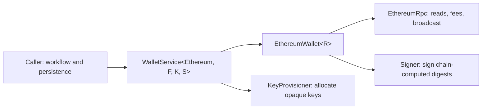

# Wallet Service Rust library usage

This guide explains how an in-process Rust application composes and calls the
stateless [`wallet_worker::WalletService`](../apps/wallet/src/lib.rs) facade for
native ETH and ERC-20 assets. It covers the eight asynchronous operations on
that facade. For the separately deployed mode-aware HTTP process, use
[`WALLET_SERVICE.md`](./WALLET_SERVICE.md) instead.

The Wallet Service knows how to perform one chain-native operation. It does not
own users, deposits, watches, reservations, databases, retries, accounting, or
multi-step token workflows. A Payment Service or another durable caller must
own those concerns.

## Quick start: run every operation offline

From the workspace root:

```bash
cargo run --locked -p wallet-worker --example ethereum_wallet_service_operations
```

The example uses a synthetic chain ID and token, a deterministic in-memory RPC
double, and `LocalSigner::ephemeral_for_testing()`. It exercises all eight
operations without an RPC endpoint, credentials, real funds, or network side
effects. It prints addresses and transaction IDs, but never private keys or
signed transaction envelopes.

The complete executable is
[`ethereum_wallet_service_operations.rs`](../apps/wallet/examples/ethereum_wallet_service_operations.rs).

## Architecture and ownership



The concrete type is:

```rust
WalletService<Ethereum, EthereumWallet<R>, K, S>
```

- `R: EthereumRpc` supplies balances, nonce/gas/fee context, receipt reads, and
  broadcast.
- `K: KeyProvisioner` allocates a key and returns an opaque `KeyLocator` plus
  its public key.
- `S: Signer` signs the digest computed by the Ethereum crate. It does not
  receive or construct an Ethereum transaction.
- `EthereumWallet<R>` owns Ethereum address validation, EIP-1559 construction,
  ERC-20 calldata, sender recovery, collection calculations, and chain-ID
  checks.
- `WalletService` selects the adapter for the asset and delegates. It retains
  no workflow state between calls.

The transaction lifecycle remains explicit:

```text
EthereumTransferRequest
  -> build_transfer
  -> UnsignedEthereumTransaction
  -> caller review and policy checks
  -> sign_transaction
  -> EthereumSignedTransaction
  -> caller persists the exact ID and envelope
  -> broadcast
  -> transaction / Indexer monitoring
```

## Values that callers must preserve

### Assets and amounts

Use `EthereumAsset::Native` for ETH and
`EthereumAsset::Erc20(token_address)` for a token. All values are integer
atomic units:

- native ETH values are wei;
- ERC-20 values are the token contract's raw units;
- the current Ethereum API uses `Wei` as its U256-sized amount wrapper for
  both, so the asset determines the unit meaning.

Never use floating point for transaction or collection amounts. Convert human
display values to atomic units at the application boundary with checked
arithmetic.

### Operation IDs and key locators

`OperationId` is the caller-owned durable identity of one exact custody
operation. Replaying the same ID with identical content is idempotent; reusing
it with different content is a conflict.

- Reuse an ID when retrying the identical provisioning or signing request.
- Allocate a new signing ID after rebuilding a transaction with a different
  nonce, gas limit, fee, recipient, amount, or calldata.
- Persist the returned `KeyLocator` exactly as an opaque custody handle. Never
  parse its string representation for chain or business meaning.

### Chain identity

`EthereumWallet::new(chain_id, rpc)` fixes one expected chain. Address requests
and RPC-supplied build contexts must use that same non-zero chain ID. A
production application must also call `EthereumHttpRpc::verify_chain_id()`
before making the service ready.

## Operation reference

| Operation | Input | Output | Dependencies and side effects | Common failures and retry guidance |
|---|---|---|---|---|
| `generate_address` | `&EthereumAsset`, `EthereumGenerateAddress` | `GeneratedAddress<EthereumAddress>` | Calls `KeyProvisioner`; no Ethereum RPC or chain write. | Invalid chain/public-key context or `Signer`. Retry only the identical request with the same `OperationId`. |
| `balance` | `&EthereumAsset`, `&EthereumAddress` | `Balance<Wei>` | Ethereum RPC read only. The current Ethereum adapter reports the RPC value as confirmed and spendable, with pending set to zero. | `RpcUnavailable` may be retried with bounded backoff; `Other` needs investigation. |
| `build_transfer` | `&EthereumAsset`, `EthereumTransferRequest` | `UnsignedEthereumTransaction` | Reads nonce, chain ID, gas estimate, and EIP-1559 fees; does not sign or broadcast. | `InvalidTransaction`, `RpcUnavailable`, or `Other`. After any signing attempt, a rebuild that changes transaction bytes needs a new signing `OperationId`. |
| `sign_transaction` | `&EthereumAsset`, `UnsignedEthereumTransaction` | `EthereumSignedTransaction` | Calls the injected signer; no RPC broadcast. Ethereum verifies the signature recovers the requested sender. | `Signer` or `InvalidTransaction`. Retry only the identical unsigned transaction with the same signing ID. |
| `broadcast` | `&EthereumAsset`, `EthereumSignedTransaction` | `EthereumTransactionId` | Submits the exact signed envelope to RPC. This is an external chain side effect. | On `RpcUnavailable` or response loss, the outcome is unknown. Retry the exact same envelope; do not rebuild a replacement implicitly. |
| `transaction` | `&EthereumAsset`, `&EthereumTransactionId` | `Option<EthereumReceipt>` | Ethereum RPC receipt read only. | `None` means no receipt is currently available; it is not proof of a dropped transaction. Retry reads or monitor through IX. |
| `collection_requirements` | `&EthereumAsset`, `&EthereumCollectionRequest` | `Vec<EthereumCollectionRequirement>` | Native collection returns no prerequisite; token collection reads token/native balances and build context. No signing or broadcast. | `InsufficientFunds`, `InvalidTransaction`, `RpcUnavailable`, or `Other`. Resolve reported gas deficits before collecting. |
| `collect` | `&EthereumAsset`, `EthereumCollectionRequest` | `CollectionSubmission<EthereumTransactionId, EthereumCollectionAttribution>` | Reads state, builds, signs, and broadcasts one collection transaction in one call. | All build/sign/broadcast failures apply. A lost broadcast response is an unknown outcome; this convenience operation has no persistence boundary. |

`ChainErrorKind` is structured but does not by itself encode a complete retry
policy. Preserve the kind and contextual message in application diagnostics
without logging credentials, private material, or signed envelopes.

## Step 1: compose the service for local development

The offline example uses one ephemeral object as both `KeyProvisioner` and
`Signer`:

```rust
use chain_ethereum::{Ethereum, EthereumWallet};
use signer_local::LocalSigner;
use std::sync::Arc;
use wallet_worker::WalletService;

let custody = Arc::new(LocalSigner::ephemeral_for_testing());
let service = WalletService::<Ethereum, _, _, _>::new(
    EthereumWallet::new(31_337, DemoEthereumRpc::new()),
    Arc::clone(&custody),
    custody,
);
```

`DemoEthereumRpc` is the example's deterministic implementation of the
`EthereumRpc` trait. `LocalSigner::ephemeral_for_testing()` stores keys only in
memory and loses them at process exit. Never fund those keys or substitute it
for production custody.

## Step 2: generate addresses

Use a stable operation ID and an application-owned purpose string:

```rust
use chain_ethereum::{EthereumAsset, EthereumGenerateAddress};
use signer::OperationId;

let native = EthereumAsset::Native;
let generated = service
    .generate_address(
        &native,
        EthereumGenerateAddress::new(
            31_337,
            OperationId::new("provision-deposit-user-42")?,
            "deposit:user-42",
        ),
    )
    .await?;
```

The result contains:

- `generated.address`: the chain-native EOA address;
- `generated.key`: the opaque locator required for later signing; and
- `generated.public_key`: public metadata returned by custody.

Persist the address-to-locator association in the caller's store. Address
generation does not register an IX watch and does not provide an indexing
birthday.

Ethereum EOA derivation is the same for native ETH and ERC-20. The asset still
remains explicit so application routing does not erase chain/asset context.

## Step 3: read native and ERC-20 balances

```rust
use chain_ethereum::EthereumAsset;

let native_balance = service.balance(&EthereumAsset::Native, &address).await?;
let token_balance = service
    .balance(&EthereumAsset::Erc20(token.clone()), &address)
    .await?;
```

`Balance<Wei>` has `confirmed`, `pending`, and `spendable` fields. The current
Ethereum wallet RPC surface does not model mempool deltas: it returns the
queried balance as both confirmed and spendable and sets pending to zero. Do
not interpret that zero as a general statement that the address has no pending
activity.

## Step 4: build, review, and sign native ETH

Build an unsigned EIP-1559 transaction with a chain-native request:

```rust
use chain_ethereum::{EthereumAsset, EthereumTransferRequest, Wei};
use signer::OperationId;

let asset = EthereumAsset::Native;
let unsigned = service
    .build_transfer(
        &asset,
        EthereumTransferRequest::native(
            OperationId::new("sign-native-transfer-42")?,
            source_key,
            source_address,
            recipient,
            Wei::from_u128(1_000_000_000_000_000),
        ),
    )
    .await?;
```

Before signing, review at least:

- `chain_id`, `from`, `to`, `value`, and `input`;
- `nonce` and any caller-owned per-sender reservation;
- `gas_limit`, `max_fee_per_gas`, and `max_priority_fee_per_gas`;
- `value + gas_limit * max_fee_per_gas` using checked arithmetic; and
- the application policy for destination and maximum debit.

Then sign without broadcasting:

```rust
let signed = service.sign_transaction(&asset, unsigned).await?;
```

The result contains the locally computed `signed.id` and the exact opaque
`signed.envelope`. Production callers should durably persist both before the
first broadcast attempt. Do not log or expose the envelope as ordinary
diagnostic data.

## Step 5: build, review, and sign ERC-20

Use `EthereumTransferRequest::erc20`; the Ethereum crate owns canonical
`transfer(address,uint256)` encoding:

```rust
let asset = EthereumAsset::Erc20(token.clone());
let unsigned = service
    .build_transfer(
        &asset,
        EthereumTransferRequest::erc20(
            OperationId::new("sign-token-transfer-42")?,
            source_key,
            source_address,
            token,
            recipient,
            Wei::from_u128(1_000_000),
        ),
    )
    .await?;
```

For ERC-20, the unsigned transaction's `to` is the token contract, `value` is
zero native wei, and `input` contains the token recipient and raw token amount.
Review all three rather than treating the transaction's `to` field as the
logical payment recipient.

Sign through the same facade:

```rust
let signed = service.sign_transaction(&asset, unsigned).await?;
```

## Step 6: broadcast the exact signed transaction

```rust
let expected_id = signed.id.clone();
let returned_id = service.broadcast(&asset, signed).await?;
if returned_id != expected_id {
    return Err("RPC returned a different transaction ID".into());
}
```

Broadcast is the first external chain write in the explicit transfer flow. RPC
acceptance means submission, not inclusion or confirmation.

If the call times out or the connection is lost, assume the result is unknown:

1. keep the persisted transaction ID and exact signed envelope;
2. query IX and/or the receipt endpoint for that ID;
3. if policy permits rebroadcast, submit the same bytes again; and
4. never silently rebuild with a new nonce or fee as though the first attempt
   definitely failed.

## Step 7: read a receipt

```rust
match service.transaction(&asset, &transaction_id).await? {
    Some(receipt) => {
        // Inspect included_in, succeeded, and confirmations.
    }
    None => {
        // Pending, not yet visible, or otherwise unknown; do not mark dropped.
    }
}
```

The receipt is a current chain fact. Durable systems should use the Indexer
Service for canonical observation revisions, confirmations, and reorg handling
rather than treating one receipt read as permanent finality.

## Step 8: inspect and execute collections

### Native ETH

```rust
let request = EthereumCollectionRequest::Native {
    signing_operation_id: OperationId::new("collect-native-deposit-42")?,
    from: deposit_address,
    key: deposit_key,
    destination: master_address,
};

let requirements = service
    .collection_requirements(&EthereumAsset::Native, &request)
    .await?;
assert!(requirements.is_empty());

let submission = service.collect(&EthereumAsset::Native, request).await?;
```

Native collection reads the current balance, calculates the maximum EIP-1559
fee, and transfers the remaining non-zero value. The returned attribution is
the gross deposit debit, separate from the network fee.

### ERC-20

```rust
let asset = EthereumAsset::Erc20(token.clone());
let request = EthereumCollectionRequest::Token {
    signing_operation_id: OperationId::new("collect-token-deposit-42")?,
    token,
    from: deposit_address,
    key: deposit_key,
    destination: master_address,
    amount: None, // Sweep the complete token balance.
};

let requirements = service.collection_requirements(&asset, &request).await?;
```

A non-empty result contains
`EthereumCollectionRequirement::NativeGasBalance { address, current, required,
deficit }`. The caller must own a separate durable gas-funding workflow, wait
for the funding transaction to become confirmation-qualified, and then compute
requirements again.

When requirements are satisfied:

```rust
let submission = service.collect(&asset, request).await?;
for attribution in submission.attribution {
    // attribution.address, attribution.asset, attribution.gross_debit
}
```

`collect` is a convenience operation that prepares, signs, and broadcasts in
one call. It cannot give a durable caller a persistence checkpoint between
signing and broadcast. Production payment workflows that require crash-safe
retry must use the existing separated collection preparation and exact-envelope
broadcast boundary described in [`CONTRACTS.md`](./CONTRACTS.md#wallet-service-implementation)
and [`WALLET_SERVICE.md`](./WALLET_SERVICE.md#routes).

## Error handling and retry rules

| `ChainErrorKind` | Caller response |
|---|---|
| `InvalidAddress` | Correct the address, network, chain, or custody public-key context. Do not retry unchanged input. |
| `InvalidTransaction` | Correct the request, chain ID, amounts, calldata, nonce/fee context, or signature mismatch. |
| `InsufficientFunds` | Re-read state and fund or reduce the operation according to caller policy. |
| `FeeUnavailable` | Retry fee discovery with bounded backoff or stop according to policy. |
| `RpcUnavailable` | Retry reads with bounded backoff. For broadcast, first treat the result as unknown and retain the exact envelope. |
| `Signer` | Inspect custody availability and capabilities without exposing secrets. Retry only an identical idempotent request when safe. |
| `Rejected` | Preserve the provider rejection and require an explicit caller decision before changing transaction fields. |
| `NotFound` | Treat as a current lookup result, not proof that historical activity never existed. |
| `Other` | Preserve the contextual message and investigate; do not assume retryability. |

Serialize transaction construction per sender or use a durable nonce
reservation strategy. Two concurrent builds can otherwise select the same
pending nonce. A later fee bump or replacement is a new caller-owned workflow,
not an automatic retry of the original transaction.

## Production composition

The production-shaped in-process composition uses the concrete bounded HTTP
RPC adapter and a process-separated durable custody service:

```rust
use chain_ethereum::{Ethereum, EthereumHttpRpc, EthereumWallet};
use signer_remote::RemoteSignerClient;
use wallet_worker::WalletService;

let rpc = EthereumHttpRpc::new(rpc_config)?;
rpc.verify_chain_id().await?;

let custody = RemoteSignerClient::connect(custody_config).await?;
// Before readiness, require secp256k1 ECDSA digest signing and Available status.

let service = WalletService::<Ethereum, _, _, _>::new(
    EthereumWallet::new(expected_chain_id, rpc),
    custody.clone(),
    custody,
);
```

Construct `EthereumHttpRpcConfig` with explicit request timeouts, response-size
limits, retry bounds, input-size limits, gas margin, maximum gas, per-gas fee
ceilings, and maximum total fee. Use HTTPS for non-loopback RPC endpoints and
keep authentication header values out of logs.

Construct `RemoteSignerConfig` with one explicit auth constructor: strict mode
uses a bearer secret loaded from a secret manager, while global-trusted mode
uses the dedicated credential-free constructor. Never infer the mode from a
missing optional token. In either mode use a validated HTTPS endpoint, bounded
connection/request timeouts, a response limit, and bounded operation retries.
The `wallet-worker` composition root selects this explicitly with
`WS_CUSTODY_AUTHENTICATION_POLICY`: `repository_mode_matched` follows
`STRICT_AUTHENTICATION_MODE`, while `independent_strict` requires
`WS_CUSTODY_BEARER_TOKEN` and a strict custody posture in either service mode.
Before readiness, require the custody endpoint to report the selected
authentication mode plus:

- `Curve::Secp256k1`;
- `SignatureScheme::EcdsaSecp256k1`;
- digest signing capability; and
- `SignerStatus::Available` for unattended operation.

The repository's concrete reference composition is
[`apps/wallet/src/runtime.rs`](../apps/wallet/src/runtime.rs). The included
`custody-worker` is loopback-only, ephemeral, and loses every key when the
process exits. Neither it nor `LocalSigner::ephemeral_for_testing()` is
production custody.

Production callers must additionally own:

- encrypted durable storage for address/locator relationships, signed
  envelopes, reservations, and workflow state;
- per-sender nonce concurrency and idempotency;
- IX watch registration, confirmations, receipt monitoring, and reorg recovery;
- explicit destination/amount/gas/fee policy before signing;
- exact-envelope rebroadcast after response loss; and
- secret management, authentication, TLS, telemetry redaction, backups, and
  operational recovery.

## Scope

This guide intentionally does not cover Bitcoin, HTTP routes, curl/Postman,
deployment commands, or real-chain signing/broadcast walkthroughs. It also does
not claim that compiling an adapter proves production readiness. Use current
source, tests, and runtime evidence for that assessment.
