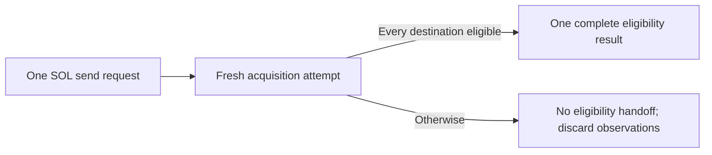

# ADR-0008: Treat SOL destination observations as one all-or-nothing attempt

## Status

Accepted

## Date

2026-08-27

## Context

ADR-0007 requires a complete account observation before an on-curve native SOL
destination can be accepted. One public send request may contain one transfer
or an ordered batch, and the canonical requirements require every destination
to validate before the first broadcast.

Account acquisition may eventually use one RPC response, several calls, or a
deduplicated query. It may also encounter a transport failure, RPC error,
malformed result, retry, or endpoint restart after some destinations were
already observed. Retaining those partial facts could combine observations
from different attempts, endpoints, or points in chain state and make the
operation appear more coherent than it was.

The logical success boundary must be decided before selecting the RPC method,
commitment, freshness rule, or retry policy.

## Decision

Each acquisition attempt for one native SOL send request covers every input
destination that needs an account-state check and its S1.6.2.2 classification.

The attempt may hand later preparation exactly one successful result: complete
eligibility for every required destination. If any required observation is
unavailable or any destination is unsupported, it hands no eligibility result
forward. It never returns an eligible prefix or partial observation set. Every
observation produced by an unsuccessful attempt is discarded and may not reach
later preparation stages or be combined with a later retry or endpoint attempt.

A later attempt, if retries or endpoint restart are approved, starts with no
account observations from the failed attempt. This rule does not yet authorize
either behavior.

A complete observation proving that one destination is unsupported remains a
definitive S1.6.2.2 policy rejection when considered alone; this ADR does not
convert it into an acquisition failure. If several unavailable or unsupported
results coexist, their reporting precedence and failed input index are
deferred. The whole send request still stops before signing, simulation, or
broadcast, and observations for its other destinations are not retained.
Whether acquisition is sequential, concurrent, cancelled early, or completed
before classification is also deferred.

For a single transfer, the logical attempt covers only that transfer's
destination. Every repeated destination occurrence in a batch belongs to the
attempt; deduplication, observation reuse, response mapping, and error-index
mapping are deferred.

All-or-nothing describes the handoff of destination eligibility. It does not
claim the RPC server provides an atomic multi-account snapshot, and it does not
require all destinations to be fetched in one JSON-RPC call.

No canonical requirement correction is needed for S1.6.3.1. The existing
requirements already prohibit one send operation from silently spanning RPC
endpoints and require complete batch validation before the first broadcast.
ADR-0007 already makes every observation ephemeral and requires a new or
restored preparation to establish eligibility again; S1.6.3.1 does not reopen
that lifetime decision.

## Scope boundary

S1.6.3.1 decides only the logical success and discard boundary for destination
account observations. It does not decide:

- commitment or whether it is configurable;
- response context, minimum context slot, or freshness regression;
- `getAccountInfo`, `getMultipleAccounts`, JSON-RPC batches, or call ordering;
- sequential, concurrent, or fail-fast acquisition scheduling;
- duplicate-address deduplication or response-to-input mapping;
- diagnostic precedence or failed-input selection;
- RPC request cardinality or supported batch limits;
- account-data encoding, slicing, or proof of total data length;
- exact wire-error classification;
- endpoint binding, same-endpoint retries, or endpoint failover;
- in-operation revalidation timing; or
- source balance, blockhash, fees, transaction construction, signing,
  simulation, broadcast, or ambiguous submission.

Those choices require separate approvals under S1.6.3 or later transaction
steps.

## Alternatives considered

### Retain successful observations and retry only missing destinations

Rejected. It reduces repeated reads but can assemble one eligibility decision
from facts acquired in different attempts or through different endpoints.

### Require one atomic multi-account RPC response

Deferred. The protocol method, cardinality limits, and the exact meaning of a
returned context slot have not been approved. This decision needs only an
all-or-nothing logical handoff.

### Let each batch item advance independently after its observation succeeds

Rejected. It conflicts with the canonical requirement that the complete batch
validate before its first broadcast.

## Consequences

- Later preparation receives one complete eligibility result or no eligible
  result.
- Retries may repeat successful reads, increasing RPC work in exchange for a
  clear coherence boundary.
- A failed attempt cannot leak stale partial eligibility into another attempt.
- ADR-0007's existing ephemeral-observation and fresh-preparation rules remain
  unchanged.
- No generic address, wallet, transaction, indexing, persistence, HTTP, or
  JSON-RPC type changes for S1.6.3.1.

## Validation requirements

Focused tests must prove:

- an eligible single-destination attempt can reach later preparation;
- an eligible multi-destination attempt reaches later preparation as one unit;
- a failure after one or more successful reads exposes no eligible prefix or
  observations;
- a new attempt cannot access observations from the failed attempt;
- when it is the only failing condition, a definitively unsupported destination
  rejects the complete send and retains no observations for its other
  destinations;
- no partial result reaches later preparation, and no failed or rejected
  request reaches signer, simulator, or broadcaster doubles.

## Approval boundary

Decision `S1.6.3.1` was explicitly approved on 2026-08-27. Acceptance records
only the all-or-nothing logical observation boundary. It does not authorize
Solana source, wallet, transaction, RPC, dependency, API, or test
implementation, and it does not approve any later S1.6.3 decision.

## References

- [Solana `getAccountInfo`](https://solana.com/docs/rpc/http/getaccountinfo)
- [Solana `getMultipleAccounts`](https://solana.com/docs/rpc/http/getmultipleaccounts)
- `docs/SYSTEM_REQUIREMENTS.md`
- `docs/adr/0007-require-zero-data-system-wallet-destinations.md`
- `packages/json-rpc/src/client.rs`
- `packages/json-rpc/src/http.rs`
- `sdk/chains/base/src/transaction.rs`
- `sdk/wallets/src/wallet.rs`
