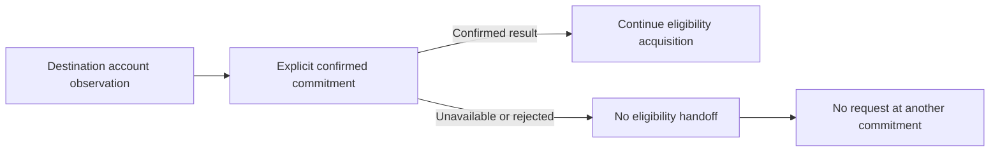

# ADR-0009: Use confirmed commitment for SOL destination reads

## Status

Accepted

## Date

2026-08-27

## Context

ADR-0007 makes native SOL destination eligibility a point-in-time account-state
decision. ADR-0008 requires one complete eligibility handoff for every
destination in a send request. Solana account RPC methods can evaluate state at
`processed`, `confirmed`, or `finalized` commitment, so the selected level
changes which bank supplies the owner, executable flag, data length, or absence
used by that policy.

The account facts are mutable. An eligible absent or zero-data System account
can later become data-bearing, executable, or owned by another program. Reading
an older bank can therefore accept state that is no longer eligible. Reading a
speculative bank can instead accept state from a fork that is later discarded.

Solana documents `processed` as the node's newest but rollbackable view,
`confirmed` as directly voted on by more than two-thirds of active stake, and
`finalized` as the strongest maximum-lockout state. The RPC protocol permits
commitment to be omitted, in which case the default is typically `finalized`.
That optional protocol default is not precise enough for a payment policy.

Canonical indexing and public balance presentation already require finalized
state because they expose durable history and exact canonical balance. A
pre-send destination check has a different purpose: it needs a substantially
agreed view during transaction preparation.

## Decision

Every RPC acquisition that supplies one or more account observations to the
S1.6.2.2 destination predicate must explicitly request `confirmed` commitment
for all observations it supplies.

This decision constrains only destination-observation acquisition. It does not
set commitment for other Solana account reads or decide how the policy is
represented in internal configuration, method signatures, or public APIs.

Every such acquisition must carry the exact commitment rather than rely on an
RPC server or client-library default. If the node cannot answer at `confirmed`,
destination eligibility is not established and the S1.6.3.1 attempt produces
no successful handoff. The SDK must not retry by omitting commitment or
substituting `processed` or `finalized`. A retry, if separately approved, must
preserve `confirmed`.

This selection balances two distinct risks:

- `processed` is fresher but may describe a fork that never survives; and
- `finalized` is strongest against rollback but intentionally older, increasing
  the window in which newer account state can make the destination ineligible.

`confirmed` materially reduces speculative-fork exposure and, on the same
healthy endpoint, is normally closer to current execution state than
`finalized`. Commitment alone does not prove freshness. A confirmed bank can
still be rolled back in exceptional conditions, an RPC node can lag, and the
account can change after observation.

This decision applies only to destination eligibility. It does not change:

- finalized canonical indexing;
- finalized public SOL balance responses; or
- any not-yet-approved commitment for blockhash acquisition, fee reads,
  simulation, preflight, submission, or confirmation.

If S1.6.3.2 is accepted, `docs/SYSTEM_REQUIREMENTS.md` must clarify that the
existing lower-commitment rejection applies to canonical indexing and must add
the explicit confirmed destination-read policy. This prevents the finalized
indexing rule from being misread as a global Solana RPC commitment rule.

## Scope boundary

S1.6.3.2 decides only the commitment used for destination account eligibility.
It does not decide:

- validation and use of the contextual response already required by ADR-0007;
- a minimum context slot or maximum acceptable node lag;
- stale or regressing response handling;
- `getAccountInfo`, `getMultipleAccounts`, or JSON-RPC batching;
- duplicate-destination mapping or RPC cardinality;
- account-data encoding, slicing, or total-length proof;
- wire-error or public error mapping;
- internal configuration, method-signature, or public API representation;
- endpoint binding or whether a load-balanced URL honors one backend view;
- retry count, backoff, or endpoint failover;
- in-operation revalidation timing;
- balance, blockhash, fee, transaction, signing, or simulation policy; or
- broadcast, preflight, ambiguity, or confirmation behavior.

Those remain separate approvals. In particular, this ADR does not require a
later blockhash or simulation decision to copy `confirmed`; their coherence
must be evaluated in their own steps.

## Alternatives considered

### Use processed commitment

Rejected. It supplies the newest node-local state, but an eligible result may
belong to a fork that the cluster later abandons.

### Use finalized commitment

Rejected for destination eligibility. It provides the strongest rollback
protection but can miss a newer transition from eligible to data-bearing,
executable, or non-System-owned state. It remains required for canonical
indexing and public balance presentation.

### Omit commitment and rely on the RPC or SDK default

Rejected. The documented default is typically finalized, library defaults can
change with dependency selection, and omission makes the intended product
policy invisible on the wire.

### Require processed and confirmed observations to agree

Deferred. It may conservatively detect some newer state changes, but it adds a
multi-bank comparison whose context, endpoint, and failure precedence have not
been approved.

## Consequences

- Every supplied destination observation has one visible and testable
  commitment policy.
- A confirmed-state outage fails closed instead of changing safety semantics.
- On a comparably healthy endpoint, destination validation normally observes a
  newer bank than finalized indexing and public balance presentation.
- Confirmed fork risk, node lag, and post-observation state changes remain
  residual risks for later context, freshness, endpoint, and revalidation
  decisions.
- No generic address, wallet, transaction, indexing, persistence, HTTP, or
  JSON-RPC type changes for S1.6.3.2.

## Validation requirements

Focused tests must prove:

- every RPC acquisition supplying one or more destination observations carries
  exact `commitment: "confirmed"`;
- an omitted, `processed`, or `finalized` commitment is never substituted;
- an RPC failure at confirmed produces no retry at another commitment;
- only the result obtained under confirmed commitment reaches destination
  classification;
- one batch attempt applies the same commitment to every supplied destination
  observation;
- finalized indexing and finalized public balance behavior remain unchanged;
- Bitcoin and Ethereum preparation behavior remains unchanged.

## Approval boundary

Decision `S1.6.3.2` was explicitly approved on 2026-08-27. Acceptance records
the fixed confirmed destination-read policy and the matching
canonical-requirement clarification only. It does not authorize Solana source,
wallet, transaction, RPC, configuration, dependency, API, or test
implementation, and it does not approve later S1.6.3 decisions.

## References

- [Solana RPC commitment levels](https://solana.com/docs/rpc#configuring-state-commitment)
- [Solana `getAccountInfo`](https://solana.com/docs/rpc/http/getaccountinfo)
- [Solana transaction commitment guidance](https://solana.com/developers/cookbook/transactions/confirmation#fetch-blockhashes-with-the-appropriate-commitment-level)
- [Anza RPC client commitment documentation](https://github.com/anza-xyz/agave/blob/master/rpc-client/src/rpc_client.rs)
- `docs/SYSTEM_REQUIREMENTS.md`
- `docs/adr/0004-derive-native-sol-history-from-system-transfers.md`
- `docs/adr/0007-require-zero-data-system-wallet-destinations.md`
- `docs/adr/0008-treat-sol-destination-observations-as-one-attempt.md`
- `ARCHITECTURE.md`
- `apps/api/src/config.rs`
