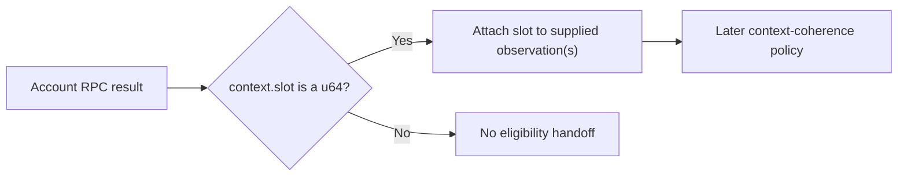

# ADR-0010: Require valid context slots for SOL destination observations

## Status

Accepted

## Date

2026-08-27

## Context

ADR-0007 permits a native SOL destination to be classified only from one
complete account observation. ADR-0008 makes the observations for one send
request an all-or-nothing attempt, and ADR-0009 fixes `confirmed` as the
commitment for every RPC acquisition supplying them.

Solana account RPC responses do not return only an account value. The response
envelope also contains a context whose `slot` identifies the bank position at
which the node evaluated the request. The value may be either an account object
or explicit `null`; the contextual envelope applies in both cases.

Ignoring that context would discard the only protocol field that locates the
observation in the node's chain view. Treating a malformed contextual response
as complete would also let `value: null` become absence without knowing where
the node evaluated it.

A context slot still has limited meaning. It is neither the account's creation
or last-modification slot nor a produced-block height, block identity,
confirmation count, wall-clock time, or canonical indexing checkpoint. A slot
number alone also does not prove freshness, fork identity, or coherence with a
separate RPC response.

## Decision

Every successful RPC result that supplies one or more account observations to
the S1.6.3.1 attempt must contain an object `context` with a required `slot`.
The slot must deserialize directly as a JSON unsigned integer representable by
Rust `u64`.

The complete structural policy is:

| Response context | S1.6.3.3 result |
|---|---|
| `context.slot` from `0` through `u64::MAX` | Structurally valid |
| Missing or null `context` | Observation unavailable |
| Non-object `context` | Observation unavailable |
| Missing or null `context.slot` | Observation unavailable |
| Negative, fractional, exponent-form, string, Boolean, collection, or out-of-range slot | Observation unavailable |

Slot zero is valid. This step must not introduce a non-zero requirement or
narrow the value through a signed integer, floating-point value, or smaller
unsigned integer.

The context requirement applies equally to a populated account value and
explicit `value: null`. Only a valid context paired with explicit `null` may
reach ADR-0007's absent-account classification. An otherwise complete account
object paired with invalid context is also unavailable and must not reach the
eligibility predicate, even if its account facts would have produced a
definitive unsupported-destination result.

The validated context slot remains attached to every observation supplied by
that RPC result. If one future response supplies several account values, each
mapped observation carries that response's one slot. If several responses
supply one attempt, each observation retains the slot returned with its own
response. One missing or malformed context makes the complete S1.6.3.1 handoff
fail and every observation from that attempt is discarded.

The slot is Solana-local, ephemeral acquisition evidence. A future internal
representation must keep it inseparable from the present-or-absent account
observation for the current outbound operation, then discard it. It must not be
serialized into a transaction snapshot, persisted by indexing, exposed in the
public send contract, or generalized into a chain-neutral contextual account
type for this decision. Exact private Rust type and field names remain an
implementation detail.

The context slot must not be stored in or converted to the current
`BlockHeight` or `BlockRef`. A destination response context provides no block
hash, parent, produced-block height, or proof that its slot produced a block,
so it cannot form an indexing checkpoint. ADR-0003's future `BlockPosition`
could represent the same numeric native coordinate without supplying those
missing semantics. Whether the private observation stores that approved value
or a Solana-local slot value remains an implementation detail; the observation
wrapper and its lifetime remain Solana-local either way.

Solana's optional `apiVersion` context field is not required or consumed by
this boundary. The destination-observation decoder must ignore it regardless
of its JSON value, just as it ignores unrelated additive context metadata.
Neither can replace or weaken the required slot.

S1.6.3.3 validates and carries the slot but does not compare it. Differing
valid slots in one attempt remain distinct at this boundary. This step does not
select a minimum or maximum, require equality or monotonicity, reject an old or
apparently future slot, or claim that several observations form one atomic RPC
snapshot.

If S1.6.3.3 is accepted, `docs/SYSTEM_REQUIREMENTS.md` must add the matching
canonical requirement that every supplied destination observation, including
explicit absence, carries a valid returned Solana context slot and that an
invalid context fails destination validation. That requirement must preserve
the separation between RPC context and canonical block/checkpoint identity.

## Scope boundary

S1.6.3.3 decides only structural validation, association, and ephemeral
retention of the returned response slot. It does not decide:

- a minimum context slot, its source, or `minContextSlot` request semantics;
- maximum acceptable node lag or apparently future-slot handling;
- stale, equal, decreasing, or otherwise regressing slot policy;
- fork identity or same-bank guarantees;
- equality, ordering, or aggregation across several valid response slots;
- `getAccountInfo`, `getMultipleAccounts`, JSON-RPC batching, or call order;
- duplicate-address mapping, response cardinality, or provider batch limits;
- account-data encoding, slicing, or authoritative total-length proof;
- exact transport, JSON-RPC, domain, or public error mapping;
- endpoint binding, load-balanced backend behavior, retry, or failover;
- revalidation timing or context comparison with balance, blockhash, fee,
  simulation, preflight, submission, or confirmation reads; or
- transaction construction, signing, broadcast, or ambiguous submission.

Those remain separate approvals. In particular, successful structural parsing
under S1.6.3.3 does not establish that the observation is fresh enough to use.

## Alternatives considered

### Ignore response context and classify only `value`

Rejected. It loses the protocol position of the account observation and allows
a structurally incomplete response to influence destination eligibility.

### Treat `value: null` as absence without valid context

Rejected. Missing context is an incomplete response, not evidence that the
account was absent in an evaluated bank view.

### Require a positive slot

Rejected. Solana's slot type is the complete `u64` domain, including zero. A
non-zero rule would invent a protocol constraint and confuse structural
validity with later plausibility or freshness policy.

### Reuse `BlockHeight`, `BlockRef`, or an indexing checkpoint

Rejected. A context slot is a native RPC coordinate without the produced-block
facts and canonical identity required by those indexing concepts.

### Collapse several response slots into one attempt-wide slot

Rejected for this step. Selecting a minimum, maximum, or equality rule would
silently decide the later context-coherence policy and could misrepresent
separate observations as one atomic snapshot.

### Persist or publicly expose the observation slot

Rejected. The observation is a pre-send point-in-time check, not canonical
history or a durable property of the transaction or address.

## Consequences

- Every account fact or explicit absence used by destination eligibility keeps
  its returned evaluation coordinate.
- Malformed context fails closed before ADR-0007 classification.
- Multi-response acquisition may retain several distinct valid slots until a
  later policy decides whether they are coherent enough to use.
- The future Solana adapter needs a private contextual observation boundary,
  but generic wallet, transaction, indexing, persistence, and HTTP contracts do
  not change for S1.6.3.3.
- Slot freshness, fork coherence, endpoint consistency, and post-observation
  account changes remain residual risks for later decisions.

## Validation requirements

Focused tests must prove:

- slots `0`, `1`, and `u64::MAX` are structurally accepted;
- a missing or null context, non-object context, missing or null slot,
  negative value, fractional or exponent-form value, string, Boolean,
  collection, and `u64::MAX + 1` are rejected;
- valid context plus explicit `value: null` can reach absent-account
  classification;
- invalid context plus `value: null` never becomes absence;
- invalid context plus otherwise classifiable present-account facts never
  reaches the ADR-0007 predicate;
- one invalid contextual response prevents the complete S1.6.3.1 handoff and
  leaks no observations;
- one response slot remains associated with every account value it supplied;
- several valid, differing response slots remain attached to their own
  observations without comparison or aggregation;
- missing, null, string, or unexpected JSON values under `apiVersion`, and
  unrelated additive context fields, do not change slot validation; and
- no context observation is persisted, publicly returned, or converted to an
  indexing block reference.

## Approval boundary

Decision `S1.6.3.3` was explicitly approved on 2026-08-27. Acceptance records
only the required context-slot structure, its Solana-local ephemeral
association with each destination observation, and the matching
canonical-requirement correction. It does not authorize Solana source, wallet,
transaction, RPC, configuration, dependency, API, or test implementation, and
it does not approve later S1.6.3 decisions.

## References

- [Solana `getAccountInfo`](https://solana.com/docs/rpc/http/getaccountinfo)
- [Solana `getMultipleAccounts`](https://solana.com/docs/rpc/http/getmultipleaccounts)
- [Solana RPC JSON structures](https://solana.com/docs/rpc/json-structures)
- [Anza RPC response context](https://github.com/anza-xyz/agave/blob/master/rpc-client-types/src/response.rs)
- [Solana SDK slot type](https://github.com/anza-xyz/solana-sdk/blob/master/clock/src/lib.rs)
- `docs/SYSTEM_REQUIREMENTS.md`
- `docs/adr/0003-separate-native-block-position-from-produced-block-height.md`
- `docs/adr/0007-require-zero-data-system-wallet-destinations.md`
- `docs/adr/0008-treat-sol-destination-observations-as-one-attempt.md`
- `docs/adr/0009-use-confirmed-commitment-for-sol-destination-reads.md`
- `sdk/chains/base/src/block.rs`
- `packages/json-rpc/src/value.rs`
