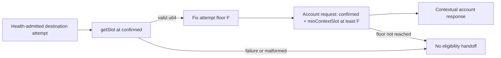

# ADR-0011: Anchor SOL destination reads to one confirmed attempt slot

## Status

Accepted

## Date

2026-08-27

## Context

ADR-0008 makes destination eligibility for one native SOL send request one
all-or-nothing acquisition attempt. ADR-0009 requires every RPC acquisition
supplying its account observations to use explicit `confirmed` commitment.
ADR-0010 requires every supplied observation to retain its returned
`context.slot`.

Commitment selects a class of bank, but it does not by itself express a lower
numeric position for a later request. Separate confirmed account calls could
otherwise be answered from a bank below the confirmed position already seen at
the beginning of this operation because a node regressed, a backend lagged, or
a later endpoint-affinity failure reached a different backend.

Solana account RPC configuration provides `minContextSlot`. Current Agave first
selects a bank at the requested commitment, rejects the request when that
bank's slot is below `minContextSlot`, and otherwise evaluates the request
against that selected bank. The parameter is therefore a lower bound, not a
request for historical state at exactly that slot. A successful response may
have a context slot equal to or greater than the requested minimum.

The attempt needs an initial floor before its first destination account read.
It must not obtain that floor from finalized indexing, a source balance, a
blockhash, or a previous account response: each choice either has different
semantics, leaves the first read unanchored, or prematurely decides a later
transaction-preparation step.

## Decision

Every fresh S1.6.3.1 destination-observation attempt must establish one
immutable slot floor `F` before issuing any destination account request.

ADR-0015 now requires exact native `getHealth` admission before this floor
acquisition. That health call is the attempt's first RPC admission call but
supplies no slot. The confirmed `getSlot` below remains the first slot-bearing
acquisition and the only call that can establish `F`.

The attempt establishes `F` from a successful:

```text
getSlot({ commitment: "confirmed" })
```

The commitment must be explicit. An attempt with no inherited operation floor
does not carry `minContextSlot` on this opening request, because it establishes
the attempt's first floor rather than being constrained by an earlier one.
ADR-0014 narrowly refines this rule for a successor attempt inside the same
live send invocation: its opening `getSlot` must carry the inherited operation
floor as `minContextSlot`, and its nominally successful result must satisfy the
exact sent floor before it can establish `F`. A first attempt and a separate or
process-restored operation remain unconstrained by a predecessor floor.

The bare `getSlot` result must deserialize directly as a JSON unsigned integer
representable by Rust `u64`. Slot zero is valid. A missing, null, negative,
fractional, exponent-form, string, Boolean, collection, or out-of-range result
does not establish a floor. A transport or JSON-RPC failure likewise
establishes no floor. Without `F`, the attempt issues no destination account
request and produces no S1.6.3.1 eligibility handoff.

Every RPC request that supplies one or more destination account observations
in that attempt must then carry both:

```text
commitment: "confirmed"
minContextSlot: at least F
```

The same immutable base `F` applies to every destination and every account
request in the attempt. It applies whether S1.6.3.6 later selects
`getAccountInfo`, `getMultipleAccounts`, or another approved composition of
those account methods. Omitting, defaulting, or sending a value below `F` is
not permitted. S1.6.3.4 does not decide whether a later approved
stale-response rule may raise an individual request's effective floor above
`F`.



Under the Solana RPC contract, a conforming successful account response is
evaluated at a context slot greater than or equal to `F`; equality is valid and
the response need not describe state at exactly `F`. The returned slot still
belongs to ADR-0010's observation. It does not replace or mutate the attempt
floor.

An RPC `MinContextSlotNotReached` response, including the reference server's
`-32016` error, supplies no account observation. Its reported current context
slot does not replace, lower, or re-establish `F`. The SDK must not recover by
omitting `minContextSlot`, sending a value below `F`, or changing commitment.
Exact error mapping, retryability, backoff, and whether any later wire call
belongs to a new attempt remain later decisions.

`F` is private, Solana-local, and ephemeral. It belongs only to the current
destination-acquisition attempt. It must not be configured by callers,
persisted, placed in an indexing checkpoint or transaction snapshot, or
exposed through wallet or HTTP contracts. Exact internal type and field names
remain implementation details.

The attempt must not substitute any of these values for `F`:

- a finalized indexing checkpoint or source tip;
- `BlockHeight`, `BlockRef`, or an RPC `blockHeight`;
- a wallet balance observation;
- `getLatestBlockhash.context.slot` or `lastValidBlockHeight`;
- the first account response's context slot.

This decision does not propagate `F` to balance, fee, blockhash, simulation,
preflight, submission, or confirmation requests. Their commitments, ordering,
and operation-coherence rules remain unapproved.

The floor proves only that a conforming destination account response was not
evaluated below the numeric slot returned by the opening confirmed `getSlot`
response. It does not prove proximity to the cluster tip, a maximum observation
age, fork ancestry, same-bank identity, atomicity across calls, or the slot at
which an account last changed.

The matching canonical requirement makes each health-admitted
destination-observation attempt obtain one explicit confirmed `getSlot` result
as its first slot-bearing acquisition and use that ephemeral slot as the base
`minContextSlot` floor for every destination account request, without omission
or lowering.

## Scope boundary

S1.6.3.4 decides only the initial floor source, its commitment, its lifetime,
and its required placement on destination account requests. It does not decide:

- defensive handling of a nominally successful response below `F`;
- equality, decrease, increase, spread, or aggregation among several returned
  context slots;
- maximum node lag, wall-clock age, or apparently future-slot policy;
- comparisons with slots from earlier or later attempts;
- fork identity, ancestry, or same-bank proof;
- `getAccountInfo`, `getMultipleAccounts`, JSON-RPC batching, concurrency, or
  account-call ordering;
- duplicate-address mapping, response cardinality, or provider limits;
- account-data encoding, slicing, or authoritative total-length proof;
- exact transport, JSON-RPC, domain, or public error mapping;
- physical endpoint binding or behavior behind one load-balanced URL;
- retry count, backoff, attempt restart, or endpoint failover;
- revalidation timing; or
- balance, fee, blockhash, simulation, preflight, submission, confirmation, or
  ambiguous-broadcast policy.

S1.6.3.5 will decide defensive stale and regressing-response handling without
lowering this immutable base floor. Later transaction steps may define their
own coherent lower bounds, but S1.6.3.4 does not propagate `F` to them.

## Alternatives considered

### Omit `minContextSlot` or use constant zero

Rejected. It permits an arbitrarily lagging confirmed bank to supply the
observation. A genuine `getSlot` result of zero remains valid at genesis, but a
hard-coded zero provides no operation-specific lower bound.

### Use processed or finalized `getSlot`

Rejected. A processed floor may be ahead of the confirmed bank required by
ADR-0009 and unnecessarily make confirmed account reads unavailable. A
finalized floor can trail the confirmed bank and therefore provides a weaker
operation-opening floor. The floor and the protected reads use the same
explicit confirmed commitment.

### Use the finalized indexing checkpoint or source tip

Rejected. Those values belong to durable canonical traversal and may lag the
operation-start confirmed state. Depending on them would also couple wallet
transaction preparation to indexing internals.

### Use a blockhash response context

Deferred. It could eventually anchor several transaction RPCs, but selecting
it now would decide blockhash commitment, acquisition order, and lifetime
before those transaction steps are approved.

### Use a source-balance response context

Rejected for this step. The first balance read would itself need a floor, and
multi-source batches would require unapproved aggregation, commitment, and
ordering policy.

### Chain account reads from the previous response slot

Rejected as the initial floor. The first account request would remain
unanchored, later requests would become order-dependent, and the choice would
prematurely decide S1.6.3.5 and constrain S1.6.3.6.

## Consequences

### Positive

- Every destination account request has one visible, testable lower bound.
- A lagging confirmed bank below the attempt-opening position cannot
  conformingly supply an account observation.
- The floor works with either single-account or multi-account acquisition.
- Sending remains independent of indexing, source balance, and not-yet-approved
  blockhash sequencing.

### Negative

- Each fresh destination attempt requires an additional logical RPC
  acquisition before account reads.
- A responding confirmed bank or backend that cannot satisfy the attempt floor
  reduces liveness by failing the attempt closed.

### Neutral

- `F` is a numeric lower bound, not an exact-state selector or global freshness
  proof.
- No generic address, wallet, transaction, indexing, persistence,
  configuration, or HTTP type changes for S1.6.3.4.

## Validation requirements

Focused tests must prove:

- a destination attempt obtains `F` before any account request using exact
  `getSlot` with explicit `commitment: "confirmed"`; an attempt without an
  inherited operation floor sends no initial `minContextSlot`, while an
  ADR-0014 successor sends and defensively enforces its exact inherited floor;
- floor results `0`, `1`, and `u64::MAX` are structurally accepted;
- every malformed or out-of-range floor result prevents all destination account
  requests, signing, simulation, and broadcast;
- transport and JSON-RPC failure while acquiring `F` produces no eligibility
  handoff;
- every destination account request carries exact
  `commitment: "confirmed"` and `minContextSlot` no lower than `F`;
- one or many destination account requests in the same attempt preserve the
  same immutable base floor;
- a `MinContextSlotNotReached` response produces no observation and never
  triggers a request with an omitted or lower floor;
- the current context slot reported with `MinContextSlotNotReached` neither
  replaces, lowers, nor re-establishes `F`;
- response slots equal to or above `F` do not mutate `F`;
- no indexing checkpoint, balance context, blockhash field, configuration, or
  caller input supplies the opening floor;
- the floor is not persisted, serialized into a snapshot, or publicly exposed;
  and
- Bitcoin and Ethereum transaction preparation remain unchanged.

Defensive tests for a server that returns nominal success below `F`, and for
equal, decreasing, or widely separated successful context slots, belong to
S1.6.3.5.

## Approval boundary

Decision `S1.6.3.4` was explicitly approved on 2026-08-27. Acceptance records
only the confirmed first slot-bearing `getSlot` attempt base floor, its
required lower-bound placement in every destination account request, its
ephemeral lifetime, and the matching canonical-requirement correction. It does
not authorize Solana source, wallet, transaction, RPC, configuration,
dependency, API, or test implementation, and it does not approve later
S1.6.3 decisions.

## References

- [Solana `getSlot`](https://solana.com/docs/rpc/http/getslot)
- [Solana `getAccountInfo`](https://solana.com/docs/rpc/http/getaccountinfo)
- [Solana `getMultipleAccounts`](https://solana.com/docs/rpc/http/getmultipleaccounts)
- [Solana `getLatestBlockhash`](https://solana.com/docs/rpc/http/getlatestblockhash)
- [Anza RPC bank and minimum-context selection](https://github.com/anza-xyz/agave/blob/master/rpc/src/rpc.rs)
- [Anza minimum-context RPC error](https://github.com/anza-xyz/agave/blob/master/rpc-client-api/src/custom_error.rs)
- `docs/SYSTEM_REQUIREMENTS.md`
- `docs/adr/0003-separate-native-block-position-from-produced-block-height.md`
- `docs/adr/0008-treat-sol-destination-observations-as-one-attempt.md`
- `docs/adr/0009-use-confirmed-commitment-for-sol-destination-reads.md`
- `docs/adr/0010-require-valid-context-slots-for-sol-destination-observations.md`
- `docs/adr/0014-carry-sol-destination-progress-across-operation-retries.md`
- `docs/adr/0015-gate-sol-destination-reads-on-native-rpc-health.md`
- `packages/json-rpc/src/client.rs`
- `sdk/chains/base/src/block.rs`
- `sdk/chains/base/src/transaction.rs`
- `sdk/wallets/src/wallet.rs`
