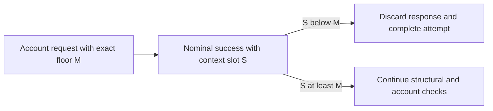

# ADR-0012: Reject SOL destination responses below the requested floor

## Status

Accepted

## Date

2026-08-27

## Context

ADR-0008 makes the destination observations for one native SOL send request one
all-or-nothing acquisition attempt. ADR-0009 requires explicit `confirmed`
commitment, ADR-0010 requires every supplied observation to retain a valid
returned `context.slot`, and ADR-0011 establishes one immutable attempt base
floor `F` before account reads.

ADR-0011 requires every destination account request to carry an effective
`minContextSlot` no lower than `F`. A later approved policy may raise an
individual request's effective floor above `F`. Let `M` be the exact effective
`minContextSlot` serialized on one request and `S` be the valid
`context.slot` decoded from that request's nominally successful response.

Current Agave selects a bank for the requested commitment, returns
`MinContextSlotNotReached` when that bank's slot is below `M`, and otherwise
constructs the response context from the selected bank. A successful response
from the reference implementation therefore has `S >= M`; equality is valid.
Both `getAccountInfo` and `getMultipleAccounts` follow this rule.

The SDK must still treat an RPC endpoint and every intermediary as an external
boundary. A nominal JSON-RPC success claiming `S < M` contradicts the lower
bound requested on that call. The SDK needs a defensive rule for that response
before it trusts any returned account value, without yet deciding ordering
among different successful responses or broader freshness policy.

## Decision

The Solana destination-account acquisition boundary must retain the semantic
association between every outgoing logical account request and the exact
effective floor `M` placed in that request's `minContextSlot` field. Generic
JSON-RPC machinery continues to own wire IDs, response correlation, and batch
ordering; this decision introduces no second correlation mechanism.

For each nominally successful destination account response, the boundary must:

1. decode and validate `context.slot` as required by ADR-0010;
2. compare the decoded slot `S` with the exact request-local floor `M`; and
3. permit account-value domain classification, exposure, or handoff only when
   `S >= M`.

The complete response may be syntactically deserialized into a private wire DTO
to obtain its context. This rule does not require staged JSON parsing. It
requires the floor guard to run before any decoded account value or `null` is
interpreted as a domain fact or exposed to later logic.

The comparison is direct unsigned `u64` ordering. It must not use subtraction,
addition, or a derived threshold. `S == M` is valid, including at zero and
`u64::MAX`. `S > M` passes this one guard but proves no broader freshness or
coherence property.

If a nominally successful response has `S < M`, the entire response is
unusable acquisition evidence:

- no present account value from it may be classified;
- an explicit `null` value must not be classified as account absence;
- an otherwise unsupported account must not become a destination-policy
  rejection;
- a `getMultipleAccounts` response supplies none of its array values because
  its one response context covers the complete array; and
- the complete S1.6.3.1 attempt produces no eligibility handoff and discards
  every observation already acquired in that attempt.

Nothing from that failed attempt may reach signing, simulation, or broadcast.
This decision fixes the all-or-nothing logical result; it does not decide
whether already scheduled calls are cancelled, drained, or allowed to finish.

The comparison must use the exact floor sent on the corresponding request, not
only ADR-0011's base `F`. For example, when `F = 100`, `M = 120`, and `S = 110`,
the response fails even though `S >= F`.

This nominal-success violation is distinct from a server-returned
`MinContextSlotNotReached` JSON-RPC error. The SDK must not synthesize that wire
error, reinterpret the response as an ordinary account result, lower or omit
the floor, or change commitment. Exact private error vocabulary, retryability,
public error mapping, diagnostics, backoff, endpoint failover, and whether a
later call starts a fresh attempt remain later decisions.

The future concrete Solana account-acquisition adapter owns this check because
it owns both request construction and response interpretation. A private wire
type may decode `context.slot`, but a generic decoder cannot validate the
request-response invariant without the request-local `M`. This decision adds
no Solana semantics to `packages/json-rpc`, `sdk/chains/base`, `sdk/indexing`,
`sdk/wallets`, persistence, transaction snapshots, configuration, or public
HTTP contracts.

For several account requests in one attempt, each response is checked only
against its own sent floor. This decision does not compare successful response
slots with one another. A response that passes `S >= M` must still pass all
other structural, account, destination, and attempt checks before it can
contribute to an eligibility handoff.

If S1.6.3.5.1 is accepted, `docs/SYSTEM_REQUIREMENTS.md` must add the matching
canonical requirement: a nominally successful destination account response
whose context slot is below the exact `minContextSlot` sent on its request is
rejected before account-value or absence classification, and the complete
attempt produces no eligibility handoff.

## Scope boundary

S1.6.3.5.1 decides only the defensive comparison between one nominally
successful response slot and the exact floor sent on its corresponding
request. It does not decide:

- equality, ordering, decrease, increase, or spread among separately valid
  response slots inside one attempt;
- whether one valid response slot raises a later request's effective floor;
- comparisons across attempts, maximum node lag, wall-clock age, or apparently
  future-slot policy;
- fork identity, ancestry, same-bank proof, or atomicity across calls;
- `getAccountInfo`, `getMultipleAccounts`, JSON-RPC batching, concurrency,
  cancellation, or account-call ordering;
- endpoint affinity or behavior behind one load-balanced URL;
- retry count, retryability, backoff, attempt restart, or endpoint failover;
- exact transport, JSON-RPC, private-domain, or public error variants and
  mappings, except that this locally detected nominal-success violation must
  remain distinguishable from the server-returned wire error;
- response cardinality, duplicate-address mapping, provider limits, account
  encoding, slicing, or authoritative total-length proof;
- revalidation timing; or
- balance, fee, blockhash, simulation, preflight, submission, confirmation, or
  ambiguous-broadcast policy.

S1.6.3.5.2 will decide ordering and spread among individually floor-valid
response slots inside one attempt. S1.6.3.5.3 will decide cross-attempt and
maximum-lag policy.

## Alternatives considered

### Trust every nominally successful response

Rejected. It would allow a response that contradicts the exact lower bound in
its request to influence destination eligibility.

### Compare only with the immutable base floor `F`

Rejected. A request may validly carry a higher effective floor `M`; accepting
`F <= S < M` would ignore the stronger contract actually placed on that call.

### Inspect or salvage the account value before rejecting the context

Rejected. The account value and `null` absence are observations from the same
below-floor response. Neither can safely establish account facts for this
attempt.

### Convert the nominal success into `MinContextSlotNotReached`

Rejected. That named JSON-RPC error is a server response with its own wire
shape. The SDK may detect a local request-response invariant violation without
inventing a different wire result or prematurely fixing its error mapping.

### Require every successful response slot to equal `M`

Rejected. `minContextSlot` is a lower bound, not an exact historical-state
selector. Current Agave permits a selected bank above the requested minimum.

### Compare the response with another response slot

Deferred to S1.6.3.5.2. It is independent of whether this response violates its
own request-local floor.

### Retry with an omitted or lower floor

Rejected. It would weaken ADR-0011 and permit the same unsafe observation the
floor was introduced to prevent. Retry behavior that preserves all approved
constraints remains undecided.

## Consequences

### Positive

- Every account response that passes this guard declares a context slot that
  satisfies the exact numeric lower bound placed on its request.
- A response that explicitly declares a below-floor context slot cannot
  contribute destination-eligibility evidence.
- Present values, explicit absence, and multi-account arrays share one
  fail-closed rule.
- The check remains private to the chain boundary that has enough information
  to enforce it.

### Negative

- A nominally successful but below-floor response reduces liveness by failing
  the complete destination-observation attempt.
- The adapter must retain each logical request's effective floor until it
  validates the already wire-correlated response.

### Neutral

- Equality and any greater slot pass only this guard; they do not prove a
  common bank, fork ancestry, atomicity, or proximity to the cluster tip.
- The rule is independent of whether a later decision selects single-account,
  multi-account, sequential, concurrent, or batched acquisition.
- No generic RPC, wallet, indexing, persistence, configuration, snapshot, or
  public API change is approved by S1.6.3.5.1.

## Validation requirements

Focused tests must prove:

- `M = 0, S = 0`, `M = 1, S = 1`, and
  `M = u64::MAX, S = u64::MAX` pass this guard;
- `S > M` passes this guard where representable, without implying that later
  checks accept the observation;
- `M = 1, S = 0` and `M = u64::MAX, S = u64::MAX - 1` fail without arithmetic
  overflow or underflow;
- when `F = 100`, `M = 120`, and `S = 110`, the response fails against exact
  `M` even though it is not below `F`;
- with base `F = 100`, requests using `M1 = 110` and `M2 = 130`, a declared
  response slot of `120` passes the first request's guard and fails the second
  request's guard, proving that neither response uses the other request's
  retained floor;
- a below-floor present account never reaches the eligibility predicate;
- a below-floor otherwise unsupported present account does not become a
  destination-policy rejection;
- a below-floor `null` does not become account absence;
- a below-floor multi-account response exposes none of its array values;
- one below-floor response makes the complete attempt produce no handoff and
  discards earlier valid observations;
- the failed attempt reaches no signing, simulation, or broadcast;
- no recovery request omits or lowers `minContextSlot` or changes commitment;
- a server-returned `MinContextSlotNotReached` error remains distinct from a
  locally detected nominal-success violation;
- separately successful responses that are equal, increasing, decreasing, or
  widely separated while each remains above its own floor are not rejected by
  this guard alone; and
- Bitcoin and Ethereum behavior remains unchanged.

## Approval boundary

Decision `S1.6.3.5.1` was explicitly approved on 2026-08-27. Acceptance records
only the request-local below-floor rejection rule and its matching
`docs/SYSTEM_REQUIREMENTS.md` correction. It does not authorize Solana source,
wallet, transaction, RPC, configuration, dependency, API, or test
implementation, and it does not approve S1.6.3.5.2, S1.6.3.5.3, or later
S1.6.3 decisions.

## References

- [Solana `getAccountInfo`](https://solana.com/docs/rpc/http/getaccountinfo)
- [Solana `getMultipleAccounts`](https://solana.com/docs/rpc/http/getmultipleaccounts)
- [Agave v3.1.8 minimum-context selection](https://github.com/anza-xyz/agave/blob/v3.1.8/rpc/src/rpc.rs#L269-L285)
- [Agave v3.1.8 single-account response](https://github.com/anza-xyz/agave/blob/v3.1.8/rpc/src/rpc.rs#L530-L556)
- [Agave v3.1.8 multi-account response](https://github.com/anza-xyz/agave/blob/v3.1.8/rpc/src/rpc.rs#L558-L588)
- [Agave v3.1.8 response context construction](https://github.com/anza-xyz/agave/blob/v3.1.8/rpc/src/rpc.rs#L144-L149)
- `docs/SYSTEM_REQUIREMENTS.md`
- `docs/adr/0007-require-zero-data-system-wallet-destinations.md`
- `docs/adr/0008-treat-sol-destination-observations-as-one-attempt.md`
- `docs/adr/0009-use-confirmed-commitment-for-sol-destination-reads.md`
- `docs/adr/0010-require-valid-context-slots-for-sol-destination-observations.md`
- `docs/adr/0011-anchor-sol-destination-reads-to-one-confirmed-attempt-slot.md`
- `packages/json-rpc/src/client.rs`
