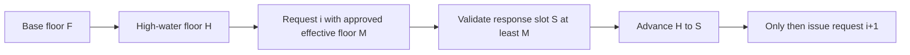

# ADR-0013: Chain SOL destination reads through a monotonic floor

## Status

Accepted

## Date

2026-08-27

## Context

ADR-0008 permits one native SOL destination-observation attempt to use one or
several account RPC responses while making its eligibility handoff
all-or-nothing. ADR-0010 retains each response's valid `context.slot`, ADR-0011
establishes the attempt's immutable confirmed base floor `F`, and ADR-0012
rejects a nominal success below the exact `minContextSlot` sent on its request.

Those decisions make each response individually floor-valid, but they do not
yet relate several successful responses inside one attempt. If every request
uses only `F`, an attempt could first accept a response declaring slot `120`
and later accept one declaring slot `105` because both are above `F = 100`.
The later observation would numerically regress behind the confirmed context
slot the attempt had already accepted.

Current Agave treats `minContextSlot` as a lower bound, not an exact-slot
selector. It independently selects a commitment bank for each account request,
rejects it when its slot is below the request's minimum, and constructs the
response context from that selected bank. `getMultipleAccounts` selects one
bank and returns one context for all values in that response.

The RPC contract defines no equality or maximum-spread guarantee across
separate responses. Current Agave also exposes no bank hash, fork identity, or
cross-request sequence in the response context. Equal numeric slots therefore
do not prove one bank, while increasing slots may legitimately skip any number
of numeric positions.

The attempt needs a method-neutral way to prevent numeric regression without
inventing an unsupported slot-distance threshold or prematurely selecting
`getAccountInfo` versus `getMultipleAccounts`.

## Decision

Each destination-observation attempt owns a private, ephemeral high-water floor
`H`. It is initialized once from ADR-0011's immutable base floor:

```text
H = F
```

If the attempt needs one contextual account response, its request carries an
effective `minContextSlot` `M = H` and ADR-0012 validates its returned slot
`S`. No cross-response rule is needed.

S1.6.3.5.2 introduces no other source that may inflate `M`. If another
separately approved rule later supplies an additional request floor, the
effective `M` is the greatest of `H` and only those approved floors. An
implementation must not choose an arbitrary value above `H`.

If the attempt needs more than one contextual account response, the requests
must form a causal sequence:

1. issue one request with effective floor `M = H`, unless another separately
   approved floor requires `M` to be higher;
2. wait for its response;
3. require its context to pass every approved contextual guard, currently
   ADR-0010's structural validation and ADR-0012's `S >= M` check;
4. advance `H` to `max(H, S)`; and
5. only then issue the next account request with an effective floor no lower
   than the advanced `H`.

Because an accepted response already satisfies `S >= M >= H`, advancing the
high-water floor is equivalent to assigning `H = S`. The implementation must
use comparison or assignment, not addition or subtraction.



This causal floor chain makes every accepted response slot nondecreasing in
the deliberately sequenced request order. Equality is valid. Any forward jump
is valid under this decision, including a jump of many slots. S1.6.3.5.2
defines no maximum within-attempt spread by itself and performs no
slot-distance arithmetic. Every response remains subject to separately
approved freshness and plausibility guards, including S1.6.3.5.3 if accepted.

A response that supplies several account values advances `H` once using its
single context slot. If one response supplies every required observation, the
sequence consists of one request and the chaining rule is otherwise vacuous.
If later method and cardinality decisions require several single-account or
multi-account chunks, every chunk participates in the same chain.

The sequencing consequence is intentional: several contextual account
requests in one attempt must not be concurrent and must not be submitted as
independent entries in one JSON-RPC batch. A later request cannot carry a floor
derived from its predecessor until that predecessor has returned and its
context has passed every approved contextual guard, currently ADR-0010 and
ADR-0012. Sorting concurrently returned slots or ordering them by arrival,
input position, or JSON-RPC ID is not causal chaining.

The chain does not decide which destination or chunk is queried first.
S1.6.3.6 must choose the method, grouping, cardinality, deduplication, mapping,
and logical request order while preserving this dependency.

Only a response that passes every approved contextual guard may advance `H`.
Those guards currently include ADR-0010 and ADR-0012 and will include any
later accepted freshness or plausibility policy. A transport or JSON-RPC
failure, malformed context, below-floor nominal success, or other contextual
rejection supplies no successor floor and makes the all-or-nothing attempt
produce no eligibility handoff. The SDK must not continue the chain by lowering
`H`, reverting to `F`, omitting `minContextSlot`, changing commitment, or
inventing a slot from error data.

A context accepted by every approved contextual guard can advance `H` before
later account-value classification. Whether a definitively unsupported account
stops remaining acquisition or the SDK continues for diagnostic precedence
remains undecided; any continued request must still use the advanced floor. No
observation from an ultimately failed or rejected attempt reaches later
preparation.

`H` never mutates ADR-0011's base `F`. It is Solana-local and exists only for
the current attempt. It must not be persisted, configured, publicly exposed,
stored in a transaction snapshot, or used as an indexing checkpoint.
S1.6.3.5.2 authorizes no automatic inheritance by a fresh attempt; any later
cross-attempt comparison or derived floor requires S1.6.3.5.3 approval.

The private concrete Solana destination-account acquisition adapter or
coordinator owns `F`, `H`, each logical request's effective `M`, causal
issuance, contextual validation, and the complete-or-empty handoff.
`packages/json-rpc` continues to own JSON-RPC framing, wire IDs, response
correlation, batch-result ordering, and generic transport execution; it gains
no Solana slot semantics or causal acquisition policy.

The high-water chain proves only numeric non-regression among declared response
slots. It does not prove that the responses came from the same bank, backend,
fork, or ancestry; that earlier account facts remain true at the final `H`;
that all observations formed an atomic snapshot; or that the endpoint reported
its underlying state honestly. Account state can still change immediately
after any observation.

If S1.6.3.5.2 is accepted, `docs/SYSTEM_REQUIREMENTS.md` must add the matching
canonical requirement: when one destination-observation attempt needs several
contextual account responses, it issues them causally and sequentially, and
each request after the first carries a floor no lower than the greatest
predecessor slot accepted by every approved contextual guard. Without another
separately approved floor, that greatest predecessor slot is the exact request
floor; arbitrary floor inflation is forbidden. Accepted response slots are
therefore nondecreasing; this ordering guard permits equality and defines no
maximum forward spread by itself, while separately approved freshness and
plausibility guards still apply.

## Scope boundary

S1.6.3.5.2 decides only the private within-attempt high-water floor, causal
request dependency, numeric non-regression, and absence of a maximum
within-attempt spread. It does not decide:

- the account RPC method, grouping, chunk size, provider limit, deduplication,
  response cardinality, or destination-to-result mapping;
- which destination or chunk establishes each position in the request order;
- whether one valid contextual response's later account-policy rejection stops
  remaining acquisition;
- comparisons across attempts or reuse of any prior attempt slot;
- maximum node lag, wall-clock age, or apparently future-slot policy;
- endpoint affinity, backend identity, node restart behavior, or behavior
  behind a load-balanced URL;
- fork identity, ancestry, bank hash, same-bank proof, or atomicity;
- post-acquisition or pre-signing revalidation of earlier observations;
- exact transport, JSON-RPC, private-domain, or public error mapping;
- retry count, backoff, fresh-attempt restart, or endpoint failover;
- account-data encoding, slicing, or authoritative total-length proof; or
- balance, fee, blockhash, simulation, preflight, submission, confirmation, or
  ambiguous-broadcast coherence.

S1.6.3.5.3 will decide cross-attempt comparison, maximum lag, and apparently
future slots. S1.6.3.6 will decide account acquisition and mapping while
respecting this causal sequence.

## Alternatives considered

### Apply only the immutable base floor `F`

Rejected. It permits a later request to return a numerically older context than
one the same attempt already accepted, despite the protocol providing a native
lower-bound mechanism.

### Compare concurrently acquired responses after they return

Rejected. Concurrent calls cannot carry floors derived from one another.
Choosing input order, response arrival order, or JSON-RPC ID after the fact
would make acceptance depend on an arbitrary ordering rather than a causal
request-response relationship.

### Sort the returned slots before validation

Rejected. Sorting makes every set appear nondecreasing and therefore detects
no regression. It also destroys the relationship between a request, its floor,
and its response.

### Require all response slots to be equal

Rejected. `minContextSlot` cannot request exact historical state, and confirmed
state may advance between valid calls. Equality would reduce liveness and
pressure S1.6.3.6 toward one RPC method without proving same-bank or same-fork
identity.

### Permit a fixed maximum slot spread

Rejected. The RPC contract provides no maximum-spread threshold. Slots can be
skipped, elapsed time is not encoded by slot subtraction, one slot can contain
a relevant account change, and a large forward advance can be legitimate.

### Re-read every earlier account at the final high-water slot

Deferred. That may narrow some mixed-time observation risk but decides
revalidation, request amplification, mapping, and termination policy beyond
numeric non-regression.

### Force one `getMultipleAccounts` response

Deferred to S1.6.3.6. One response naturally provides one context, but method
selection must also decide request limits, grouping, duplicate mapping, and
unsupported input sizes.

### Carry the final high-water floor into another attempt

Deferred to S1.6.3.5.3. ADR-0008 currently requires a fresh attempt to retain
no account observations from its predecessor, and cross-attempt slot policy is
independent of within-attempt ordering.

## Consequences

### Positive

- A later accepted account response cannot declare a lower slot than an
  earlier accepted response in the same causal sequence.
- The policy uses Solana's existing `minContextSlot` contract and needs no
  project-defined distance constant.
- Equality, advancing confirmed state, and either single- or multi-account
  response shapes remain supported.
- A lagging backend below the attempt's current high-water floor fails closed
  instead of supplying a regressing observation.

### Negative

- Several account responses require sequential round trips; they cannot be
  acquired concurrently or through one independent JSON-RPC batch.
- One large declared forward jump raises every remaining request floor and may
  reduce liveness. Apparently future-slot handling remains S1.6.3.5.3.
- The chain does not refresh earlier observations after a later response
  advances `H`.

### Neutral

- This ordering guard defines no maximum accepted forward spread inside one
  attempt; later contextual guards still apply.
- A one-response acquisition satisfies the rule without additional calls.
- Numeric monotonicity is not an atomic snapshot, bank identity, fork proof, or
  end-of-attempt revalidation.
- No generic RPC, wallet, indexing, persistence, snapshot, configuration, or
  public API change is approved by S1.6.3.5.2.

## Validation requirements

Focused tests must prove:

- a one-response attempt uses exact `M = F` in the absence of another approved
  floor and requires no successor request;
- with `F = 100`, a first request using `M1 = 100` and returning `S1 = 120`
  causes the next request to use exact `M2 = 120` in the absence of another
  approved floor;
- `S2 = 120` is accepted as equality and leaves `H = 120`;
- a later `S3 = 150` is accepted and advances `H` to `150`;
- no successor request is issued before the predecessor context passes every
  approved contextual guard, currently ADR-0010 and ADR-0012;
- no request is emitted with `M < H`, an arbitrary `M > H`, omitted
  `minContextSlot`, or a changed commitment when no other approved floor
  applies;
- a nominal success declaring `S < M` fails under ADR-0012, yields no
  successor floor, and produces no eligibility handoff;
- `MinContextSlotNotReached`, transport failure, JSON-RPC failure, or malformed
  context yields no successor floor and never triggers a lowered request;
- one response supplying several account values advances `H` exactly once;
- several response chunks are causally chained and never overlap in flight;
- the adapter does not use independent JSON-RPC batch entries for a
  multi-response attempt;
- an arbitrarily large forward spread passes this ordering rule alone while
  remaining subject to separately approved contextual guards;
- `H = u64::MAX` is valid, a later request carries exact `M = u64::MAX`, and no
  arithmetic overflows;
- S1.6.3.5.2 alone provides no automatic prior-`H` inheritance or
  cross-attempt floor input; any later comparison or derived floor is covered
  only by S1.6.3.5.3;
- when a context passes every approved contextual guard and advances `H` but
  later account decoding or destination classification fails, any deliberately
  continued diagnostic request uses the advanced floor and the eventual
  attempt discards every observation;
- any eventual attempt failure discards every acquired observation and reaches
  no signing, simulation, or broadcast;
- `H` is not persisted, publicly returned, configured, or converted into an
  indexing checkpoint; and
- Bitcoin and Ethereum behavior remains unchanged.

## Approval boundary

Decision `S1.6.3.5.2` was explicitly approved on 2026-08-27. Acceptance records
only the within-attempt causal high-water floor, its sequencing consequence,
the absence of a maximum within-attempt spread from this ordering guard, and
the matching `docs/SYSTEM_REQUIREMENTS.md` correction. It does not authorize
Solana source, wallet, transaction, RPC, configuration, dependency, API, or
test implementation, and it does not approve S1.6.3.5.3.1,
S1.6.3.5.3.2, S1.6.3.5.3.3, S1.6.3.6, or later decisions.

## References

- [Solana RPC commitment levels](https://solana.com/docs/rpc#configuring-state-commitment)
- [Solana `getAccountInfo`](https://solana.com/docs/rpc/http/getaccountinfo)
- [Solana `getMultipleAccounts`](https://solana.com/docs/rpc/http/getmultipleaccounts)
- [Agave v4.2 minimum-context check](https://github.com/anza-xyz/agave/blob/v4.2/rpc/src/rpc.rs#L261-L275)
- [Agave v4.2 confirmed-bank selection](https://github.com/anza-xyz/agave/blob/v4.2/rpc/src/rpc.rs#L333-L344)
- [Agave v4.2 account responses](https://github.com/anza-xyz/agave/blob/v4.2/rpc/src/rpc.rs#L503-L557)
- [Agave v4.2 response construction](https://github.com/anza-xyz/agave/blob/v4.2/rpc/src/rpc.rs#L141-L145)
- [Agave response context](https://github.com/anza-xyz/agave/blob/master/rpc-client-types/src/response.rs#L66-L72)
- [Agave confirmed-bank tracker](https://github.com/anza-xyz/agave/blob/master/rpc/src/optimistically_confirmed_bank_tracker.rs#L290-L404)
- `docs/SYSTEM_REQUIREMENTS.md`
- `docs/adr/0008-treat-sol-destination-observations-as-one-attempt.md`
- `docs/adr/0010-require-valid-context-slots-for-sol-destination-observations.md`
- `docs/adr/0011-anchor-sol-destination-reads-to-one-confirmed-attempt-slot.md`
- `docs/adr/0012-reject-sol-destination-responses-below-the-requested-floor.md`
- `packages/json-rpc/src/client.rs`
- `packages/json-rpc/src/lib.rs`
- `sdk/chains/ethereum/src/rpc/accounts.rs`
