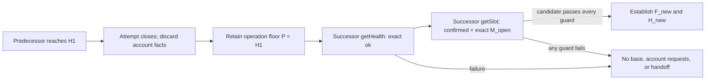

# ADR-0014: Carry SOL destination progress across retries of one operation

## Status

Accepted

## Date

2026-08-27

## Context

ADR-0008 makes one native SOL destination acquisition an all-or-nothing
attempt. A failed attempt discards every account observation and a later
attempt, if separately authorized, must reacquire every required destination.
ADR-0011 gives each attempt a confirmed `getSlot` base floor `F`. ADR-0013
derives an ephemeral high-water floor `H` from `F` and advances `H` only while
that attempt causally accepts contextual account responses.

Those decisions do not yet say whether a separately authorized successor
attempt inside the same still-running destination-validation operation may
move below the predecessor's final `H`.

A full reset would improve availability after a lower confirmed view following
process reconstruction, backend change, fork movement, or a falsely high
response. It would also permit a downgrade inside one logical send
preparation. For example, an attempt could accept destination A at slot `120`,
fail while acquiring destination B, and then let its successor accept the
complete destination set from slot `110`. Discarding A's account value prevents
fact reuse, but it does not prevent the successor from moving behind the
numeric lower bound already accepted for that operation.

Solana's documented `confirmed` commitment is strong but not final. Official
guidance says a blockhash fetched at `confirmed` has a very low, rather than
zero, chance of belonging to a dropped fork and warns that RPC nodes may expose
different levels of cluster progress. A response context contains a slot and
optional API version; it does not identify a bank, fork ancestry, validator
process, or backend instance. Numeric non-regression therefore cannot prove
same-fork continuity, but `minContextSlot` can still fail closed against a
lower numeric view.

Solana's `getSlot` method accepts `minContextSlot`. Current Agave applies that
minimum through the same bank-selection guard used by account methods and
returns `MinContextSlotNotReached` when the selected bank is below it. A
successor can therefore carry one numeric operation floor into its own opening
request instead of first trusting an unconstrained lower base.

That is request-local server behavior. Solana RPC defines no client operation
identity, cross-request watermark, or persistence for earlier floors. The
operation floor and every lifetime boundary below are Payment-SDK policy.

The policy needs a narrow lifetime. A valid-looking but false extreme slot,
including `u64::MAX`, can make the remaining attempts unable to satisfy their
floor. Sharing such a value across independent sends, process restarts,
wallets, or persistent state would turn one response into unbounded denial of
service.

S1.6.3.5.3 therefore has three separate concerns:

1. whether and where numeric progress crosses an attempt boundary;
2. what independent reference, if any, can bound acceptable node lag; and
3. how to reject an apparently future slot before it raises a floor.

This ADR decides only the first concern.

## Decision

One operation is the in-memory native SOL destination-validation lifetime
belonging to one public single- or batch-send invocation. It includes every
automatic destination reacquisition, retry, endpoint restart, or internal
preparation reconstruction before that invocation returns or is cancelled.
The operation owns an optional private numeric progress floor `P` and begins
with no `P`. It never obtains `P` from another caller invocation, wallet,
process, restored operation, indexer, snapshot, configuration value, or
persistent record.

ADR-0015 now requires one endpoint-bound `getHealth` admission before every
attempt's opening `getSlot`. Health supplies no slot and cannot create, lower,
raise, replace, consume, or validate `P`. The flows below begin after that
admission and continue to describe the first slot-bearing acquisition.

The first attempt begins with a provisional base candidate:

```text
getSlot({ commitment: "confirmed" }) -> F_candidate
validate every applicable guard
F = F_candidate
H = F
```

Under the rules approved through S1.6.3.5.3.1, no prior operation floor or
other approved opening floor exists for the first attempt, so that opening
`getSlot` carries no `minContextSlot`.

Whenever an attempt that established `H` closes while its containing public
invocation remains live, the operation must retain exactly one derived
lower-bound constraint:

```text
P = greatest H reached by any closed predecessor attempt in this operation
```

Every account value, explicit absence, eligibility classification, mapping,
and partial result is still discarded under ADR-0008. The predecessor's `F`,
`H`, request-local `M` values, and response objects also end with that attempt;
only the derived scalar constraint represented by `P` crosses into the
successor. An earlier successful eligibility handoff supplies no account fact
to a later reacquisition; that reacquisition still starts as a fresh attempt.

A successor attempt must establish its own base `F_new`. Under the rules
approved through S1.6.3.5.3.1, its exact opening request floor is:

```text
M_open = P
getSlot({ commitment: "confirmed", minContextSlot: M_open }) -> F_candidate
```

If a separately approved later rule supplies a higher opening floor, the exact
`M_open` must be the greatest of `P` and only those approved floors. The
successor must retain that request-local `M_open`, structurally validate the
bare candidate, apply every other approved freshness or plausibility guard,
and defensively require `F_candidate >= M_open` before establishing
`F_new = F_candidate`. Equality is valid. A nominal success below `M_open`,
malformed result, transport failure, JSON-RPC failure, or
`MinContextSlotNotReached` establishes no new base, issues no destination
account request, and produces no eligibility handoff. Error data, including a
minimum-context error's reported current slot, must not replace, lower, or
raise `P`. A rejected candidate never becomes `F`, `H`, or `P`.

After a valid successor base:

```text
H_new = F_new
```

ADR-0013 then chains the successor's account requests normally. Since the
opening call required and defensively verified
`F_new >= M_open >= P`, every effective account floor is also no lower than
`P`. No `max(F_new, P)` is needed after a valid opening response, and the
implementation must not use addition or subtraction.



When another attempt closes after reaching `H_new` while the containing
invocation remains live, the operation updates:

```text
P_new = max(P, H_new)
```

`H_new` is already no lower than `P`, so assignment to `H_new` is equivalent.
Direct comparison or assignment must be used. A malformed context,
below-request-floor nominal success, transport or JSON-RPC error, or error-data
slot never advances `H` and therefore never advances `P`.

A context-slot candidate that passes every approved contextual guard may
advance `H` before later account decoding or destination classification. If
the attempt later closes and the live operation performs another acquisition,
its final accepted `H` may therefore become `P`, but none of the account facts
cross the boundary. A candidate rejected by any applicable guard never raises
`H` or `P`. A late response from a closed attempt must not advance `P` or
contribute evidence to its successor.

The operation floor is a fail-closed safety choice with a bounded liveness
cost. A lower confirmed view makes the successor unable to establish a base
until a selected backend reaches `M_open`; the live operation may terminate
before that occurs. A false extreme value can remain unreachable for the
operation's entire lifetime. Apparently future-slot handling was unresolved
when this ADR was accepted. The proposed Destination Account Acquisition ADR
now supplies an endpoint-local closing witness and delays floor promotion; that
rule remains unapproved until the named proposal is accepted.

`P` ends only when the containing public send invocation returns success or a
terminal error, is cancelled, or is lost with the process. An identical
payload submitted later is a separate caller invocation and starts without
`P`. An operation restored after process loss also starts without `P`; this ADR
authorizes no persistence or resumption protocol. Reconstructing a destination
coordinator or restarting preparation inside the same live invocation must not
reset `P`.

This decision does not authorize any retry or reacquisition. It only defines
the floor behavior if a later decision creates a successor attempt inside the
same still-running public send invocation. Whether a particular failure is
retryable, how many attempts are allowed, and whether endpoint failover or
later-stage reacquisition is permitted remain undecided.

The future private concrete Solana send-preparation destination coordinator is
created per public invocation and owns the operation identity, `P`,
attempt-local `F` and `H`, request-local floors, causal issuance, and
complete-or-empty handoff. Reconstructing its attempt machinery must preserve
the containing operation's `P`. `P` must not be a mutable field on a shared RPC
client or sender because concurrent operations require isolated floors. The
concrete Solana RPC adapter owns request construction and the request-result
comparison. `packages/json-rpc` continues to own framing, transport, wire IDs,
and response correlation; it gains no Solana slot or operation lifetime.

No state owner in `sdk/chains/base`, `sdk/wallets`, `sdk/indexing`, persistence,
configuration, or `apps/api` may store `P`. This ADR does not decide whether
non-semantic diagnostics may record numeric slots, but diagnostic data must not
be read back as a floor or eligibility input.

If S1.6.3.5.3.1 is accepted, `docs/SYSTEM_REQUIREMENTS.md` must add the matching
canonical requirement: if a separately approved behavior starts a successor
destination-observation attempt inside the same live native SOL send
invocation, only the greatest accepted attempt high-water floor may cross the
boundary. The successor must reacquire every account observation and establish
a new confirmed `getSlot` base using the exact inherited operation floor as
`minContextSlot`. Inability to satisfy that floor or a nominal success below
the exact sent floor must fail before any destination account request without
omitting or lowering the floor. A separate caller invocation or operation
restored after process loss starts with no inherited floor.

Acceptance must also clarify ADR-0011: its unconstrained opening `getSlot` rule
continues to govern a first attempt or any attempt without an inherited
operation floor, while ADR-0014 narrowly supersedes that rule for a successor
inside one live operation. ADR-0013's attempt-local `H = F` initialization
remains unchanged because the successor establishes `F` only after its opening
candidate satisfies `M_open` and every other applicable guard.

## Scope boundary

S1.6.3.5.3.1 decides only the operation-local numeric progress floor, its
placement on a successor's opening `getSlot`, its candidate-promotion guard,
and its reset boundary. It does not decide:

- which failures permit another attempt or whether retries exist at all;
- retry count, backoff, cancellation, endpoint failover, or error precedence;
- a maximum acceptable node lag, its reference, threshold, or units;
- an apparently future-slot reference, tolerance, or rejection rule;
- the contents, thresholds, or failure mapping of future freshness and
  plausibility guards, except that a candidate rejected by any applicable
  guard may not become `F` or raise `H` or `P`;
- physical endpoint affinity, backend identity, process identity, or behavior
  behind a load-balanced URL;
- fork identity, ancestry, bank hash, rollback classification, or atomicity;
- the account RPC method, grouping, cardinality, deduplication, response
  mapping, or request order;
- exact transport, JSON-RPC, private-domain, or public error mapping;
- in-attempt revalidation or whether an earlier account fact remains true at
  the final `H`;
- account encoding, slicing, or authoritative total-length proof; or
- balance, fee, blockhash, simulation, preflight, submission, confirmation,
  or ambiguous-broadcast coherence.

ADR-0016 through ADR-0022 record the accepted no-reference, exact-input, and
empty-batch boundaries. If accepted, the named Public Transaction Semantics
and Destination Account Acquisition proposals would consolidate order/index
behavior, slot-plausibility, account acquisition, and mapping. The former
nested future labels become historical only upon that acceptance.

## Alternatives considered

### Reset every slot at each attempt boundary

Rejected for successor attempts inside one live operation. It improves
recovery from rollback or a false high slot, but allows the same destination
validation to reacquire its complete evidence below a numeric floor it already
accepted. A new caller invocation or process-restored operation still resets
to bound the poisoning risk.

### Carry the predecessor floor across every future operation

Rejected. A valid-looking false slot could poison unrelated sends, wallets,
process restarts, and persistent state indefinitely. The floor has meaning
only as an in-memory guard for one live operation.

### Carry only account observations that already succeeded

Rejected. It violates ADR-0008 and could assemble one eligibility result from
different attempts, endpoints, or chain views. Only a scalar lower bound may
cross the boundary.

### Carry only the predecessor's original base `F`

Rejected. The attempt may have accepted a later account context and advanced
`H`; reverting to `F` would permit the successor to move below progress already
accepted by that operation.

### Obtain an unconstrained new base, then use `max(F_new, P)` on accounts

Rejected. `getSlot` itself supports `minContextSlot`, so the predecessor floor
can be made visible and enforceable on the successor's first slot-bearing
acquisition after ADR-0015 health admission. Constraining only later account
reads adds an avoidable unconstrained step and weakens the causal chain.

### Reject a successor immediately when its node is below `P`

Rejected as a separate client policy. Sending `P` through the protocol lets a
conforming server either answer from a suitable confirmed bank or return its
defined minimum-context failure. The SDK still defensively rejects a nominal
success below the exact requested `M_open`.

### Retain last-seen slots per endpoint, wallet, or address

Rejected. It adds hidden shared state, couples unrelated or concurrent sends,
and cannot prove that one URL represents one unchanged backend or fork.

### Let a caller supply a previous floor

Rejected. It exposes a private chain-policy mechanism and permits accidental
or malicious liveness poisoning.

### Reset `H` inside a still-active attempt

Rejected. It violates ADR-0013's within-attempt monotonic floor. Only a failed
or otherwise closed attempt may reduce its final `H` to the narrower
operation-floor meaning `P`, and only while the containing invocation remains
live.

### Decide maximum lag and future-slot rejection here

The empty reference set and inseparable numeric non-guarantee are decided by
S1.6.3.5.3.2.2.1. Startup/static unsupported lag/reference configuration is
decided by ADR-0017 and S1.6.3.5.3.2.2.2.1. The shared public destination
object is decided by ADR-0018 and S1.6.3.5.3.2.2.2.2.1. The single-send
envelope is decided by ADR-0019 and S1.6.3.5.3.2.2.2.2.2. The batch item is
decided by ADR-0020 and S1.6.3.5.3.2.2.2.2.3. The batch-root schema is decided
by ADR-0021 and S1.6.3.5.3.2.2.2.2.4.1. Cardinality/empty behavior is decided
by ADR-0022 and its historical approval label. Order/index behavior is now
would be owned by the Public Transaction Semantics proposal upon acceptance,
and future-slot handling would likewise be owned by Destination Account
Acquisition. Neither follows from the lifetime of `P`.

## Consequences

### Positive

- A successor inside one operation cannot conformingly reacquire destination
  evidence below the greatest numeric floor that operation already accepted.
- Every successor still establishes its own confirmed base and reacquires all
  account observations.
- One scalar guard provides operation-local downgrade resistance without
  persisting account facts or coupling independent sends.
- Placing `P` on the opening `getSlot` makes the cross-attempt dependency
  explicit at the first slot-bearing call after health admission.

### Negative

- A lower confirmed view after rollback, process reconstruction, or backend
  change makes the live operation unavailable until a selected backend reaches
  the floor or the operation terminates.
- A valid-looking false extreme slot can poison the remainder of that one
  operation under this ADR alone. The proposed Destination Account Acquisition
  closing witness narrows that risk but remains separately approvable.
- Every successor repeats health admission, its opening `getSlot`, and all
  destination reads.

### Neutral

- Numeric non-regression does not prove same-bank identity, fork ancestry,
  atomicity, or that an earlier account fact remains current.
- A new caller invocation or operation restored after process loss may start
  below a completed or abandoned predecessor because it has no inherited `P`.
- No retry, failover, or endpoint-switch behavior is authorized.
- No Solana implementation or test code is authorized by S1.6.3.5.3.1.

## Validation requirements

Focused tests must prove:

- under the rules approved through this step, the first attempt in an operation
  first passes ADR-0015 health admission and then issues confirmed `getSlot`
  without `minContextSlot`; only a candidate that passes every applicable guard
  establishes `F` and initializes `H = F`;
- after an attempt reaches `F1 = 100`, advances to `H1 = 120`, and fails, a
  separately authorized successor sends confirmed `getSlot` with exact
  `M_open = minContextSlot = 120`;
- successor candidates `F2 = 120` and `F2 > 120` that pass every other
  applicable guard establish the new base and initialize `H2 = F2`;
- a nominal candidate `F2 = 119`, malformed result, transport or JSON-RPC
  failure, or `MinContextSlotNotReached` issues no account request and produces
  no eligibility handoff;
- if another separately approved opening floor is higher than `P`, the exact
  `M_open` sent and defensively checked is that higher approved floor;
- an error's reported current slot cannot replace, lower, or raise `P`;
- failure after establishing `F1 = 100` but before an account response retains
  `P = 100`, while failure before establishing any first base creates no `P`;
- a context accepted by every applicable guard can advance `H` and later `P`
  even if account decoding or classification subsequently fails, while none of
  its account facts survive;
- malformed context, below-request-floor nominal success, transport or RPC
  failure, and late responses from closed attempts never raise `P`;
- a base or account-context candidate rejected by any later applicable lag or
  future-slot guard never becomes `F` or raises `H` or `P`;
- several failed successor attempts keep `P` numerically nondecreasing;
- `P = u64::MAX` is sent and compared without overflow, and can fail only the
  current live operation rather than another operation;
- each successor reacquires every destination and never receives account
  values, absence, classifications, or mappings from its predecessor;
- concurrent destination-validation operations have isolated floors;
- reconstructing destination acquisition or preparation inside the same live
  public invocation cannot reset `P`;
- completion, terminal failure, cancellation, a separate caller invocation,
  and operation restoration after process loss provide no inherited `P`;
- no floor appears in persistence, indexing, configuration, transaction
  snapshots, public HTTP, signing, simulation, or broadcast;
- any failed or rejected operation reaches no signing, simulation, or
  broadcast; and
- Bitcoin and Ethereum behavior remains unchanged.

## Approval boundary

Decision `S1.6.3.5.3.1` was explicitly approved on 2026-08-27. Acceptance
records only the operation-local numeric progress floor, its placement and
defensive validation on successor `getSlot`, its candidate-promotion and
bounded reset rules, the matching `docs/SYSTEM_REQUIREMENTS.md` correction,
and the narrow ADR-0011 clarification. It does not authorize Solana source,
wallet, transaction, RPC, configuration, dependency, API, or test
implementation, and it does not approve S1.6.3.5.3.2, S1.6.3.5.3.3,
S1.6.3.6, or later decisions.

## References

- [Solana RPC commitment levels](https://solana.com/docs/rpc#configuring-state-commitment)
- [Solana transaction confirmation and expiration](https://solana.com/developers/cookbook/transactions/confirmation)
- [Solana `getSlot`](https://solana.com/docs/rpc/http/getslot)
- [Agave v4.2 minimum-context selection](https://github.com/anza-xyz/agave/blob/v4.2/rpc/src/rpc.rs#L260-L275)
- [Agave v4.2 `getSlot` implementation](https://github.com/anza-xyz/agave/blob/v4.2/rpc/src/rpc.rs#L911-L914)
- [Agave response context](https://github.com/anza-xyz/agave/blob/master/rpc-client-types/src/response.rs#L66-L72)
- [Agave confirmed-bank tracker](https://github.com/anza-xyz/agave/blob/master/rpc/src/optimistically_confirmed_bank_tracker.rs#L290-L404)
- `docs/SYSTEM_REQUIREMENTS.md`
- `docs/adr/0008-treat-sol-destination-observations-as-one-attempt.md`
- `docs/adr/0010-require-valid-context-slots-for-sol-destination-observations.md`
- `docs/adr/0011-anchor-sol-destination-reads-to-one-confirmed-attempt-slot.md`
- `docs/adr/0012-reject-sol-destination-responses-below-the-requested-floor.md`
- `docs/adr/0013-chain-sol-destination-reads-through-a-monotonic-floor.md`
- `docs/adr/0015-gate-sol-destination-reads-on-native-rpc-health.md`
- `docs/adr/0016-use-no-independent-sol-lag-reference-initially.md`
- `packages/json-rpc/src/client.rs`
- `packages/json-rpc/src/lib.rs`
