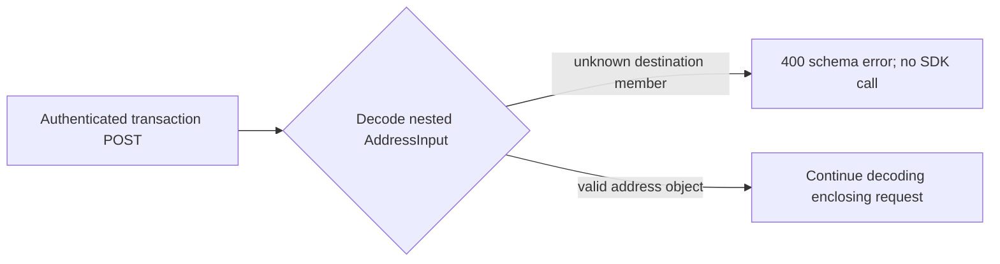

# ADR-0018: Reject unsupported SOL lag-reference destination members

## Status

Accepted

## Date

2026-08-27

## Context

ADR-0016 establishes that initial native SOL support has no independently
trusted cluster-progress reference and no SDK-enforced numeric maximum-lag
guarantee. ADR-0017 therefore rejects startup/static settings that would imply
such a capability. Public transaction JSON remains a separate adapter and
approval boundary.

Both public transaction POST endpoints reuse one destination wire type:

- `POST /v1/wallets/{id}/transactions` contains one
  `SendFunds.destination: AddressInput`; and
- `POST /v1/transactions` contains one
  `WalletTransfer.destination: AddressInput` in every batch item.

`AddressInput` is one shared OpenAPI component and runtime deserialization type.
Approving it for one endpoint necessarily affects the other. Splitting solely
by endpoint would therefore hide an overlapping public contract.

S1.6.3.5.3.2.2.2.2 is instead split by non-overlapping request ownership:

1. S1.6.3.5.3.2.2.2.2.1 decides only the shared destination object;
2. S1.6.3.5.3.2.2.2.2.2 decides only the single-send `SendFunds`
   envelope;
3. S1.6.3.5.3.2.2.2.2.3 decides only the `WalletTransfer`-specific members
   outside the shared `AddressInput`; and
4. S1.6.3.5.3.2.2.2.2.4 is the `TransferRequest`-root umbrella later split by
   ADR-0021 into root-schema and collection-behavior leaves.

The current `AddressInput` is already structurally closed. It accepts only
`encoding` and `text` and derives `Deserialize` with
`#[serde(deny_unknown_fields)]`. Because each POST handler extracts its
complete JSON graph before post-deserialization domain conversion or SDK
delegation, an unknown member in a nested destination currently rejects the
complete request.

The closure must remain intentional when Solana becomes a supported wallet
family. A maximum-lag, provider, quorum, or reference selector describes
transaction-observation policy, not an address. Accepting such a destination
member would also imply a capability that initial support cannot enforce.

## Decision

The shared public `AddressInput` JSON object must remain an exact address-only
schema. It must expose no maximum-lag, reference-provider, provider-role,
quorum, reference-sampling, reference-fallback, or explicit no-reference
member.

Its object fields remain:

- `encoding`, whose accepted enum variants are decided separately; and
- `text`, whose chain-native parsing rules are decided separately.

This decision does not freeze the `AddressEncoding` variants or Solana address
text rules. It decides only that lag/reference controls are not destination
members.

Representative attempted member names include:

- `max_lag_slots` or `max_lag_seconds`;
- `reference_endpoint` or `reference_endpoints`;
- `reference_provider`, `reference_providers`, or `provider_role`;
- `reference_quorum` or `min_reference_responses`; and
- `allow_unbounded_lag`, `freshness_mode`, or another explicit disabled/no-
  reference selector.

These names are rejection probes, not reserved aliases. Every member outside
the approved `AddressInput` schema must fail JSON body deserialization,
regardless of its spelling or whether its value is a positive, zero, or
negative number, `null`, true, false, a string, an array, or an object.

No optional field, default, alias, flattening map, catch-all value, coercion,
preprocessor, warning-only path, or accepted-but-ignored sentinel may convert
an unsupported destination member into a valid request.

For an authenticated request that reaches JSON extraction, a rejected
destination member retains the existing public boundary for either POST
endpoint:

- HTTP status is `400 Bad Request`;
- the response uses the generic message
  `request body must match the documented JSON schema`;
- `transaction_ids` and `failed_index` fields are absent; and
- post-deserialization `TryInto` conversion is not reached for either enclosing
  request, and no request is delegated to `Wallets::send` or
  `Wallets::send_all`.

Consequently, wallet lookup, address parsing, destination observation, RPC,
transaction preparation, signing, simulation, and broadcast are not reached.
A rejected batch destination rejects the whole JSON graph before any item can
produce an accepted prefix or failed index.

The published OpenAPI contract must represent the same shared closure:

- `AddressInput` has `additionalProperties: false`; and
- it publishes no lag/reference property or alias.

This JSON-object decision does not claim that runtime rejects every arbitrary
query parameter or HTTP header. Non-body input policy would require separate
approval. No query parameter or header is introduced or interpreted as a
lag/reference control by this decision.

The shared boundary is:

`apps/api` owns `AddressInput`, its JSON deserialization, HTTP error mapping,
OpenAPI component, and delegation boundary. Concrete Solana,
`sdk/chains/base`, `sdk/wallets`, `sdk/indexing`, persistence, and generic
JSON-RPC gain no public lag/reference-input type or state.

Acceptance adds the matching canonical shared-destination rule to
`docs/SYSTEM_REQUIREMENTS.md` and documents its closed object and generic `400`
rejection in `docs/API.md`. Acceptance also narrows ADR-0014 through ADR-0017
future-step pointers to distinguish the shared destination decision. ADR-0019
later accepts the single-send envelope, and ADR-0020 later accepts the
batch-item members. ADR-0021 later accepts the batch-root schema; cardinality,
empty-list, and order/index behavior remain unapproved.

## Scope boundary

S1.6.3.5.3.2.2.2.2.1 decides only the absence and structural rejection of
lag/reference members in shared `AddressInput`, the resulting existing generic
`400` response and pre-SDK boundary for either enclosing POST request, its
OpenAPI closure, and ownership. It does not decide:

- top-level `SendFunds` members or single-send amount behavior;
- top-level `TransferRequest` members, `WalletTransfer`-specific members,
  batch amount conversion, or downstream batch error metadata;
- runtime rejection of query parameters or HTTP headers;
- authentication failure precedence or bearer-token behavior;
- the final accepted Solana `AddressEncoding` variant or address text rules;
- amount precision, lamport conversion, balances, fees, or priority fees;
- destination account acquisition, grouping, mapping, context floors,
  health, reference evidence, or apparently future slots;
- transaction construction, blockhash acquisition, signing, simulation,
  preflight, submission, confirmation, or ambiguous-broadcast behavior;
- exact JSON parser path, line, column, or rejected-key diagnostics;
- startup/static configuration, readiness, monitoring, or persistence; or
- implementation, dependency, migration, compatibility, or test execution.

ADR-0019 decides the single-send `SendFunds` envelope, ADR-0020 decides the
`WalletTransfer`-specific members, ADR-0021 decides the `TransferRequest` root,
and ADR-0022 decides minimum cardinality. The accepted Public Transaction
Semantics and Destination Account Acquisition decisions consolidate the
remaining collection, non-body input, slot-plausibility, acquisition, and
mapping questions; the former nested future labels are historical.

## Alternatives considered

### Split only by endpoint

Rejected. `AddressInput` is one shared runtime and OpenAPI type. Treating its
closure as single-send-only would hide the same contract change inside every
batch destination or require an unnecessary duplicate DTO.

### Duplicate the destination DTO for each endpoint

Rejected. The exact same chain-native address input is reused intentionally.
Duplicating it solely to manufacture separate approvals would weaken the
repository's preference for fewer, stronger shared wire types.

### Decide all transaction request objects together

Rejected for this micro-step. The shared destination, single-send envelope,
batch item, and batch root have distinct schema ownership and can be approved
without overlap.

### Add optional lag/reference destination members

Rejected. The controls do not describe an address, and `Option` would make an
unsupported capability part of the accepted public contract.

### Treat zero, false, null, or empty values as disabled

Rejected. Sentinels can silently defeat caller intent, while zero could mean a
strict zero-slot tolerance. Every unsupported member presence fails.

### Accept and ignore unsupported members

Rejected. A caller could believe a safety constraint was enforced even though
ADR-0016 establishes that no independent initial reference exists.

### Return a chain-domain or transaction error

Rejected. The enclosing request never forms a valid public input and must fail
at the HTTP JSON boundary before chain or wallet behavior.

## Consequences

### Positive

- One shared address input has one exact meaning in both transaction endpoints.
- A caller cannot hide an unenforceable lag/reference preference inside a
  destination object.
- Rejection happens before wallet, chain, RPC, signing, or broadcast behavior.
- Runtime deserialization and OpenAPI express one closed shared contract.

### Negative

- Clients cannot pre-stage future transaction-observation controls inside a
  destination object.
- Adding a real public reference mode later requires a separately approved
  request owner rather than extending the address type.

### Neutral

- This decision affects the shared destination occurrence in both POST
  request graphs.
- It does not approve either enclosing top-level request schema.
- Bitcoin and Ethereum address-input behavior remains unchanged.
- No implementation or test code is authorized by this decision.

## Validation requirements

Focused future tests must prove:

- valid existing destination objects still decode inside both POST request
  graphs;
- every representative probe fails inside the single-send destination and a
  non-first batch destination;
- each probe fails for positive, zero, and negative numbers, `null`, true,
  false, and empty or non-empty string, array, and object values;
- no alias, default, flattening map, catch-all value, coercion, preprocessing,
  warning-only path, or sentinel accepts an unsupported member;
- every authenticated structural rejection returns `400` with only the generic
  documented-schema message;
- single-send rejection occurs before `Wallets::send`;
- batch rejection occurs before the enclosing request's `TryInto` domain
  conversion and `Wallets::send_all`, with no `transaction_ids` or
  `failed_index`;
- rejection occurs before wallet lookup, destination observation, RPC,
  preparation, signing, simulation, and broadcast;
- OpenAPI marks `AddressInput` with `additionalProperties: false` and publishes
  none of the probe properties;
- this decision alone changes no `SendFunds`, `TransferRequest`, or
  `WalletTransfer`-specific field; and
- Bitcoin and Ethereum behavior remains unchanged.

## Approval boundary

Decision `S1.6.3.5.3.2.2.2.2.1` was explicitly approved on 2026-08-27.
Acceptance records only the shared destination-object rejection policy,
matching canonical and API documentation, and narrow ADR-0014 through ADR-0017
pointer clarifications. It does not authorize Solana source, wallet,
transaction, RPC, configuration, dependency, API, or test implementation, and
it does not approve S1.6.3.5.3.2.2.2.2.2, S1.6.3.5.3.2.2.2.2.3,
S1.6.3.5.3.2.2.2.2.4, S1.6.3.5.3.3, S1.6.3.6, or later decisions.

## References

- `ARCHITECTURE.md`
- `docs/API.md`
- `docs/SYSTEM_REQUIREMENTS.md`
- `apps/api/src/api/contract.rs`
- `apps/api/src/api/error.rs`
- `apps/api/src/api/transaction.rs`
- `apps/api/src/api/api_test.rs`
- `apps/api/tests/route_contract.rs`
- `docs/adr/0014-carry-sol-destination-progress-across-operation-retries.md`
- `docs/adr/0015-gate-sol-destination-reads-on-native-rpc-health.md`
- `docs/adr/0016-use-no-independent-sol-lag-reference-initially.md`
- `docs/adr/0017-reject-unsupported-sol-lag-reference-startup-configuration.md`
- `docs/adr/0019-reject-unsupported-sol-lag-reference-single-send-envelope-members.md`
- `docs/adr/0020-reject-unsupported-sol-lag-reference-batch-item-members.md`
- `docs/adr/0021-reject-unsupported-sol-lag-reference-batch-root-members.md`
