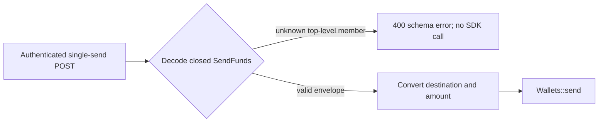

# ADR-0019: Reject unsupported SOL lag-reference single-send envelope members

## Status

Accepted

## Date

2026-08-27

## Context

ADR-0018 accepts the exact shared `AddressInput` object used inside both
transaction POST bodies. It does not decide the enclosing top-level request
objects. S1.6.3.5.3.2.2.2.2.2 now addresses only the single-send envelope.

`POST /v1/wallets/{id}/transactions` declares `SendFunds` as its JSON body.
That endpoint-local object currently has exactly two fields:

- `destination: AddressInput`; and
- `amount: String`.

`SendFunds` derives `Deserialize` with `#[serde(deny_unknown_fields)]`. For an
authenticated request, the handler resolves `Result<Json<SendFunds>,
JsonRejection>` before its post-deserialization `request.try_into()` conversion
and before `Wallets::send`.

The shared destination object's internal fields and closure already belong to
ADR-0018. The outer `destination` occurrence and `amount` field belong to
`SendFunds`. Treating those owners separately prevents this decision from
reopening address encoding or text rules.

Initial native SOL support has no independently trusted cluster-progress
reference and no SDK-enforced numeric maximum-lag guarantee. A top-level
single-send field suggesting such a control would therefore provide false
caller assurance even if the destination object remains closed.

## Decision

The public single-send `SendFunds` JSON object must remain an exact closed
envelope with only:

- `destination`, referencing the already-accepted shared `AddressInput`; and
- `amount`, retaining its existing JSON string representation.

It must expose no top-level maximum-lag, reference-provider, provider-role,
quorum, reference-sampling, reference-fallback, or explicit no-reference
member. This decision does not reinterpret either accepted field:

- it does not reopen any member or invariant inside `AddressInput`; and
- it does not decide amount parsing, positivity, precision, lamport conversion,
  or chain-native limits.

Any future additional top-level field requires a separate public-contract
decision. Representative rejected member names include:

- `max_lag_slots`, `max_lag_seconds`, or `max_slot_distance`;
- `reference_endpoint`, `reference_endpoints`, `reference_rpc_url`, or
  `reference_rpc_urls`;
- `reference_provider`, `reference_providers`, or `provider_role`;
- `reference_quorum` or `min_reference_responses`; and
- `minContextSlot`, `min_context_slot`, `required_slot`, `reference_slot`,
  `commitment`, `reference_timeout`, `sampling`, `allow_unbounded_lag`,
  `disable_reference`, `freshness_mode`, or another policy selector.

Generic wrappers such as `reference`, `freshness`, `lag_policy`, `rpc`,
`provider`, `solana`, or `options` are also rejection probes. Snake-case,
camel-case, kebab-case, dotted, singular, and plural spellings remain unknown
rather than aliases.

These names are rejection probes, not reserved aliases. Every member outside
the approved `SendFunds` schema must fail JSON body deserialization regardless
of its spelling or whether its value is a positive, zero, or negative number,
`null`, true, false, a string, an array, or an object.

No optional field, default, alias, `serde(flatten)` field of any type, catch-all
value, untagged alternative, coercion, preprocessor, warning-only path, or
accepted-but-ignored sentinel may convert an unsupported top-level member into
a valid request.

For an authenticated request that reaches JSON extraction, rejection retains
the existing single-send boundary:

- HTTP status is `400 Bad Request`;
- the response contains only the generic message
  `request body must match the documented JSON schema`;
- `transaction_id`, `transaction_ids`, and `failed_index` fields are absent;
- the handler's post-deserialization `request.try_into()` is not reached; and
- `Wallets::send` is not called.

Consequently, wallet lookup, amount parsing, address conversion or parsing,
destination observation, RPC, transaction preparation, signing, simulation,
and broadcast are not reached.

This rejection is owned by the chain-neutral HTTP envelope and therefore
applies before BTC, ETH, or future SOL wallet-family resolution. It is not a
Solana-domain conditional.

The published OpenAPI contract must represent the same envelope:

- `SendFunds` has `additionalProperties: false`;
- its exact properties are `destination` and `amount`;
- both properties remain required, and `amount` remains a JSON string;
- `destination` continues to reference the accepted shared `AddressInput`;
- it publishes no lag/reference body property or alias.

Runtime and published OpenAPI policy for query parameters or HTTP headers is
wholly outside this JSON-envelope decision and requires separate approval.

The boundary is:

`apps/api` owns `SendFunds`, its JSON extraction, HTTP mapping, OpenAPI
component, and delegation boundary. Concrete Solana, `sdk/chains/base`,
`sdk/wallets`, `sdk/indexing`, persistence, and generic JSON-RPC gain no public
lag/reference-input type or state.

Acceptance adds the matching canonical single-send-envelope rule to
`docs/SYSTEM_REQUIREMENTS.md` and documents its exact body, generic `400`, and
pre-wallet boundary in `docs/API.md`. Acceptance also narrows ADR-0014 through
ADR-0018 future-step pointers to distinguish the accepted shared destination
and single-send envelope. ADR-0020 later accepts the batch item; the batch root
is later split, with ADR-0021 accepting its schema while collection behavior
remains unapproved.

## Scope boundary

S1.6.3.5.3.2.2.2.2.2 decides only the top-level `SendFunds` field set,
structural rejection of unsupported top-level members, existing generic `400`
response, pre-`Wallets::send` boundary, OpenAPI closure, and ownership. It does
not decide:

- any field, enum variant, text rule, or validation inside `AddressInput`;
- amount parsing, decimal precision, positivity, lamport conversion, balances,
  fees, or priority fees;
- the `{id}` path member, wallet-identity validation, or lookup outcome;
- `WalletTransfer`-specific members, the `TransferRequest` root, or batch
  failure behavior;
- runtime or published OpenAPI policy for query parameters or HTTP headers;
- authentication failure precedence or bearer-token behavior;
- destination account acquisition, grouping, mapping, context floors, health,
  reference evidence, or apparently future slots;
- transaction construction, blockhash acquisition, signing, simulation,
  preflight, submission, confirmation, or ambiguous-broadcast behavior;
- exact JSON parser path, line, column, or rejected-key diagnostics;
- startup/static configuration, readiness, monitoring, or persistence; or
- implementation, dependency, migration, compatibility, or test execution.

ADR-0020 decides `WalletTransfer`-specific members, ADR-0021 decides the
`TransferRequest` root, and ADR-0022 decides minimum cardinality. If accepted,
the named Public Transaction Semantics and Destination Account Acquisition
proposals would consolidate the remaining collection, non-body input,
slot-plausibility, acquisition, and mapping questions; the former nested future
labels become historical only upon that acceptance.

## Alternatives considered

### Split `destination` and `amount` into separate approvals

Rejected. They are fields of one Serde and OpenAPI object with one JSON
extraction boundary. Splitting field occurrences would be ceremonial and would
not establish a closed envelope.

### Reopen the nested destination object

Rejected. ADR-0018 already owns `AddressInput`. This decision composes that
accepted component without duplicating or changing it.

### Decide single-send and batch-specific objects together

Rejected for this micro-step. `SendFunds`, `WalletTransfer`, and
`TransferRequest` are separate runtime and OpenAPI object schemas with
non-overlapping field ownership.

### Add optional lag/reference envelope members

Rejected. An `Option` would make an unsupported capability part of the public
contract and create ambiguity between omission, `null`, and later activation.

### Treat zero, false, null, or empty values as disabled

Rejected. Sentinels can silently defeat caller intent, while zero could mean a
strict zero-slot tolerance. Every unsupported member presence fails.

### Accept and ignore unsupported members

Rejected. A caller could believe a safety constraint was enforced even though
ADR-0016 establishes that no independent initial reference exists.

### Return a wallet or transaction error

Rejected. The body never forms a valid `SendFunds` input and must fail at the
HTTP JSON boundary before wallet lookup or transaction behavior.

## Consequences

### Positive

- The single-send envelope has one exact documented meaning.
- A caller cannot silently attach an unenforceable lag/reference preference at
  the top level.
- Rejection happens before wallet lookup, chain RPC, signing, or broadcast.
- Runtime deserialization and OpenAPI express the same closed object.

### Negative

- Clients cannot pre-stage future transaction-observation controls in current
  single-send bodies.
- Adding a real public reference mode later requires a separately approved
  request owner and compatibility decision.

### Neutral

- `AddressInput` remains the accepted shared nested component.
- This decision does not approve any batch-specific field.
- Bitcoin and Ethereum single-send envelope behavior remains unchanged.
- No implementation or test code is authorized by this decision.

## Validation requirements

Focused future tests must prove:

- a valid body containing only `destination` and `amount` still reaches
  `Wallets::send`;
- every representative probe fails as a top-level sibling of those fields;
- each probe fails for positive, zero, and negative numbers, `null`, true,
  false, and empty or non-empty string, array, and object values;
- probe placement before, between, or after the two accepted fields does not
  change rejection;
- no alias, default, `serde(flatten)` field of any type, catch-all value,
  untagged alternative, coercion, preprocessing, warning-only path, or sentinel
  accepts an unsupported member;
- every authenticated rejection returns exactly the generic documented-schema
  `400` body and no `transaction_id`, `transaction_ids`, or `failed_index`;
- rejection occurs before `request.try_into()`, `Wallets::send`, wallet lookup,
  amount parsing, destination observation, RPC, preparation, signing,
  simulation, and broadcast;
- route-level transfer and broadcast effect counters remain unchanged;
- OpenAPI marks `SendFunds` with `additionalProperties: false`, publishes
  exactly `destination` and `amount` as required properties, preserves the
  `AddressInput` reference, keeps `amount` typed as a string, and publishes none
  of the probe body properties;
- this decision alone changes no `AddressInput`, `WalletTransfer`,
  `TransferRequest`, or batch handler behavior; and
- Bitcoin and Ethereum behavior remains unchanged.

## Approval boundary

Decision `S1.6.3.5.3.2.2.2.2.2` was explicitly approved on 2026-08-27.
Acceptance records only the single-send envelope rejection policy, matching
canonical and API documentation, and narrow ADR-0014 through ADR-0018 pointer
clarifications. It does not authorize Solana source, wallet, transaction, RPC,
configuration, dependency, API, or test implementation, and it does not
approve S1.6.3.5.3.2.2.2.2.3, S1.6.3.5.3.2.2.2.2.4, S1.6.3.5.3.3,
S1.6.3.6, or later decisions.

## References

- `ARCHITECTURE.md`
- `docs/API.md`
- `docs/SYSTEM_REQUIREMENTS.md`
- `apps/api/src/api/contract.rs`
- `apps/api/src/api/error.rs`
- `apps/api/src/api/transaction.rs`
- `apps/api/src/api/api_test.rs`
- `apps/api/tests/route_contract.rs`
- `sdk/wallets/src/wallet.rs`
- `sdk/wallets/src/wallets.rs`
- `docs/adr/0016-use-no-independent-sol-lag-reference-initially.md`
- `docs/adr/0017-reject-unsupported-sol-lag-reference-startup-configuration.md`
- `docs/adr/0018-reject-unsupported-sol-lag-reference-destination-members.md`
- `docs/adr/0020-reject-unsupported-sol-lag-reference-batch-item-members.md`
- `docs/adr/0021-reject-unsupported-sol-lag-reference-batch-root-members.md`
