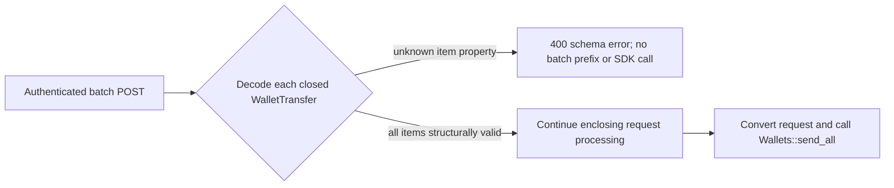

# ADR-0020: Reject unsupported SOL lag-reference batch-item members

## Status

Accepted

## Date

2026-08-27

## Context

ADR-0018 accepts the exact shared `AddressInput` object used inside both
transaction POST bodies. ADR-0019 accepts the enclosing single-send
`SendFunds` object. Neither decision owns the per-transfer object inside the
batch request. S1.6.3.5.3.2.2.2.2.3 now addresses only that batch-item owner.

`POST /v1/transactions` declares `TransferRequest` as its JSON body. Every
element of its `transfers` collection is a `WalletTransfer` with exactly three
fields:

- `wallet_id: String`;
- `destination: AddressInput`; and
- `amount: String`.

`WalletTransfer` derives `Deserialize` with
`#[serde(deny_unknown_fields)]`. The enclosing handler resolves
`Result<Json<TransferRequest>, JsonRejection>` before
its post-deserialization `request.try_into()` conversion and before
`Wallets::send_all`. Consequently, one structurally invalid item prevents the
complete authenticated body from forming, regardless of that item's position.

The shared destination object's internal fields and closure belong to
ADR-0018. The root `transfers` member and ordered collection belong to
`TransferRequest` under the S1.6.3.5.3.2.2.2.2.4 umbrella. ADR-0021 later
accepts its root-schema leaf as S1.6.3.5.3.2.2.2.2.4.1 while leaving collection
behavior separate. Treating these owners separately prevents this decision
from reopening address rules or deciding batch-root semantics.

Initial native SOL support has no independently trusted cluster-progress
reference and no SDK-enforced numeric maximum-lag guarantee. A per-transfer
field suggesting such a control would therefore provide false caller
assurance even if the shared destination and single-send objects remain
closed.

## Decision

The public batch-item `WalletTransfer` JSON object must remain an exact closed
object with only:

- `wallet_id`, retaining its existing JSON string representation;
- `destination`, referencing the accepted shared `AddressInput`; and
- `amount`, retaining its existing JSON string representation.

All three properties remain required. This decision does not reinterpret any
accepted property:

- it does not decide wallet-ID syntax, existence, lookup, family, or asset
  compatibility;
- it does not reopen any member or invariant inside `AddressInput`; and
- it does not decide amount parsing, positivity, precision, lamport conversion,
  or chain-native limits.

`WalletTransfer` must expose no maximum-lag, reference-provider,
provider-role, quorum, reference-sampling, reference-fallback, explicit
no-reference, commitment, or slot-override member. Any future additional item
property requires a separate public-contract decision. Representative rejected
member names include:

- `max_lag_slots`, `max_lag_seconds`, or `max_slot_distance`;
- `reference_endpoint`, `reference_endpoints`, `reference_rpc_url`, or
  `reference_rpc_urls`;
- `reference_provider`, `reference_providers`, or `provider_role`;
- `reference_quorum` or `min_reference_responses`; and
- `minContextSlot`, `min_context_slot`, `required_slot`, `reference_slot`,
  `commitment`, `reference_timeout`, `sampling`, `allow_unbounded_lag`,
  `disable_reference`, `freshness_mode`, or another policy selector.

Generic wrappers such as `reference`, `freshness`, `lag_policy`, `rpc`,
`provider`, `solana`, or `options` are also rejection probes. So are tempting
item aliases such as `wallet`, `walletId`, `source`, `to`, `recipient`,
`value`, or `lamports`. Snake-case, camel-case, kebab-case, dotted, singular,
and plural spellings remain unknown rather than aliases.

These names are rejection probes, not reserved aliases. Every property outside
the approved `WalletTransfer` schema must fail JSON body deserialization
regardless of its spelling, item index, property order, or whether its value is
a positive, zero, or negative number, `null`, true, false, a string, an array,
or an object.

No optional property, default, alias, `serde(flatten)` field of any type,
catch-all value, untagged alternative, coercion, preprocessor, warning-only
path, or accepted-but-ignored sentinel may convert an unsupported batch-item
property into a valid request.

For an authenticated request that reaches JSON extraction, one invalid
`WalletTransfer` retains the existing structural-error boundary for the whole
body:

- HTTP status is `400 Bad Request`;
- the response contains only the generic message
  `request body must match the documented JSON schema`;
- `transaction_id`, `transaction_ids`, and `failed_index` fields are absent;
- no earlier or later item is accepted as a valid prefix;
- the handler's post-deserialization `request.try_into()` is not reached; and
- `Wallets::send_all` is not called.

Consequently, batch amount parsing, destination conversion, wallet lookup,
family or asset compatibility checks, destination observation, RPC,
transaction preparation, signing, simulation, and broadcast are not reached.
This is distinct from a validly decoded batch that later fails at an indexed
conversion or submission stage and may carry a `failed_index` or accepted
transaction IDs.

This boundary does not claim that Serde skipped examining properties or items
that appeared earlier in the JSON text. It establishes that deserialization
produces no complete `TransferRequest`, so no post-deserialization conversion,
accepted prefix, or external effect occurs.

This rejection is owned by the chain-neutral HTTP batch item and therefore
applies before BTC, ETH, or future SOL wallet-family resolution. It is not a
Solana-domain conditional.

The published OpenAPI contract must represent the same component:

- `WalletTransfer` has `additionalProperties: false`;
- its exact properties are `wallet_id`, `destination`, and `amount`;
- all three properties remain required;
- `wallet_id` and `amount` remain JSON strings;
- `destination` continues to reference the accepted shared `AddressInput`;
- it publishes no lag/reference, commitment, or slot-override property or
  alias.

Runtime and published OpenAPI policy for query parameters or HTTP headers is
wholly outside this JSON-item decision and requires separate approval.

The boundary is:

`apps/api` owns `WalletTransfer`, its nested JSON deserialization, HTTP error
mapping, OpenAPI component, and pre-delegation boundary. Concrete Solana,
`sdk/chains/base`, `sdk/wallets`, `sdk/indexing`, persistence, and generic
JSON-RPC gain no public lag/reference-input type or state.

Acceptance adds the matching canonical batch-item rule to
`docs/SYSTEM_REQUIREMENTS.md` and documents its exact object, generic `400`,
whole-body rejection, and pre-wallet boundary in `docs/API.md`. Acceptance also
narrows ADR-0014 through ADR-0019 future-step pointers to distinguish the
accepted shared destination, single-send envelope, and batch item from the
batch root. ADR-0021 later accepts the root-schema leaf while collection
behavior remains unapproved.

## Scope boundary

S1.6.3.5.3.2.2.2.2.3 decides only the `WalletTransfer` field set, structural
rejection of unsupported item properties, existing generic `400` whole-body
response, pre-`Wallets::send_all` boundary, OpenAPI component closure, and
ownership. It does not decide:

- any field, enum variant, text rule, or validation inside `AddressInput`;
- wallet-ID syntax, parsing, existence, lookup, family, asset, or compatibility;
- amount parsing, decimal precision, positivity, lamport conversion, balances,
  fees, or priority fees;
- the `TransferRequest` root field set, collection cardinality, empty-list
  behavior, ordering semantics, duplicate-wallet behavior, or root OpenAPI
  composition;
- runtime or published OpenAPI policy for query parameters or HTTP headers;
- authentication failure precedence or bearer-token behavior;
- destination account acquisition, grouping, mapping, context floors, health,
  reference evidence, or apparently future slots;
- transaction construction, blockhash acquisition, signing, simulation,
  preflight, submission, confirmation, partial valid-batch failure, or
  ambiguous-broadcast behavior;
- exact JSON parser path, line, column, rejected-key, or invalid-item-index
  diagnostics;
- startup/static configuration, readiness, monitoring, or persistence; or
- implementation, dependency, migration, compatibility, or test execution.

ADR-0021 decides the `TransferRequest` root and ADR-0022 decides minimum
cardinality. If accepted, the named Public Transaction Semantics and
Destination Account Acquisition proposals would consolidate the remaining
collection, non-body input, slot-plausibility, acquisition, and mapping
questions; the former nested future labels become historical only upon that
acceptance.

## Alternatives considered

### Split `wallet_id`, `destination`, and `amount` into separate approvals

Rejected. They are properties of one Serde and OpenAPI object with one nested
deserialization boundary. Splitting property occurrences would be ceremonial
and would not establish a closed batch item.

### Reopen the nested destination object

Rejected. ADR-0018 already owns `AddressInput`. This decision composes that
accepted component without duplicating or changing it.

### Decide the batch item and root together

Rejected for this micro-step. `WalletTransfer` and `TransferRequest` are
separate runtime and OpenAPI object schemas with non-overlapping field
ownership.

### Add optional lag/reference item properties

Rejected. An `Option` would make an unsupported capability part of the public
contract and create ambiguity between omission, `null`, and later activation.

### Treat zero, false, null, or empty values as disabled

Rejected. Sentinels can silently defeat caller intent, while zero could mean a
strict zero-slot tolerance. Every unsupported property presence fails.

### Accept and ignore unsupported properties

Rejected. A caller could believe a per-transfer safety constraint was enforced
even though ADR-0016 establishes that no independent initial reference exists.

### Return an indexed batch failure

Rejected. No valid `WalletTransfer` collection exists at this boundary, so the
API must not imply that a particular transfer reached conversion, validation,
or submission.

## Consequences

### Positive

- Every batch item has one exact documented meaning.
- A caller cannot silently attach an unenforceable per-transfer lag/reference
  preference.
- One malformed item rejects the complete body before wallet lookup, RPC,
  signing, or broadcast.
- Runtime deserialization and OpenAPI express the same closed component.

### Negative

- Clients cannot pre-stage future per-transfer observation controls in current
  batch bodies.
- Adding a real public reference mode later requires a separately approved
  request owner and compatibility decision.

### Neutral

- `AddressInput` remains the accepted shared nested component.
- The `TransferRequest` root remains unapproved by this decision.
- Bitcoin and Ethereum batch-item behavior remains unchanged.
- No implementation or test code is authorized by this decision.

## Validation requirements

Focused future tests must prove:

- a valid item containing only `wallet_id`, `destination`, and `amount` still
  reaches `Wallets::send_all` when enclosed by an otherwise valid request;
- omitting any of the three properties or supplying its wrong JSON type fails
  at the same structural boundary without deciding its domain semantics;
- every representative probe fails as a top-level property of an item;
- each probe fails for positive, zero, and negative numbers, `null`, true,
  false, and empty or non-empty string, array, and object values;
- probe placement before, between, or after the three accepted properties does
  not change rejection, using raw JSON so the authored property order is
  preserved;
- an invalid first, middle, or final item rejects the complete body without
  converting or accepting an earlier prefix;
- an unknown property in a later item still wins at JSON extraction when an
  earlier structurally valid item contains an amount or wallet ID that would
  fail only during conversion or wallet lookup;
- no alias, default, `serde(flatten)` field of any type, catch-all value,
  untagged alternative, coercion, preprocessing, warning-only path, or sentinel
  accepts an unsupported property;
- every authenticated rejection returns exactly the generic documented-schema
  `400` body and no `transaction_id`, `transaction_ids`, or `failed_index`;
- rejection occurs before the handler's `request.try_into()`,
  `Wallets::send_all`, amount parsing, destination conversion, wallet lookup,
  destination observation, RPC, preparation, signing, simulation, and
  broadcast;
- the route-level batch effect counter remains unchanged;
- OpenAPI marks `WalletTransfer` with `additionalProperties: false`, publishes
  exactly `wallet_id`, `destination`, and `amount` as required properties,
  preserves the `AddressInput` reference, keeps `wallet_id` and `amount` typed
  as strings, and publishes none of the probe properties;
- this decision alone changes no `AddressInput`, `SendFunds`, `TransferRequest`
  root, or single-send handler behavior; and
- Bitcoin and Ethereum behavior remains unchanged.

## Approval boundary

Decision `S1.6.3.5.3.2.2.2.2.3` was explicitly approved on 2026-08-27.
Acceptance records only the batch-item rejection policy, matching canonical
and API documentation, and narrow ADR-0014 through ADR-0019 pointer
clarifications. It does not authorize Solana source, wallet, transaction, RPC,
configuration, dependency, API, or test implementation, and it does not
approve S1.6.3.5.3.2.2.2.2.4, S1.6.3.5.3.3, S1.6.3.6, or later decisions.

## References

- `ARCHITECTURE.md`
- `docs/API.md`
- `docs/SYSTEM_REQUIREMENTS.md`
- `apps/api/src/api/contract.rs`
- `apps/api/src/api/error.rs`
- `apps/api/src/api/transaction.rs`
- `apps/api/src/api/api_test.rs`
- `apps/api/tests/route_contract.rs`
- `sdk/wallets/src/wallets.rs`
- `docs/adr/0016-use-no-independent-sol-lag-reference-initially.md`
- `docs/adr/0017-reject-unsupported-sol-lag-reference-startup-configuration.md`
- `docs/adr/0018-reject-unsupported-sol-lag-reference-destination-members.md`
- `docs/adr/0019-reject-unsupported-sol-lag-reference-single-send-envelope-members.md`
- `docs/adr/0021-reject-unsupported-sol-lag-reference-batch-root-members.md`
