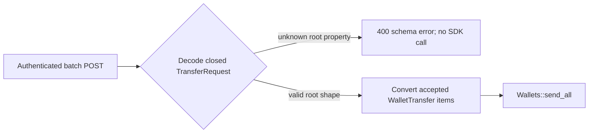

# ADR-0021: Reject unsupported SOL lag-reference batch-root schema members

## Status

Accepted

## Date

2026-08-27

## Context

ADR-0018 accepts the shared `AddressInput`, ADR-0019 accepts the single-send
`SendFunds` envelope, and ADR-0020 accepts each batch `WalletTransfer` item.
The earlier planning tree combined the batch root's wire schema with collection
behavior that has a different enforcement owner. It was split into the
following records:

1. S1.6.3.5.3.2.2.2.2.4.1 decides only the root JSON/OpenAPI schema and
   structural rejection boundary;
2. ADR-0022 later decided minimum cardinality and the empty-list HTTP/OpenAPI
   contract; and
3. Public Transaction Semantics proposes request-order and
   original-item-index preservation up to the chain-specific handoff.

S1.6.3.5.3.2.2.2.2.4.2 is only a collection-semantics grouping label, not an
approval step. This ADR now addresses only S1.6.3.5.3.2.2.2.2.4.1.

`POST /v1/transactions` declares `TransferRequest` as its JSON body. The root
currently has exactly one field:

- `transfers: Vec<WalletTransfer>`.

`TransferRequest` derives `Deserialize` with
`#[serde(deny_unknown_fields)]`. Its sole non-optional field is required, is
represented as a JSON array, and composes the accepted `WalletTransfer` item.
The handler resolves `Result<Json<TransferRequest>, JsonRejection>` before its
post-deserialization `request.try_into()` conversion and before
`Wallets::send_all`.

This root schema and the collection's domain behavior have different
enforcement owners. JSON deserialization establishes the required array and
rejects unknown root properties. `Wallets::send_all` later enforces non-empty
input, positive amounts, wallet lookup, and one-family compatibility before
chain-specific sending. This decision must not turn those downstream rules
into root-schema assertions.

Initial native SOL support has no independently trusted cluster-progress
reference and no SDK-enforced numeric maximum-lag guarantee. A batch-wide root
field suggesting such a control would therefore provide false caller
assurance even though every nested transaction input object is already closed.

## Decision

The public batch-root `TransferRequest` JSON object must remain an exact closed
object with one required property:

- `transfers`, retaining its existing JSON array representation whose items
  reference the accepted `WalletTransfer` component.

It must expose no batch-wide maximum-lag, reference-provider, provider-role,
quorum, reference-sampling, reference-fallback, explicit no-reference,
commitment, or slot-override property. Any future additional root property
requires a separate public-contract decision. Representative rejected property
names include:

- `max_lag_slots`, `max_lag_seconds`, or `max_slot_distance`;
- `reference_endpoint`, `reference_endpoints`, `reference_rpc_url`, or
  `reference_rpc_urls`;
- `reference_provider`, `reference_providers`, or `provider_role`;
- `reference_quorum` or `min_reference_responses`; and
- `minContextSlot`, `min_context_slot`, `required_slot`, `reference_slot`,
  `commitment`, `reference_timeout`, `sampling`, `allow_unbounded_lag`,
  `disable_reference`, `freshness_mode`, or another policy selector.

Generic wrappers such as `reference`, `freshness`, `lag_policy`, `policy`,
`defaults`, `rpc`, `provider`, `solana`, or `options` are also rejection
probes. So are root aliases such as `transfer`, `items`, `transactions`,
`payments`, `requests`, `wallet_transfers`, or `batch`. Snake-case,
camel-case, kebab-case, dotted, singular, and plural spellings remain unknown
rather than aliases.

These names are rejection probes, not reserved aliases. Every property outside
the approved `TransferRequest` schema must fail JSON body deserialization
regardless of its spelling, property order, or whether its value is a positive,
zero, or negative number, `null`, true, false, a string, an array, or an object.

No optional property, default, alias, `serde(flatten)` field of any type,
catch-all value, untagged alternative, coercion, preprocessor, warning-only
path, or accepted-but-ignored sentinel may convert an unsupported root
property into a valid request.

For an authenticated request that reaches JSON extraction, an unknown root
property retains the existing structural-error boundary for the complete body:

- HTTP status is `400 Bad Request`;
- the response contains only the generic message
  `request body must match the documented JSON schema`;
- `transaction_id`, `transaction_ids`, and `failed_index` fields are absent;
- no batch prefix is accepted;
- the handler's post-deserialization `request.try_into()` is not reached; and
- `Wallets::send_all` is not called.

Consequently, item amount conversion, destination conversion, wallet lookup,
family or asset compatibility checks, destination observation, RPC,
transaction preparation, signing, simulation, and broadcast are not reached.
This is distinct from a structurally valid batch that later fails during
conversion, domain validation, or submission and may carry a failed index or
accepted transaction IDs.

This boundary does not claim that Serde skipped examining a `transfers` value
that appeared earlier in the JSON text. It establishes that deserialization
produces no complete `TransferRequest`, so no post-deserialization conversion,
accepted prefix, or external effect occurs.

This rejection is owned by the chain-neutral HTTP batch root and therefore
applies before BTC, ETH, or future SOL wallet-family resolution. It is not a
Solana-domain conditional.

The published OpenAPI contract must represent the same root:

- `TransferRequest` has `additionalProperties: false`;
- its exact and only property is required `transfers`;
- `transfers` remains an array whose items reference `WalletTransfer`;
- the `POST /v1/transactions` request body continues to reference
  `TransferRequest`; and
- it publishes no lag/reference, commitment, slot-override, wrapper, or alias
  property.

This decision does not add or decide `minItems`, `maxItems`, uniqueness, an
empty-list outcome, duplicate-wallet behavior, execution ordering, failed-index
policy, or accepted-prefix behavior for a structurally valid batch that reaches
downstream processing. Runtime and published OpenAPI policy for query
parameters or HTTP headers is also outside this JSON-root decision and requires
separate approval.

The boundary is:

`apps/api` owns `TransferRequest`, its JSON extraction, HTTP error mapping,
OpenAPI component and route-body reference, and pre-delegation boundary.
Concrete Solana, `sdk/chains/base`, `sdk/wallets`, `sdk/indexing`, persistence,
and generic JSON-RPC gain no public lag/reference-input type or state.

Acceptance adds the matching canonical batch-root schema rule to
`docs/SYSTEM_REQUIREMENTS.md` and documents its exact object, generic `400`,
whole-body rejection, and pre-wallet boundary in `docs/API.md`. Acceptance also
narrows ADR-0014 through ADR-0020 planning pointers to identify the accepted
root-schema leaf while retaining cardinality and remaining collection behavior
as separate decisions.

## Scope boundary

S1.6.3.5.3.2.2.2.2.4.1 decides only the `TransferRequest` root field set,
required array representation and accepted item reference, structural
rejection of unsupported root properties, existing generic `400` whole-body
response, pre-`request.try_into()` and pre-`Wallets::send_all` boundary,
OpenAPI root closure and route-body reference, and ownership. It does not
decide:

- any field, type, validation, or OpenAPI detail inside `WalletTransfer` or
  `AddressInput`;
- collection minimum or maximum cardinality, uniqueness, empty-list behavior,
  duplicate-wallet behavior, or execution-order policy;
- wallet-ID syntax, parsing, existence, lookup, family, asset, or compatibility;
- amount parsing, decimal precision, positivity, lamport conversion, balances,
  fees, or priority fees;
- runtime or published OpenAPI policy for query parameters or HTTP headers;
- authentication failure precedence or bearer-token behavior;
- destination account acquisition, grouping, mapping, context floors, health,
  reference evidence, or apparently future slots;
- transaction construction, blockhash acquisition, signing, simulation,
  preflight, submission, confirmation, partial valid-batch failure, or
  ambiguous-broadcast behavior;
- exact JSON parser path, line, column, or rejected-key diagnostics;
- startup/static configuration, readiness, monitoring, or persistence; or
- implementation, dependency, migration, compatibility, or test execution.

ADR-0022 now decides minimum cardinality and the empty-list HTTP/OpenAPI
contract. If accepted, the named Public Transaction Semantics and Destination
Account Acquisition proposals would consolidate request order, original
indices, maximum and duplicate behavior, non-body inputs, slot plausibility,
acquisition, and mapping. The former nested future labels become historical
only upon that acceptance.

## Alternatives considered

### Combine the root with `WalletTransfer`

Rejected. ADR-0020 already owns the item component. `TransferRequest` is a
separate Serde/OpenAPI object and route-body owner.

### Split the `transfers` occurrence from root closure

Rejected. A one-property object cannot establish an exact closed schema without
deciding that property's required name and structural array type.

### Decide non-empty and execution-order behavior here

Rejected for this micro-step. The current root deserializer accepts a JSON
array structurally, while downstream wallet orchestration owns non-empty and
execution behavior. This decision does not add a schema cardinality assertion
or re-approve downstream policy.

### Add optional lag/reference root properties

Rejected. An `Option` would make an unsupported capability part of the public
contract and create ambiguity between omission, `null`, and later activation.

### Treat zero, false, null, or empty values as disabled

Rejected. Sentinels can silently defeat caller intent, while zero could mean a
strict zero-slot tolerance. Every unsupported property presence fails.

### Accept and ignore unsupported properties

Rejected. A caller could believe one safety constraint governed the complete
batch even though ADR-0016 establishes that no independent initial reference
exists.

### Return an indexed batch failure

Rejected. No valid `TransferRequest` exists at this boundary, so the API must
not imply that any item reached conversion, domain validation, or submission.

## Consequences

### Positive

- The batch root has one exact documented wire schema.
- A caller cannot silently attach an unenforceable batch-wide lag/reference
  preference.
- Root rejection happens before request conversion, wallet lookup, RPC,
  signing, or broadcast.
- Runtime deserialization and OpenAPI express the same closed root.

### Negative

- Clients cannot pre-stage future batch-wide observation controls in current
  bodies.
- Adding a real public reference mode later requires a separately approved
  request owner and compatibility decision.

### Neutral

- `WalletTransfer` and `AddressInput` remain accepted nested components.
- Collection and downstream batch semantics remain outside this decision.
- Bitcoin and Ethereum batch-root behavior remains unchanged.
- No implementation or test code is authorized by this decision.

## Validation requirements

Focused future tests must prove:

- a valid root containing only required `transfers` reaches
  `Wallets::send_all` when its items and downstream rules are otherwise valid;
- omitting `transfers` or supplying a non-array JSON value fails at the same
  structural boundary without deciding collection semantics;
- every representative probe fails as a top-level sibling of `transfers`;
- each probe fails for positive, zero, and negative numbers, `null`, true,
  false, and empty or non-empty string, array, and object values;
- probe placement before or after `transfers` does not change rejection, using
  raw JSON so the authored property order is preserved;
- an unknown root property after a structurally valid item array still wins at
  JSON extraction even if an item contains an amount or wallet ID that would
  fail only during conversion or wallet lookup;
- no alias, default, `serde(flatten)` field of any type, catch-all value,
  untagged alternative, coercion, preprocessing, warning-only path, or sentinel
  accepts an unsupported property;
- every authenticated rejection returns exactly the generic documented-schema
  `400` body and no `transaction_id`, `transaction_ids`, or `failed_index`;
- rejection occurs before the handler's `request.try_into()`,
  `Wallets::send_all`, item conversion, wallet lookup, destination observation,
  RPC, preparation, signing, simulation, and broadcast;
- the route-level batch effect counter remains unchanged;
- OpenAPI marks `TransferRequest` with `additionalProperties: false`, publishes
  exactly required `transfers` as an array whose items reference
  `WalletTransfer`, keeps the batch operation request body referenced to
  `TransferRequest`, and publishes none of the probe properties;
- no `minItems`, `maxItems`, uniqueness, empty-list, ordering, or downstream
  failed-index or accepted-prefix rule for a structurally valid batch is
  inferred from this decision;
- this decision alone changes no `AddressInput`, `SendFunds`, `WalletTransfer`,
  single-send handler, or downstream batch behavior; and
- Bitcoin and Ethereum behavior remains unchanged.

## Approval boundary

Decision `S1.6.3.5.3.2.2.2.2.4.1` was explicitly approved on 2026-08-27.
Acceptance records only the batch-root schema rejection policy, matching
canonical and API documentation, and narrow ADR-0014 through ADR-0020 pointer
clarifications. It does not authorize Solana source, wallet, transaction, RPC,
configuration, dependency, API, or test implementation. ADR-0022 and the five
named consolidation proposals retain their own approval boundaries.

## References

- `ARCHITECTURE.md`
- `docs/API.md`
- `docs/SYSTEM_REQUIREMENTS.md`
- `apps/api/src/api/error.rs`
- `apps/api/src/api/transaction.rs`
- `apps/api/src/api/api_test.rs`
- `apps/api/tests/route_contract.rs`
- `sdk/wallets/src/wallets.rs`
- `docs/adr/0016-use-no-independent-sol-lag-reference-initially.md`
- `docs/adr/0017-reject-unsupported-sol-lag-reference-startup-configuration.md`
- `docs/adr/0018-reject-unsupported-sol-lag-reference-destination-members.md`
- `docs/adr/0019-reject-unsupported-sol-lag-reference-single-send-envelope-members.md`
- `docs/adr/0020-reject-unsupported-sol-lag-reference-batch-item-members.md`
