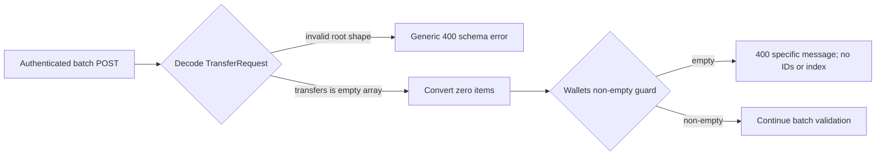

# ADR-0022: Reject empty batches without a failed item index

## Status

Accepted

## Date

2026-08-27

## Context

ADR-0021 accepts the `TransferRequest` root wire schema as
S1.6.3.5.3.2.2.2.2.4.1 while deliberately leaving collection behavior
unresolved. S1.6.3.5.3.2.2.2.2.4.2.1 now addresses only minimum cardinality and
the empty-list HTTP/OpenAPI contract.

The canonical product requirement already says that a batch is non-empty, but
the current public and runtime contracts do not express that invariant
consistently:

- `TransferRequest.transfers` is a `Vec<WalletTransfer>`, so Serde accepts
  `{"transfers":[]}` as a structurally valid request;
- the API's post-deserialization conversion enumerates no items and produces an
  empty SDK vector;
- `Wallets::send_all` then rejects the empty vector before sender selection
  with message `at least one transfer is required`;
- `SendError` currently requires a `failed_index`, so that collection-level
  rejection manufactures index `0`, and its `Display` renders
  `transaction 0 failed`;
- the HTTP adapter exposes that synthetic value even though no transfer at
  index zero exists; and
- OpenAPI publishes no `minItems` constraint while the batch operation
  description promises accepted IDs and a failed request index for every
  failure.

This is not the structural JSON failure decided by ADR-0021. Extraction has
succeeded, the root and array types are valid, and the failure is the
collection's minimum-cardinality invariant.

The repository assigns cohesive batch validation to `Wallets` and HTTP/OpenAPI
status, body, and schema projection to `apps/api`. The SDK guard must remain
authoritative for direct and future non-HTTP callers; fixing only the public
adapter would leave the domain contract unable to describe its own failure
truthfully.

## Decision

`Wallets::send_all` must reject every empty batch and accept only a non-empty
batch for further processing. `Wallets` retains the authoritative non-empty
collection guard for every caller. An empty batch is a collection-level
invalid-input failure, not the failure of a fictional item zero. Its typed
wallet error source must use a dedicated `ErrorKind::InvalidBatch` rather than
misclassifying collection cardinality as `InvalidAmount`.

The domain failure must therefore represent all of the following facts without
manufacturing an item index:

- message: `at least one transfer is required`;
- no accepted transaction IDs;
- no failed item index; and
- no `Sender::send` invocation or transaction/chain-side external effect.

This decision does not prescribe the exact Rust representation used to make a
collection-level `SendError` index-free. The implementation may evolve the
error into an enum or make its item index conditional, but it must keep the
`Wallets` invariant, expose `InvalidBatch` as the typed source classification,
and avoid deciding or altering the separately deferred metadata semantics of
non-empty failures. Every public error projection, including `SendError`'s
`Display`, must describe the empty collection without printing or implying
`transaction 0` or another failed-item index.

This is an intentional pre-release source-breaking replacement of the current
mandatory `SendError.failed_index: usize` contract. All workspace callers and
match sites must move atomically to the truthful collection-level shape. No
sentinel index, compatibility alias, legacy constructor, or parallel error DTO
may preserve the false index-zero representation.

For an authenticated `POST /v1/transactions` request whose exact body is
structurally valid but contains `{"transfers":[]}`, the public result must be:

- `400 Bad Request`;
- body exactly `{"message":"at least one transfer is required"}`;
- no `transaction_id`, `transaction_ids`, or `failed_index` property; and
- no wallet lookup, family selection, `Sender::send`, RPC, transaction
  preparation, signing, simulation, or broadcast.

JSON extraction succeeds for this exact empty-array shape. Under the current
delegation boundary, post-deserialization request conversion also succeeds
without converting an item, `Wallets::send_all` is reached, and its non-empty
guard rejects before sender selection. The HTTP adapter must map the resulting
collection-level error without adding a synthetic index.

The OpenAPI contract must publish the same minimum:

- `TransferRequest.transfers` remains required and array-typed;
- its items continue to reference the accepted `WalletTransfer` component;
- it has `minItems: 1`;
- it has no `maxItems`, `uniqueItems`, or default empty array from this
  decision; and
- `POST /v1/transactions` continues to reference `TransferRequest`.

The batch operation's published description must also stop promising a failed
request index for every failure. It must state that accepted transaction IDs
and a failed item index are present only when those facts exist for a real-item
failure; collection-level empty rejection has neither.

Missing `transfers`, `null`, a non-array value, an invalid root JSON type, or an
unknown root property remains ADR-0021's generic structural `400`. An unknown
root property and an empty array in the same body also remain a structural
failure regardless of property order: no complete `TransferRequest` reaches
the minimum-cardinality guard.

The boundary is:

`sdk/wallets` owns the invariant and truthful collection-level failure facts.
`apps/api` owns the public status/body mapping, conditional operation
description, and OpenAPI `minItems`. `Wallets` must not invoke its registered
`Sender` for empty input. Concrete Bitcoin and Ethereum senders may retain
defensive empty-vector checks, but those branches are not the public or SDK
collection-validation path and future Solana gains no new empty-batch branch
from this decision.

Acceptance adds the exact empty-batch outcome to
`docs/SYSTEM_REQUIREMENTS.md` and documents its specific message, absent
metadata, and `minItems: 1` in `docs/API.md`, including the operation
description's conditional metadata wording. Acceptance also narrows ADR-0014
through ADR-0021 planning pointers to identify this accepted cardinality leaf.
Public Transaction Semantics would own request-order and original-item-index
preservation upon acceptance.

## Scope boundary

S1.6.3.5.3.2.2.2.2.4.2.1 decides only minimum batch cardinality one, the
authoritative `Wallets` guard, the index-free empty collection error facts, the
dedicated `InvalidBatch` source classification, index-free public `Display`,
exact public `400` body, conditional operation description, OpenAPI
`minItems: 1`, the pre-registered-sender and pre-transaction/chain-effect
boundary, and ownership. It does not decide:

- the already accepted root or item field sets, types, or unknown-field
  behavior;
- maximum cardinality, body-size limits, uniqueness, duplicate-wallet policy,
  defaulting, or coercion;
- request-order or original-item-index preservation for real items, which the
  Public Transaction Semantics proposal would own upon acceptance;
- whether the index-free `SendError` representation is an enum, conditional
  field, constructor set, or another equally precise pre-release replacement;
- amount parsing, positivity for real items, wallet lookup, family or asset
  compatibility, destination validation, or downstream failure precedence;
- failed-index or accepted-prefix behavior for any non-empty batch;
- runtime or published OpenAPI policy for query parameters or HTTP headers;
- authentication failure precedence or bearer-token behavior;
- destination account acquisition, grouping, mapping, context floors, health,
  reference evidence, or apparently future slots;
- transaction construction, blockhash acquisition, fees, balances, signing,
  simulation, preflight, submission, confirmation, or ambiguous-broadcast
  behavior;
- startup/static configuration, readiness, monitoring, or persistence; or
- implementation, dependency changes, deployment or migration mechanics, or
  test execution. The pre-release direct replacement and absence of
  compatibility shims are decided, but their code is not.

If accepted, the named Public Transaction Semantics and Destination Account
Acquisition proposals would consolidate request order, original indices,
maximum and duplicate behavior, non-body inputs, slot plausibility,
acquisition, and mapping. The former nested future labels become historical
only upon that acceptance.

## Alternatives considered

### Keep the current synthetic `failed_index: 0`

Rejected. `failed_index` is defined as the zero-based index of the transfer
that failed. An empty collection has no item zero, so the value is false
metadata.

### Keep `ErrorKind::InvalidAmount` for the collection failure

Rejected. `InvalidAmount` describes an invalid transfer value. An empty batch
violates collection cardinality before any transfer amount exists, so the SDK
must classify it as `InvalidBatch`.

### Treat the empty array as malformed JSON

Rejected. The root object and array type are structurally valid. A custom
deserializer or generic schema error would collapse the accepted root-schema
boundary into a domain cardinality rule and lose the precise existing message.

### Make HTTP validation the only non-empty guard

Rejected. Direct SDK callers could still submit an empty vector. `Wallets`
must preserve the invariant regardless of transport.

### Add a redundant early HTTP check and leave the SDK error unchanged

Rejected as the final contract. It could hide the synthetic SDK index from this
one route but would leave the domain error unable to represent a
collection-level failure truthfully and would duplicate the authoritative
guard. The structurally valid request should reach `Wallets`, whose typed
failure the HTTP adapter projects.

### Accept an empty batch as a successful no-op

Rejected. It would violate the canonical non-empty batch invariant and make a
successful submission response with no transaction IDs ambiguous.

### Decide maximum size, uniqueness, and ordering together

Rejected for this micro-step. Those constraints have distinct operational and
ownership consequences. Only the already-required minimum of one is decided
here.

## Consequences

### Positive

- Public and SDK contracts agree that every batch contains at least one item.
- Empty input cannot expose a nonexistent failed-item index.
- OpenAPI clients can discover the minimum before sending a request.
- The SDK remains safe for non-HTTP callers, and `Wallets` never invokes its
  registered sender for empty input.

### Negative

- The truthful collection-level failure requires the SDK error representation
  or its internal mapping to support absence of an item index.
- Existing clients that incorrectly depend on `failed_index: 0` for empty input
  must stop doing so.
- Rust callers must update atomically for the intentional pre-release
  `SendError` and `ErrorKind` source-breaking replacement.

### Neutral

- The HTTP status and existing source/HTTP message remain unchanged.
- Structurally malformed roots retain ADR-0021's generic error.
- Non-empty Bitcoin, Ethereum, and future Solana batch behavior remains
  unchanged.
- No implementation or test code is authorized by this accepted ADR.

## Validation requirements

Focused future tests must prove:

- authenticated `{"transfers":[]}` returns exactly `400` with body
  `{"message":"at least one transfer is required"}`;
- the empty response contains no `transaction_id`, `transaction_ids`, or
  `failed_index`;
- empty input reaches no wallet lookup, family selection, `Sender::send`, RPC,
  preparation, signing, simulation, or broadcast, produces no transaction or
  chain-side external effect, and leaves route-level batch-effect counters
  unchanged;
- direct `Wallets::send_all` with an empty vector returns the typed non-empty
  `InvalidBatch` failure with no accepted IDs or failed-item index and never
  invokes its registered sender;
- every SDK projection of that collection-level error, including `Display`,
  contains the exact source message and no fictional item index or
  `transaction 0 failed` wording;
- missing, `null`, non-array, invalid-root, or unknown-root input retains
  ADR-0021's exact generic structural `400` and absent metadata;
- an empty array combined with an unknown root property remains a structural
  error regardless of property order;
- a valid singleton and valid multi-item request continue beyond the non-empty
  guard;
- OpenAPI publishes `TransferRequest.transfers` with `minItems: 1`, preserves
  required array type and `WalletTransfer` item reference, and adds no
  `maxItems`, `uniqueItems`, default, or unrelated collection keyword;
- the route request body continues to reference `TransferRequest`;
- the published batch-operation description makes IDs and failed item index
  conditional on real-item failure and does not promise them for every error;
- valid non-empty input continues beyond the non-empty guard, while real-item
  indices, accepted prefixes, order, duplicates, and maximum size remain
  outside this decision and its focused tests; and
- `Wallets` does not invoke its registered `Sender` for an empty batch; concrete
  sender defensive branches are not asserted or removed by this decision.

## Approval boundary

Decision `S1.6.3.5.3.2.2.2.2.4.2.1` was explicitly approved on 2026-08-27.
Acceptance authorizes the non-empty invariant, `InvalidBatch` source
classification, index-free empty `SendError`/`Display` facts, exact HTTP body,
conditional route description, and `minItems: 1`, plus matching canonical/API
documentation and narrow ADR-0014 through ADR-0021 pointer clarifications
only. It does not authorize Solana source, wallet, transaction, RPC,
configuration, dependency, API, SDK, error-type, or test implementation. The
five named consolidation proposals retain their own approval boundaries.

## References

- `ARCHITECTURE.md`
- `docs/API.md`
- `docs/SYSTEM_REQUIREMENTS.md`
- `apps/api/src/api/error.rs`
- `apps/api/src/api/transaction.rs`
- `apps/api/src/api/api_test.rs`
- `apps/api/tests/route_contract.rs`
- `sdk/wallets/src/sender.rs`
- `sdk/wallets/src/wallets.rs`
- `docs/adr/0020-reject-unsupported-sol-lag-reference-batch-item-members.md`
- `docs/adr/0021-reject-unsupported-sol-lag-reference-batch-root-members.md`
